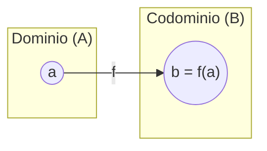
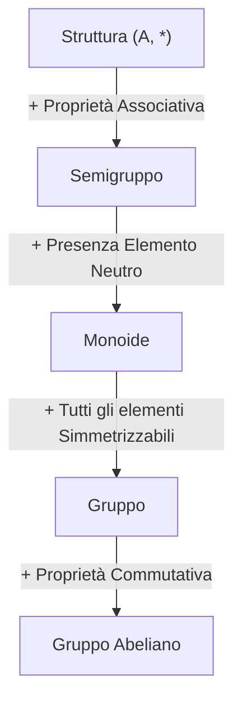

# Compendio Teorico di Matematica Discreta

## Indice Generale
1. [Insiemi, Logica e Principio di Induzione](#1-insiemi-logica-e-principio-di-induzione)
2. [Corrispondenze ed Applicazioni (Funzioni)](#2-corrispondenze-ed-applicazioni-funzioni)
3. [Calcolo Matriciale](#3-calcolo-matriciale)
4. [Relazioni di Equivalenza e Partizioni](#4-relazioni-di-equivalenza-e-partizioni)
5. [Aritmetica Intera e Congruenze](#5-aritmetica-intera-e-congruenze)
6. [Calcolo Combinatorio](#6-calcolo-combinatorio)
7. [Relazioni d'Ordine e Reticoli](#7-relazioni-dordine-e-reticoli)
8. [Strutture Algebriche](#8-strutture-algebriche)
9. [Sistemi di Equazioni Lineari](#9-sistemi-di-equazioni-lineari)
10. [Spazi Vettoriali e Applicazioni Lineari](#10-spazi-vettoriali-e-applicazioni-lineari)
11. [Autovalori, Autovettori e Diagonalizzazione](#11-autovalori-autovettori-e-diagonalizzazione)
12. [Geometria Analitica del Piano e dello Spazio](#12-geometria-analitica-del-piano-e-dello-spazio)

---

## 1. Insiemi, Logica e Principio di Induzione

### 1.1 Concetto di Insieme e Notazioni Fondamentali
Un **insieme** è una collezione intuitiva e ben definita di oggetti distinti, detti **elementi** dell'insieme.
- $x \in S$: l'elemento $x$ appartiene all'insieme $S$.
- $x \notin S$: l'elemento $x$ non appartiene all'insieme $S$.

Negli insiemi è irrilevante l'ordine con cui gli elementi sono scritti e non si considerano le ripetizioni del medesimo elemento (es. $\{3,1,5,4,1,3,2\} = \{1,2,3,4,5\}$).

> **Definizione (Cardinalità / Ordine)**
> Sia $S$ un insieme. Si definisce **ordine** (o **cardinalità**) di $S$, e si denota con $|S|$, il numero di elementi distinti di $S$.
> - $S$ si dice **finito** se il suo ordine è un intero non negativo finito.
> - $S$ si dice **infinito** se il suo ordine non è finito.

#### Insiemi Notevoli
- **Insieme vuoto** ($\emptyset$): l'unico insieme privo di elementi ($|\emptyset| = 0$).
- **Singleton**: un insieme costituito da un unico elemento (es. $F = \{5\}$, $|F| = 1$).
- **Insiemi numerici**:
  - $\mathbb{N} = \{1, 2, 3, 4, \dots\}$ (Numeri naturali positivi)
  - $\mathbb{N}_0 = \{0, 1, 2, 3, \dots\}$ (Numeri naturali inclusi lo zero)
  - $\mathbb{Z} = \{\dots, -2, -1, 0, 1, 2, \dots\}$ (Numeri interi relativi)
  - $\mathbb{Q} = \left\{\frac{a}{b} : a \in \mathbb{Z}, b \in \mathbb{Z} \setminus \{0\}\right\}$ (Numeri razionali)
  - $\mathbb{R}$: insieme dei numeri reali.
  - Per $t \in \mathbb{Z}$: $t\mathbb{N}_0 = \{tx : x \in \mathbb{N}_0\}$ e $t\mathbb{Z} = \{tx : x \in \mathbb{Z}\}$.
  - Numeri pari: $\mathbb{N}_p = \{0, 2, 4, 6, \dots\} = \{2x : x \in \mathbb{N}_0\}$.
  - Numeri dispari: $\mathbb{N}_d = \{1, 3, 5, 7, \dots\} = \{2x + 1 : x \in \mathbb{N}_0\}$.

### 1.2 Rappresentazione degli Insiemi
1. **Per elencazione**: descrivendo esplicitamente tutti i suoi elementi tra parentesi graffe.
2. **Per proprietà caratteristica**: definendo una condizione logica soddisfatta da tutti e soli gli elementi dell'insieme: $S = \{x : P(x)\}$.
3. **Mediante diagrammi di Venn**: rappresentazione grafica tramite curve chiuse nel piano.

---

### 1.3 Elementi di Logica Matematica

> **Definizioni e Quantificatori**
> Siano $P$ e $Q$ due proposizioni logiche.
> - **Implicazione ($P \Rightarrow Q$)**: "P implica Q". Significa che se $P$ è vera, allora $Q$ deve essere vera.
> - **Equivalenza ($P \iff Q$)**: "P equivale a Q". Significa $(P \Rightarrow Q) \land (Q \Rightarrow P)$, ovvero $P$ e $Q$ hanno lo stesso valore di verità.
>
> **Quantificatori**:
> - $\forall$: quantificatore universale ("per ogni" / "per tutti").
> - $\exists$: quantificatore esistenziale ("esiste almeno uno").
> - $\exists!$: quantificatore di esistenza ed unicità ("esiste ed è unico").

#### Negazione di una Proposizione Logica
Sia $P$ una proposizione. La sua negazione si denota con $\neg P$.
- $\neg (\forall x \in A, P(x)) \equiv \exists x \in A : \neg P(x)$
- $\neg (\exists x \in A : P(x)) \equiv \forall x \in A, \neg P(x)$

---

### 1.4 Inclusione e Sottoinsiemi

> **Definizione (Sottoinsieme)**
> Sia $A$ un insieme. Un insieme $B$ si dice **sottoinsieme** di $A$ (e si scrive $B \subseteq A$, oppure $B$ incluso in $A$) se ogni elemento di $B$ appartiene ad $A$:
> $B \subseteq A \iff (\forall b \in B \Rightarrow b \in A)$

- **Sottoinsieme Proprio**: $B \subset A$ ($B$ incluso strettamente in $A$) se:
  $$
  \begin{cases} B \subseteq A \\ B \neq A \end{cases} \iff \begin{cases} b \in A & \forall b \in B \\ \exists a \in A & : a \notin B \end{cases}
  $$
- **Sottoinsiemi Banali**: Per qualsiasi insieme $A$, $\emptyset \subseteq A$ e $A \subseteq A$ sono sempre verificate.
- **Principio della Doppia Inclusione**:
  $A = B \iff (A \subseteq B \land B \subseteq A)$

---

### 1.5 Tecniche di Dimostrazione
1. **Dimostrazione Diretta**: Si assume vera l'ipotesi $P$ e si deducono passaggi logici che portano a dimostrare la tesi $Q$.
2. **Dimostrazione per Assurdo (Indiretta)**: Per dimostrare $P \Rightarrow Q$, si assume vera l'ipotesi $P$ e la negazione della tesi $\neg Q$, mostrando che ciò conduce a una contraddizione (ovvero si prova $\neg Q \Rightarrow \neg P$).
3. **Confutazione tramite Controesempio**: Per mostrare che una proposizione del tipo $\forall x \in A, P(x)$ è falsa, è sufficiente esibire almeno un elemento $\bar{x} \in A$ tale che $P(\bar{x})$ sia falsa.

---

### 1.6 Operazioni tra Insiemi

> **Definizioni delle Operazioni**
> Siano $A$ e $B$ insiemi.
> - **Unione**: $A \cup B \triangleq \{x : x \in A \lor x \in B\}$
> - **Intersezione**: $A \cap B \triangleq \{x : x \in A \land x \in B\}$
> - **Differenza**: $A \setminus B \triangleq \{x : x \in A \land x \notin B\}$
> - **Unione Disgiunta**: $A \dot{\cup} B \triangleq (A \cup B) \setminus (A \cap B)$
> - **Differenza Simmetrica**: $A \Delta B \triangleq (A \setminus B) \cup (B \setminus A)$

> **Teorema**
> Per ogni coppia di insiemi $A$ e $B$, $A \dot{\cup} B = A \Delta B$.

#### Proprietà Fondamentali delle Operazioni Insiemistiche

| Proprietà | Unione ($A \cup B$) | Intersezione ($A \cap B$) |
| :--- | :--- | :--- |
| **Commutativa** | $A \cup B = B \cup A$ | $A \cap B = B \cap A$ |
| **Associativa** | $(A \cup B) \cup C = A \cup (B \cup C)$ | $(A \cap B) \cap C = A \cap (B \cap C)$ |
| **Iterativa (Idempotenza)** | $A \cup A = A$ | $A \cap A = A$ |
| **Elemento Neutro/Assorbente**| $A \cup \emptyset = A$ | $A \cap \emptyset = \emptyset$ |
| **Inclusione Correlata** | $A \subseteq A \cup B$ | $A \cap B \subseteq A$ |
| **Caratterizzazione** | $A \cup B = A \iff B \subseteq A$ | $A \cap B = A \iff A \subseteq B$ |

#### Proprietà della Differenza e Formule di De Morgan
- In generale $A \setminus B \neq B \setminus A$.
- $A \setminus \emptyset = A$, $\emptyset \setminus A = \emptyset$, $A \setminus A = \emptyset$.
- $A \setminus B \subseteq A$.
- $A \setminus B = A \iff A \cap B = \emptyset$.
- **Formule di De Morgan**:
  1. $A \setminus (B \cup C) = (A \setminus B) \cap (A \setminus C)$
  2. $A \setminus (B \cap C) = (A \setminus B) \cup (A \setminus C)$

---

### 1.7 Insieme delle Parti

> **Definizione (Insieme delle Parti)**
> Sia $A$ un insieme. Si definisce **insieme delle parti** di $A$ (o insieme potenza), e si denota con $\mathcal{P}(A)$, l'insieme di tutti i sottoinsiemi di $A$:
> $\mathcal{P}(A) \triangleq \{B : B \subseteq A\}$

> **Teorema**
> Sia $A$ un insieme finito con $|A| = n$ ($n \ge 0$). Allora $|\mathcal{P}(A)| = 2^n$.

---

### 1.8 Prodotto Cartesiano e Coppie Ordinate

> **Definizione (Coppia Ordinata e Prodotto Cartesiano)**
> - Una **coppia ordinata** con prima componente $a$ e seconda componente $b$ si indica con $(a,b)$. Per convenzione:
>   $$
>   (a,b) = (c,d) \iff \begin{cases} a = c \\ b = d \end{cases}
>   $$
> - Siano $A$ e $B$ due insiemi. Si definisce **prodotto cartesiano** di $A$ e $B$ l'insieme:
>   $A \times B \triangleq \{(a,b) : a \in A \land b \in B\}$

- Se $|A| = s$ e $|B| = t$, allora $|A \times B| = s \cdot t$.
- Se $A = \emptyset$ oppure $B = \emptyset$, allora $A \times B = \emptyset$.

#### Estensione a $n$-uple
Siano $A_1, A_2, \dots, A_n$ insiemi ($n \ge 1$). L'insieme prodotto cartesiano è:
$A_1 \times A_2 \times \dots \times A_n \triangleq \{(a_1, a_2, \dots, a_n) : a_i \in A_i, \forall i = 1, \dots, n\}$
con $(a_1, \dots, a_n) = (b_1, \dots, b_n) \iff a_i = b_i, \forall i = 1, \dots, n$.

---

### 1.9 Principio di Induzione Matematica

> **Teorema (Principio di Induzione Matematica)**
> Sia $P_n$ una successione di proposizioni indicizzate dall'intero $n \in \mathbb{N}_0$, definite per $n \ge \bar{n}$. Se risultano verificate le due seguenti condizioni:
> 1. **Base dell'Induzione**: $P_{\bar{n}}$ è VERA;
> 2. **Passo Induttivo**: $\forall n \ge \bar{n}$, l'ipotesi che $P_n$ sia VERA (**Ipotesi Induttiva**) implica logicamente che $P_{n+1}$ sia VERA;
>
> allora $P_n$ è VERA per ogni $n \ge \bar{n}$.

---

## 2. Corrispondenze ed Applicazioni (Funzioni)

### 2.1 Corrispondenze e Relazioni
Siano $A$ e $B$ due insiemi. Un qualsiasi sottoinsieme $R \subseteq A \times B$ viene detto **corrispondenza** tra $A$ e $B$. Se $A = B$, $R \subseteq A \times A$ si dice **relazione** nell'insieme $A$.
- Se $(a,b) \in R$, si scrive $a R b$.
- Se $(a,b) \notin R$, si scrive $a \not\mathrel{R} b$.

---

### 2.2 Applicazioni (o Funzioni)

> **Definizione (Applicazione)**
> Una corrispondenza $R \subseteq A \times B$ si dice **applicazione** (o funzione) da $A$ a $B$ (notazione $f: A \to B$) se:
> $\forall a \in A, \exists! b \in B : a R b$
> L'unico elemento $b \in B$ tale che $f(a) = b$ si dice **immagine** di $a$ tramite $f$.
> - $A$ prende il nome di **dominio** dell'applicazione.
> - $B$ prende il nome di **codominio** dell'applicazione.

---

### 2.3 Proprietà delle Applicazioni: Iniettività, Suriettività, Biettività

> **Definizioni**
> Sia $f: A \to B$ un'applicazione.
> - **Iniettiva**: $f$ è iniettiva se elementi distinti del dominio hanno immagini distinte nel codominio:
>   $$\forall a_1, a_2 \in A, a_1 \neq a_2 \Rightarrow f(a_1) \neq f(a_2) \iff (f(a_1) = f(a_2) \Rightarrow a_1 = a_2)$$
> - **Suriettiva**: $f$ è suriettiva se ogni elemento del codominio è immagine di almeno un elemento del dominio:
>   $$\forall b \in B, \exists a \in A : f(a) = b$$
> - **Biettiva (o Biiettiva)**: $f$ è biettiva se è **sia iniettiva che suriettiva**.

#### Applicazione Identica
Per ogni insieme $A$, l'applicazione $i_A: A \to A, x \mapsto x$ si dice **applicazione identica** su $A$. È sempre biettiva. Il sottoinsieme $\Delta_A = \{(x,x) : x \in A\} \subseteq A \times A$ si dice **diagonale** di $A$.

---

### 2.4 Immagine e Controimmagine di Sottoinsiemi

> **Definizioni**
> Sia $f: A \to B$ un'applicazione.
> - **Immagine di un sottoinsieme** $A_1 \subseteq A$:
>   $$f(A_1) \triangleq \{f(a) : a \in A_1\} \subseteq B$$
> - **Controimmagine (o antiimmagine) di un sottoinsieme** $B_1 \subseteq B$:
>   $$f^{-1}(B_1) \triangleq \{a \in A : f(a) \in B_1\} \subseteq A$$

#### Proposizioni Notevoli
1. $f: A \to B$ è suriettiva $\iff f(A) = B$.
2. $f^{-1}(B) = A$.
3. $f: A \to B$ è suriettiva $\iff \forall b \in B, f^{-1}(\{b\}) \neq \emptyset$.

---

### 2.5 Composizione di Applicazioni

> **Definizione (Composizione)**
> Siano $f: A \to B$ e $g: B \to C$ due applicazioni. Si definisce **applicazione composta** di $f$ e $g$ l'applicazione:
> $$g \circ f : A \to C, \quad a \mapsto g(f(a))$$

#### Proprietà della Composizione
- **Associatività**: Siano $f: A \to B$, $g: B \to C$, $h: C \to D$. Allora:
  $$h \circ (g \circ f) = (h \circ g) \circ f = h \circ g \circ f$$
- **Non Commutatività**: In generale $g \circ f \neq f \circ g$.
- **Neutro rispetto alla composizione**: $f \circ i_A = f$ e $i_B \circ f = f$.

> **Teorema (Proprietà Trasmesse dalla Composta)**
> Siano $f: A \to B$ e $g: B \to C$.
> 1. Se $f$ e $g$ sono iniettive $\Rightarrow g \circ f$ è iniettiva.
> 2. Se $f$ e $g$ sono suriettive $\Rightarrow g \circ f$ è suriettiva.
> 3. Se $f$ e $g$ sono biettive $\Rightarrow g \circ f$ è biettiva.
> 4. Se $g \circ f$ è iniettiva $\Rightarrow f$ è iniettiva ($g$ può non esserlo).
> 5. Se $g \circ f$ è suriettiva $\Rightarrow g$ è suriettiva ($f$ può non esserlo).
> 6. Se $g \circ f$ è biettiva $\Rightarrow f$ è iniettiva e $g$ è suriettiva.

---

### 2.6 Applicazione Inversa ed Invertibilità

> **Definizione (Inversa)**
> Sia $f: A \to B$ un'applicazione. Un'applicazione $g: B \to A$ si dice **inversa** di $f$ se:
> $$\begin{cases} g \circ f = i_A \\ f \circ g = i_B \end{cases}$$

> **Teorema (Unicità ed Esistenza dell'Inversa)**
> 1. Se un'applicazione $f: A \to B$ possiede un'inversa, tale inversa è **unica** e si indica con $f^{-1}: B \to A$.
> 2. **Teorema di Caratterizzazione**: Un'applicazione $f: A \to B$ è invertibile se e solo se è **biettiva**.

---

## 3. Calcolo Matriciale

### 3.1 Definizione di Matrice e Tipi Particolari
Siano $s, t \in \mathbb{N}$. Una **matrice reale di tipo $s \times t$** è una tabella rettangolare contenente $s \cdot t$ numeri reali disposti su $s$ righe e $t$ colonne:
$$A = (a_{ij})_{\substack{i=1,\dots,s \\ j=1,\dots,t}} = \begin{pmatrix} a_{11} & a_{12} & \dots & a_{1t} \\ a_{21} & a_{22} & \dots & a_{2t} \\ \vdots & \vdots & \ddots & \vdots \\ a_{s1} & a_{s2} & \dots & a_{st} \end{pmatrix} \in M_{s,t}(\mathbb{R})$$

- Se $s = t$, $A \in M_s(\mathbb{R})$ si dice **matrice quadrata di ordine $s$**.
  - Gli elementi $a_{11}, a_{22}, \dots, a_{ss}$ costituiscono la **diagonale principale**.
  - Gli elementi $a_{1s}, a_{2,s-1}, \dots, a_{s1}$ costituiscono la **diagonale secondaria**.

#### Matrici Notabili
- **Diagonale**: Matrice quadrata con $a_{ij} = 0$ per ogni $i \neq j$.
- **Triangolare Superiore**: Matrice quadrata con $a_{ij} = 0$ per ogni $i > j$.
- **Triangolare Inferiore**: Matrice quadrata con $a_{ij} = 0$ per ogni $i < j$.
- **Matrice Identica ($I_n$)**: Matrice diagonale di ordine $n$ con $1$ sulla diagonale principale e $0$ altrove. I suoi elementi sono dati dal Delta di Kronecker $\delta_{ij}$:
  $$\delta_{ij} = \begin{cases} 1 & \text{se } i = j \\ 0 & \text{se } i \neq j \end{cases}$$
- **Matrice Nulla ($O_{s,t}$)**: Matrice di tipo $s \times t$ contenente tutti elementi nulli.

---

### 3.2 Operazioni sulle Matrici

#### 1. Trasposizione
Data $A \in M_{s,t}(\mathbb{R})$, la **trasposta** $A^T \in M_{t,s}(\mathbb{R})$ ha come righe le colonne di $A$:
$$(A^T)_{ij} \triangleq a_{ji}$$

#### 2. Somma tra Matrici
Siano $A, B \in M_{s,t}(\mathbb{R})$. La somma è la matrice $A + B = (c_{ij}) \in M_{s,t}(\mathbb{R})$ con:
$$c_{ij} = a_{ij} + b_{ij}$$
Proprietà: Commutativa, Associativa, Elemento neutro $O_{s,t}$, Matrice opposta $-A = (-a_{ij})$.

#### 3. Prodotto per uno Scalare
Sia $A \in M_{s,t}(\mathbb{R})$ e $\alpha \in \mathbb{R}$. Il prodotto è $\alpha A = (\alpha a_{ij}) \in M_{s,t}(\mathbb{R})$.

#### 4. Prodotto Righe per Colonne
Siano $A \in M_{s,t}(\mathbb{R})$ e $B \in M_{t,u}(\mathbb{R})$. Il prodotto è la matrice $AB = (c_{ij}) \in M_{s,u}(\mathbb{R})$ dove:
$$c_{ij} \triangleq \sum_{k=1}^t a_{ik} b_{kj} = a_{i1}b_{1j} + a_{i2}b_{2j} + \dots + a_{it}b_{tj}$$

- **Proprietà del Prodotto**:
  - Associatività: $A(BC) = (AB)C$.
  - Elemento neutro: $A I_t = A$ e $I_s A = A$.
  - In generale **non è commutativo**: $AB \neq BA$.

---

### 3.3 Matrici a Scala ed Operazioni Elementari

> **Definizione (Matrice a Scala)**
> Una matrice $A \in M_{s,t}(\mathbb{R})$ si dice **a scala** se:
> 1. Le eventuali righe interamente nulle si trovano tutte in fondo alla matrice.
> 2. Il primo elemento non nullo di ogni riga non nulla (detto **pivot**) si trova strettamente più a destra del pivot della riga precedente.

#### Operazioni Elementari sulle Righe
1. Scambio di due righe: $R_h \leftrightarrow R_k$.
2. Moltiplicazione di una riga per uno scalare non nullo: $R_h \to \alpha R_h$ ($\alpha \neq 0$).
3. Sostituzione di una riga con la somma della riga stessa e un multiplo di un'altra: $R_h \to R_h + \alpha R_k$.

Due matrici $A, B \in M_{s,t}(\mathbb{R})$ si dicono **equivalenti per righe** ($A \sim B$) se l'una si ottiene dall'altra tramite un numero finito di operazioni elementari.

---

### 3.4 Determinante di una Matrice Quadrata

> **Definizione (Sviluppo di Laplace)**
> Sia $A \in M_s(\mathbb{R})$. Si definisce **matrice complementare** $A_{hk} \in M_{s-1}(\mathbb{R})$ la sottomatrice ottenuta da $A$ cancellando la riga $h$ e la colonna $k$.
> Il **determinante** $|A|$ è definito ricorsivamente:
> - Se $s = 1$: $|A| = a_{11}$.
> - Se $s > 1$: $|A| \triangleq \sum_{j=1}^s (-1)^{i+j} a_{ij} |A_{ij}|$ (scelta una qualsiasi riga $i$)
>   ovvero $|A| = \sum_{i=1}^s (-1)^{i+j} a_{ij} |A_{ij}|$ (scelta una qualsiasi colonna $j$).

- Per una matrice $2 \times 2$:
  $$
  \begin{vmatrix} a_{11} & a_{12} \\ a_{21} & a_{22} \end{vmatrix} = a_{11}a_{22} - a_{12}a_{21}
  $$

#### Proprietà del Determinante
1. Se $A$ ha una riga o una colonna interamente nulla $\Rightarrow |A| = 0$.
2. Se $A$ ha due righe o due colonne uguali $\Rightarrow |A| = 0$.
3. Lo scambio di due righe o colonne cambia il segno del determinante.
4. Moltiplicare una riga per $\alpha$ moltiplica il determinante per $\alpha$.
5. L'operazione $R_h \to R_h + \alpha R_k$ **non varia** il determinante.
6. Se $A$ è triangolare o diagonale, $|A| = a_{11} a_{22} \dots a_{ss}$ (prodotto degli elementi sulla diagonale principale).
7. $|A^T| = |A|$.
8. **Teorema di Binet**: $|AB| = |A| \cdot |B|$.

---

### 3.5 Matrice Inversa e Complementi Algebrici

> **Definizione (Complemento Algebrico e Matrice Inversa)**
> Dato $A \in M_s(\mathbb{R})$, il **complemento algebrico** dell'elemento $a_{ij}$ è $A_{ij}^* \triangleq (-1)^{i+j} |A_{ij}|$.
> Si definisce $A^* \in M_s(\mathbb{R})$ la matrice dei complementi algebrici.

> **Teorema (Invertibilità)**
> Una matrice quadrata $A \in M_s(\mathbb{R})$ è **invertibile** se e solo se $|A| \neq 0$. In tal caso, l'unica matrice inversa è data da:
> $$A^{-1} = \frac{1}{|A|} (A^*)^T$$

---

### 3.6 Rango di una Matrice e Teorema degli Orlati

> **Definizione (Rango)**
> Sia $A \in M_{s,t}(\mathbb{R})$.
> - Un **minore di ordine $k$** è il determinante di una qualsiasi sottomatrice quadrata $k \times k$ di $A$.
> - Il **rango** di $A$ ($\text{rk}(A)$) è il massimo ordine di un minore non nullo di $A$.

> **Teorema degli Orlati (Kronecker)**
> Sia $A \in M_{s,t}(\mathbb{R})$. Risulta $\text{rk}(A) = h$ se e solo se esiste un minore non nullo di ordine $h$ di $A$, e **tutti i suoi minori orlati** (cioè di ordine $h+1$ ottenuti aggiungendo una riga e una colonna) sono nulli.

> **Teorema del Rango e Riduzione a Scala**
> Per ogni matrice $A \in M_{s,t}(\mathbb{R})$, $\text{rk}(A)$ è pari al **numero di pivot** di una qualsiasi matrice a scala equivalente ad $A$.

---

## 4. Relazioni di Equivalenza e Partizioni

### 4.1 Proprietà Fondamentali delle Relazioni
Sia $A \neq \emptyset$ un insieme e $R \subseteq A \times A$ una relazione in $A$. $R$ si dice:
- **Riflessiva**: $\forall a \in A, a R a$.
- **Simmetrica**: $\forall a, b \in A, a R b \Rightarrow b R a$.
- **Transitiva**: $\forall a, b, c \in A, (a R b \land b R c) \Rightarrow a R c$.

> **Definizione (Relazione di Equivalenza)**
> Una relazione $R$ definita su un insieme $A$ si dice **relazione di equivalenza** se è riflessiva, simmetrica e transitiva.

---

### 4.2 Classi di Equivalenza ed Insieme Quoziente

> **Definizione (Classe di Equivalenza)**
> Sia $R$ una relazione di equivalenza su $A$. Per ogni $a \in A$, si definisce **classe di equivalenza** di $a$ rispetto a $R$ l'insieme:
> $$[a]_R \triangleq \{x \in A : a R x\} \subseteq A$$

> **Teorema (Proprietà delle Classi di Equivalenza)**
> Siano $a, b \in A$. Allora:
> 1. $[a]_R \neq \emptyset$ (poiché $a \in [a]_R$).
> 2. $a R b \iff [a]_R = [b]_R$.
> 3. $[a]_R \neq [b]_R \iff [a]_R \cap [b]_R = \emptyset$ (classi distinte sono disgiunte).
> 4. $\bigcup_{a \in A} [a]_R = A$.

> **Definizione (Insieme Quoziente)**
> Si definisce **insieme quoziente** di $A$ rispetto a $R$ la famiglia di tutti i sottoinsiemi costituiti dalle classi di equivalenza:
> $$A / R \triangleq \{[a]_R : a \in A\} \subseteq \mathcal{P}(A)$$

---

### 4.3 Partizioni di un Insieme

> **Definizione (Partizione)**
> Sia $A \neq \emptyset$. Una famiglia $\mathcal{F} \subseteq \mathcal{P}(A)$ si dice **partizione** di $A$ se soddisfa le tre proprietà:
> 1. $\emptyset \notin \mathcal{F}$;
> 2. $\forall X, Y \in \mathcal{F}, X \neq Y \Rightarrow X \cap Y = \emptyset$ (i blocchi sono a due a due disgiunti);
> 3. $\bigcup_{X \in \mathcal{F}} X = A$ (l'unione dei blocchi ricopre $A$).

---

### 4.4 Teorema Fondamentale delle Relazioni di Equivalenza

> **Teorema Fondamentale**
> Sia $A \neq \emptyset$ un insieme.
> 1. Se $R$ è una relazione di equivalenza su $A$, l'insieme quoziente $A / R$ è una partizione di $A$.
> 2. Se $\mathcal{F}$ è una partizione di $A$, esiste un'**unica** relazione di equivalenza $R_{\mathcal{F}}$ in $A$ definita da:
>    $$a R_{\mathcal{F}} b \iff a \text{ e } b \text{ appartengono allo stesso blocco di } \mathcal{F}$$
>    tale che $A / R_{\mathcal{F}} = \mathcal{F}$.

> **Corollario**
> Esiste un'applicazione biettiva tra l'insieme delle partizioni di $A$ e l'insieme delle relazioni di equivalenza su $A$.

---

## 5. Aritmetica Intera e Congruenze

### 5.1 Divisibilità ed Insiemi dei Divisori
Siano $a, b \in \mathbb{Z}$. Si dice che **$a$ divide $b$** (in simboli $a \mid b$) se:
$$a \mid b \iff \exists q \in \mathbb{Z} : b = a q$$

#### Proprietà della Divisibilità
- $a \mid a$, $1 \mid a$, $a \mid 0$.
- $a \mid b \Rightarrow a \mid -b$ e $-a \mid b$.
- $a \mid b \land a \mid c \Rightarrow a \mid (b + c)$ e $a \mid (b - c)$.
- $a \mid b \Rightarrow a \mid b c, \forall c \in \mathbb{Z}$.

> **Definizioni (Divisori, Numeri Primi)**
> - $D(a) \triangleq \{n \in \mathbb{Z} : n \mid a\}$ è l'insieme dei divisori di $a$.
> - Per ogni $a \in \mathbb{Z}$, gli elementi $\pm 1$ e $\pm a$ si dicono **divisori banali**.
> - Un intero $p \in \mathbb{Z}$ si dice **primo** se $p \notin \{0, 1, -1\}$ e possiede unicamente divisori banali ($|D(p)| = 4$).

---

### 5.2 Teoremi Fondamentali dell'Aritmetica

> **Teorema Fondamentale dell'Aritmetica**
> Ogni intero $a \in \mathbb{Z} \setminus \{0, 1, -1\}$ si può rappresentare in modo unico (a meno del segno e dell'ordine dei fattori) come prodotto di numeri primi:
> $$a = p_1 p_2 \dots p_n \quad (n \ge 1, p_i \text{ primi})$$

> **Teorema di Euclide**
> L'insieme dei numeri primi è infinito.

---

### 5.3 Divisione Euclidea e Algoritmo di Euclide

> **Teorema (Divisione Euclidea)**
> Siano $a, b \in \mathbb{Z}$ con $b \neq 0$. Esistono e sono univocamente determinati due interi $q$ (quoziente) e $r$ (resto) tali che:
> $$a = b q + r \quad \text{con } 0 \le r < |b|$$
> Il resto viene denotato con $R(a,b)$.

#### Massimo Comune Divisore ($MCD$) e Teorema di Bézout
Dati $a, b \in \mathbb{Z}$, l'unico intero positivo $d = MCD(a,b)$ soddisfa:
1. $d \mid a$ e $d \mid b$;
2. Se $c \mid a$ e $c \mid b \Rightarrow c \mid d$.

Due interi si dicono **coprimi** se $MCD(a,b) = 1$.

> **Teorema di Bézout**
> Siano $a, b \in \mathbb{Z}$ e $d = MCD(a,b)$. Allora esistono $\alpha, \beta \in \mathbb{Z}$ (detti **coefficienti di Bézout**) tali che:
> $$d = \alpha a + \beta b$$

#### Minimo Comune Multiplo ($mcm$)
Per $a, b \in \mathbb{Z} \setminus \{0\}$, $mcm(a,b)$ è il più piccolo intero positivo multiplo sia di $a$ che di $b$. Risulta:
$$mcm(a,b) = \frac{|a b|}{MCD(a,b)}$$

---

### 5.4 Rappresentazione in Base $b \ge 2$

> **Teorema**
> Sia $a \in \mathbb{N}$ e $b \ge 2$ un intero. Esistono e sono univocamente determinati $c_0, c_1, \dots, c_t \in \{0, 1, \dots, b-1\}$ con $c_t \neq 0$ tali che:
> $$a = c_0 b^0 + c_1 b^1 + c_2 b^2 + \dots + c_t b^t = (c_t c_{t-1} \dots c_1 c_0)_b$$

---

### 5.5 Lemmi di Divisibilità e Congruenze
- **Lemma 1**: Se $n \mid a b$ e $MCD(n,a) = 1 \Rightarrow n \mid b$.
- **Lemma 2**: Se $n \mid a$, $m \mid a$ e $MCD(n,m) = 1 \Rightarrow n m \mid a$.

> **Definizione (Congruenza modulo $n$)**
> Siano $a, b, n \in \mathbb{Z}$. Si dice che $a$ è congruo a $b$ modulo $n$ (notazione $a \equiv b \pmod n$ oppure $a \equiv_n b$) se:
> $$n \mid (a - b)$$

#### Proprietà delle Congruenze
1. Per ogni $n \in \mathbb{Z}$, la congruenza modulo $n$ è una **relazione di equivalenza** in $\mathbb{Z}$.
2. Le classi di equivalenza sono $[a]_n = \{a + n q : q \in \mathbb{Z}\}$.
3. Per $n > 0$, l'insieme quoziente è $\mathbb{Z}_n = \{[0]_n, [1]_n, \dots, [n-1]_n\}$, con $|\mathbb{Z}_n| = n$.
4. **Compatibilità**: Se $a \equiv b \pmod n$ e $c \equiv d \pmod n \Rightarrow a + c \equiv b + d \pmod n$ e $a c \equiv b d \pmod n$.

---

### 5.6 Equazioni Congruenziali Lineari

> **Teorema 1 (Compatibilità)**
> L'equazione congruenziale $a x \equiv b \pmod n$ ammette soluzioni se e solo se $d = MCD(a,n) \mid b$.

> **Teorema 2 (Semplificazione)**
> Se $d = MCD(a,n) \mid b$, l'equazione $a x \equiv b \pmod n$ è equivalente a:
> $$\frac{a}{d} x \equiv \frac{b}{d} \pmod{\frac{n}{d}} \quad \text{dove } MCD\left(\frac{a}{d}, \frac{n}{d}\right) = 1$$

> **Teorema 3 e 4 (Struttura delle Soluzioni)**
> Se $c \in \mathbb{Z}$ è una soluzione di $a x \equiv b \pmod n$ con $MCD(a,n) = 1$, allora tutti e soli gli interi della classe $[c]_n$ sono soluzioni dell'equazione.

---

### 5.7 Teorema Cinese del Resto

> **Teorema Cinese del Resto**
> Sia dato il sistema di equazioni congruenziali:
> $$\begin{cases} x \equiv b_1 \pmod{n_1} \\ x \equiv b_2 \pmod{n_2} \\ \vdots \\ x \equiv b_t \pmod{n_t} \end{cases}$$
> con moduli a due a due coprimi ($MCD(n_i, n_j) = 1$ per $i \neq j$).
> Il sistema ammette **sempre** soluzioni. Inoltre, se $c \in \mathbb{Z}$ è una soluzione particolare, tutte e sole le soluzioni del sistema sono gli interi appartenenti alla classe $[c]_N$ modulo $N = n_1 n_2 \dots n_t$.

---

## 6. Calcolo Combinatorio

### 6.1 Principi Fondamentali del Conteggio

#### 1. Principio di Addizione
Siano $A$ e $B$ due insiemi finiti disgiunti ($A \cap B = \emptyset$). Allora:
$$|A \cup B| = |A| + |B|$$

#### 2. Principio di Inclusione-Esclusione
- **Caso di due insiemi**: $|A \cup B| = |A| + |B| - |A \cap B|$.
- **Caso generale ($k$ insiemi)**:
  $$\left| \bigcup_{i=1}^k A_i \right| = \sum_{i=1}^k |A_i| - \sum_{1 \le i < j \le k} |A_i \cap A_j| + \dots + (-1)^{k-1} |A_1 \cap A_2 \cap \dots \cap A_k|$$

#### 3. Principio di Moltiplicazione
Siano $A$ e $B$ insiemi finiti. Allora $|A \times B| = |A| \cdot |B|$. Se una sequenza di $k$ scelte indipendenti prevede $n_i$ possibilità al passaggio $i$-esimo, le configurazioni totali sono $n_1 \cdot n_2 \dots n_k$.

---

### 6.2 Fattoriale e Coefficienti Binomiali

> **Definizioni**
> - **Fattoriale**: Per $n \in \mathbb{N}_0$, $n! \triangleq \begin{cases} 1 & \text{se } n = 0 \\ 1 \cdot 2 \dots n & \text{se } n \ge 1 \end{cases}$
> - **Coefficiente Binomiale**: Siano $n, k \in \mathbb{N}_0$ con $k \le n$.
>   $$\binom{n}{k} \triangleq \frac{n!}{k! (n-k)!}$$

#### Proprietà dei Coefficienti Binomiali
1. $\binom{n}{0} = 1$ e $\binom{n}{n} = 1$.
2. **Simmetria**: $\binom{n}{k} = \binom{n}{n-k}$.
3. **Formula di Pascal**: $\binom{n}{k} + \binom{n}{k+1} = \binom{n+1}{k+1}$.
4. **Somma sulla riga del Triangolo di Tartaglia**: $\sum_{k=0}^n \binom{n}{k} = 2^n$.

##### Rappresentazione del Triangolo di Tartaglia

$$
\begin{array}{rc}
\mathbf{n=0:} & \qquad 1 \\[6pt]
\mathbf{n=1:} & \qquad 1 \quad 1 \\[6pt]
\mathbf{n=2:} & \qquad 1 \quad 2 \quad 1 \\[6pt]
\mathbf{n=3:} & \qquad 1 \quad 3 \quad 3 \quad 1 \\[6pt]
\mathbf{n=4:} & \qquad 1 \quad 4 \quad 6 \quad 4 \quad 1 \\[6pt]
\mathbf{n=5:} & \qquad 1 \quad 5 \quad 10 \quad 10 \quad 5 \quad 1
\end{array}
$$

---

### 6.3 Disposizioni, Permutazioni e Combinazioni

Siano $A$ e $B$ due insiemi finiti con $|A| = n$ e $|B| = p$.

#### 1. Disposizioni con Ripetizione
Il numero totale di applicazioni $f: A \to B$ è pari a:
$$p^n$$

#### 2. Disposizioni Semplici (Senza Ripetizione)
Il numero di applicazioni **iniettive** $f: A \to B$ (con $p \ge n$) si indica con $D_{p,n}$:
$$D_{p,n} = p (p-1) (p-2) \dots (p-n+1) = \frac{p!}{(p-n)!}$$
(Se $p < n$, non esistono applicazioni iniettive, quindi $D_{p,n} = 0$).

#### 3. Permutazioni Semplici
Se $|A| = |B| = n$, un'applicazione iniettiva è anche biettiva. Il numero di permutazioni di $n$ elementi distinti è:
$$P_n = n!$$

#### 4. Permutazioni con Ripetizione
Dati $n$ oggetti complessivi di cui $n_1$ uguali al tipo 1, $n_2$ al tipo 2, ..., $n_k$ al tipo $k$ (con $\sum n_i = n$), il numero di permutazioni distinte è:
$$P_n^{n_1, n_2, \dots, n_k} = \frac{n!}{n_1! n_2! \dots n_k!}$$

#### 5. Combinazioni Semplici
Il numero di sottoinsiemi distinti di ordine $k$ estratti da un insieme di ordine $n$ ($0 \le k \le n$) è dato da:
$$C_{n,k} = \binom{n}{k} = \frac{n!}{k! (n-k)!}$$

---

## 7. Relazioni d'Ordine e Reticoli

### 7.1 Relazione d'Ordine ed Insiemi Ordinati

> **Definizione (Relazione d'Ordine)**
> Sia $A \neq \emptyset$. Una relazione $R \subseteq A \times A$ si dice **asimmetrica (o antisimmetrica)** se:
> $$\forall a, b \in A, (a R b \land b R a) \Rightarrow a = b$$
> Una relazione $\le$ definita in $A$ è una **relazione d'ordine** se è:
> 1. Riflessiva;
> 2. Antisimmetrica;
> 3. Transitiva.
> La coppia $(A, \le)$ si dice **insieme ordinato**.

- **Ordine Stretto**: $a < b \iff a \le b \land a \neq b$.

---

### 7.2 Diagrammi di Hasse
Un insieme ordinato finito può essere rappresentato mediante un **diagramma di Hasse**:
- Se $a < b$, il punto $a$ si disegna più in basso del punto $b$.
- Se $a < b$ e non esiste alcun $c$ tale che $a < c < b$, si uniscono $a$ e $b$ con un segmento.

---

### 7.3 Confrontabilità ed Ordine Totale
Due elementi $a, b \in A$ si dicono **confrontabili** se $a \le b$ oppure $b \le a$.
L'ordine $\le$ si dice **ordine totale** se ogni coppia di elementi di $A$ è confrontabile. In tal caso $(A, \le)$ si dice **insieme totalmente ordinato** (il diagramma di Hasse è una catena lineare).

---

### 7.4 Elementi Estremi

> **Definizioni**
> Sia $(A, \le)$ un insieme ordinato e $B \subseteq A$.
> - $m \in A$ è **minimo** di $A$ ($\min A$) $\iff \forall a \in A, m \le a$.
> - $M \in A$ è **massimo** di $A$ ($\max A$) $\iff \forall a \in A, a \le M$.
> - $s \in A$ è **minimale** di $A \iff \nexists a \in A : a < s$.
> - $s \in A$ è **massimale** di $A \iff \nexists a \in A : s < a$.

> **Teorema (Unicità di Minimo e Massimo)**
> Se il minimo (o il massimo) di un insieme ordinato esiste, esso è **unico**.
> - L'esistenza del minimo implica l'esistenza di un unico elemento minimale. Il viceversa non è sempre vero.

---

### 7.5 Minoranti, Maggioranti, Infimo e Supremo

> **Definizioni**
> Sia $(A, \le)$ ordinato e $B \subseteq A$.
> - $a \in A$ è un **minorante** di $B \iff \forall b \in B, a \le b$.
> - $a \in A$ è un **maggiorante** di $B \iff \forall b \in B, b \le a$.
> - **Estremo Inferiore** ($\inf_A(B)$): è il *massimo* dell'insieme dei minoranti di $B$.
> - **Estremo Superiore** ($\sup_A(B)$): è il *minimo* dell'insieme dei maggioranti di $B$.

---

### 7.6 Reticoli ed Insiemi Ben Ordinati

> **Definizione (Reticolo)**
> Un insieme ordinato $(A, \le)$ si dice **reticolo** se per ogni coppia di elementi $a, b \in A$ esistono sempre sia $\inf_A(\{a,b\})$ che $\sup_A(\{a,b\})$.

- **Teorema**: Ogni insieme totalmente ordinato è un reticolo.
- **Esempi Notabili**:
  1. $(\mathcal{P}(X), \subseteq)$ è un reticolo con $\inf(\{A,B\}) = A \cap B$ e $\sup(\{A,B\}) = A \cup B$.
  2. $(\mathbb{N}_0, \mid)$ (ordinato tramite la divisibilità) è un reticolo con $\inf(\{a,b\}) = MCD(a,b)$ e $\sup(\{a,b\}) = mcm(a,b)$.

> **Definizione (Insieme Ben Ordinato)**
> Un insieme ordinato $(A, \le)$ si dice **ben ordinato** se ogni suo sottoinsieme non vuoto ammette minimo.
> - **Teorema**: Ogni insieme ben ordinato è totalmente ordinato.

---

## 8. Strutture Algebriche

### 8.1 Operazioni Binarie e Proprietà
Un'**operazione binaria interna** su un insieme $A \neq \emptyset$ è un'applicazione $* : A \times A \to A$. La struttura si indica con $(A, *)$.

#### Proprietà dell'Operazione
- **Commutativa**: $a * b = b * a, \forall a,b \in A$.
- **Associativa**: $a * (b * c) = (a * b) * c, \forall a,b,c \in A$.
- **Elemento Neutro**: $e \in A$ è neutro se $a * e = e * a = a, \forall a \in A$.
  - *Teorema*: L'eventuale elemento neutro è **unico**.
- **Elemento Simmetrico**: Se $e \in A$ è neutro, $b \in A$ è simmetrico di $a$ se $a * b = b * a = e$.
  - Se l'operazione è associativa, l'eventuale simmetrico è **unico** (si denota con $a^{-1}$ in notazione moltiplicativa o $-a$ in additiva).
  - L'insieme degli elementi simmetrizzabili di $(A, *)$ si denota con $U(A)$.

---

### 8.2 Classificazione delle Strutture ad Una Operazione

> **Teorema (Gruppo degli Elementi Simmetrizzabili)**
> Se $(A, *)$ è un monoide, allora l'insieme $U(A)$ degli elementi simmetrizzabili forma un gruppo rispetto a $*$, detto **gruppo degli elementi simmetrizzabili** del monoide.

---

### 8.3 Anelli, Domini di Integrità e Campi

> **Definizione (Anello)**
> Una struttura algebrica con due operazioni binarie $(A, +, \cdot)$ si dice **anello** se:
> 1. $(A, +)$ è un **gruppo abeliano** (elemento neutro $0$, opposto $-a$);
> 2. $(A, \cdot)$ è un **semigruppo** (operazione associativa);
> 3. Il prodotto $\cdot$ è **distributivo** rispetto alla somma $+$, ovvero:
>    $$a \cdot (b + c) = a \cdot b + a \cdot c \quad \text{e} \quad (b + c) \cdot a = b \cdot a + c \cdot a$$

- **Anello Commutativo**: se $\cdot$ è commutativo.
- **Anello Unitario**: se $(A, \cdot)$ ammette elemento neutro (denotato con $1$).
- In qualsiasi anello vale $a \cdot 0 = 0 \cdot a = 0, \forall a \in A$.

> **Definizioni (Divisori dello Zero, Dominio di Integrità e Campo)**
> - In un anello commutativo $(A, +, \cdot)$, un elemento $a \neq 0$ si dice **divisore dello zero** se $\exists b \neq 0$ tale che $a \cdot b = 0$.
> - Un anello commutativo unitario si dice **dominio di integrità** se non possiede divisori dello zero (ossia vale la legge di annullamento del prodotto: $a \cdot b = 0 \Rightarrow a = 0 \lor b = 0$).
> - Un anello commutativo unitario con $1 \neq 0$ si dice **campo** se ogni elemento non nullo è simmetrizzabile rispetto al prodotto (ovvero $(K \setminus \{0\}, \cdot)$ è un gruppo abeliano).

> **Teoremi Notevoli**
> 1. Ogni campo è un dominio di integrità.
> 2. La struttura $(\mathbb{Z}_n, +, \cdot)$ è un campo se e solo se $n$ è un numero **primo**.

---

## 9. Sistemi di Equazioni Lineari

### 9.1 Definizioni Generali
Sia $(K, +, \cdot)$ un campo. Un sistema di $m$ equazioni lineari in $n$ incognite $x_1, x_2, \dots, x_n$ a coefficienti in $K$ ha la forma:
$$\begin{cases} a_{11}x_1 + a_{12}x_2 + \dots + a_{1n}x_n = b_1 \\ a_{21}x_1 + a_{22}x_2 + \dots + a_{2n}x_n = b_2 \\ \vdots \\ a_{m1}x_1 + a_{m2}x_2 + \dots + a_{mn}x_n = b_m \end{cases}$$

Ad esso sono associate la **matrice incompleta** $A \in M_{m,n}(K)$ e la **matrice completa** $A' = (A \mid b) \in M_{m,n+1}(K)$:
$$A = \begin{pmatrix} a_{11} & \dots & a_{1n} \\ \vdots & \ddots & \vdots \\ a_{m1} & \dots & a_{mn} \end{pmatrix}, \quad A' = \begin{pmatrix} a_{11} & \dots & a_{1n} & b_1 \\ \vdots & \ddots & \vdots & \vdots \\ a_{m1} & \dots & a_{mn} & b_m \end{pmatrix}$$

- **Compatibile**: il sistema ammette almeno una soluzione.
- **Incompatibile**: il sistema non ammette alcuna soluzione.
- **Omogeneo**: tutti i termini noti sono nulli ($b_1 = b_2 = \dots = b_m = 0$).

---

### 9.2 Sistemi Quadrati e Teorema di Cramer

> **Teorema di Cramer**
> Sia $A x = b$ un sistema lineare quadrato di $n$ equazioni in $n$ incognite ($A \in M_n(K)$). Il determinante della matrice incompleta $|A| \neq 0$ se e solo se il sistema è compatibile ed ammette un'**unica** soluzione $(c_1, c_2, \dots, c_n) \in K^n$, con:
> $$c_i = \frac{|B_i|}{|A|} \quad \forall i = 1, 2, \dots, n$$
> dove $B_i \in M_n(K)$ è la matrice ottenuta sostituendo la colonna $i$-esima di $A$ con la colonna dei termini noti $b$.

---

### 9.3 Risoluzione Generale: Teorema di Rouché-Capelli

> **Teorema di Rouché-Capelli**
> Il sistema lineare $A x = b$ è **compatibile** se e solo se la matrice incompleta e la matrice completa hanno lo stesso rango:
> $$\text{rk}(A) = \text{rk}(A')$$
> Se $\text{rk}(A) = \text{rk}(A') = r$:
> - Se $r = n$ (dove $n$ è il numero di incognite), il sistema ammette un'**unica soluzione**.
> - Se $r < n$, il sistema ammette infinite soluzioni dipendenti da **$n - r$ parametri liberi** (se $K$ è un campo finito con $|K|$ elementi, vi saranno esattamente $|K|^{n-r}$ soluzioni distinte).

---

## 10. Spazi Vettoriali e Applicazioni Lineari

### 10.1 Definizione di Spazio Vettoriale
Sia $(K, +, \cdot)$ un campo e $n \in \mathbb{N}$. L'insieme $K^n = \{(a_1, a_2, \dots, a_n) : a_i \in K\}$ è dotato di una somma tra vettori e un prodotto per uno scalare.

> **Definizione (Spazio Vettoriale e Sottospazio)**
> Un sottoinsieme non vuoto $V \subseteq K^n$ si dice **spazio vettoriale** (o sottospazio vettoriale di $K^n$) se è chiuso rispetto alle due operazioni:
> 1. $\forall u, v \in V \Rightarrow u + v \in V$;
> 2. $\forall v \in V, \forall \alpha \in K \Rightarrow \alpha v \in V$.

- Ogni spazio vettoriale contiene sempre il vettore nullo $\mathbf{0} = (0, 0, \dots, 0)$.

---

### 10.2 Combinazioni Lineari e Sottospazio Generato

> **Definizioni**
> Siano $v_1, v_2, \dots, v_m \in K^n$.
> - Un vettore $v \in K^n$ si dice **combinazione lineare** di $v_1, \dots, v_m$ se esistono scalari $\alpha_1, \dots, \alpha_m \in K$ tali che:
>   $$v = \alpha_1 v_1 + \alpha_2 v_2 + \dots + \alpha_m v_m$$
> - L'insieme di tutte le combinazioni lineari dei vettori $v_1, \dots, v_m$ costituisce un sottospazio vettoriale, detto **sottospazio generato**:
>   $$\langle v_1, v_2, \dots, v_m \rangle \triangleq \{\alpha_1 v_1 + \dots + \alpha_m v_m : \alpha_i \in K\}$$
> - Un insieme $S = \{v_1, \dots, v_m\}$ si dice **insieme di generatori** per $V$ se $\langle v_1, \dots, v_m \rangle = V$.

---

### 10.3 Dipendenza ed Indipendenza Lineare

> **Definizione (Indipendenza Lineare)**
> I vettori $v_1, v_2, \dots, v_m \in K^n$ si dicono **linearmente indipendenti** se l'unica loro combinazione lineare che dà il vettore nullo è quella con tutti i coefficienti nulli:
> $$\alpha_1 v_1 + \alpha_2 v_2 + \dots + \alpha_m v_m = \mathbf{0} \iff \alpha_1 = \alpha_2 = \dots = \alpha_m = 0$$
> Se esistono scalari non tutti nulli per cui la combinazione dà $\mathbf{0}$, i vettori si dicono **linearmente dipendenti**.

- **Teorema**: I vettori $v_1, \dots, v_m$ sono linearmente dipendenti $\iff$ almeno uno di essi è combinazione lineare dei rimanenti.
- Qualsiasi insieme contenente il vettore nullo $\mathbf{0}$ è linearmente dipendente.

---

### 10.4 Basi e Dimensione

> **Definizione (Base e Dimensione)**
> Sia $V$ uno spazio vettoriale. Un sottoinsieme $\mathcal{B} = \{v_1, v_2, \dots, v_n\} \subseteq V$ si dice **base** di $V$ se:
> 1. $\mathcal{B}$ è un insieme di vettori linearmente indipendenti;
> 2. $\mathcal{B}$ è un insieme di generatori per $V$ ($\langle \mathcal{B} \rangle = V$).

- **Teorema della Dimensione**: Tutte le basi di uno stesso spazio vettoriale $V$ hanno lo stesso numero di elementi. Tale numero si definisce **dimensione** di $V$ ($\text{dim}(V)$).
- **Base Canonica di $K^n$**: $e_1 = (1,0,\dots,0), e_2 = (0,1,\dots,0), \dots, e_n = (0,0,\dots,1)$, dunque $\text{dim}(K^n) = n$.

---

### 10.5 Applicazioni Lineari, Nucleo ed Immagine

> **Definizione (Applicazione Lineare)**
> Siano $V$ e $W$ due spazi vettoriali sullo stesso campo $K$. Un'applicazione $f: V \to W$ si dice **lineare** se:
> 1. $f(u + v) = f(u) + f(v), \quad \forall u, v \in V$;
> 2. $f(\alpha v) = \alpha f(v), \quad \forall v \in V, \forall \alpha \in K$.

> **Definizione (Nucleo ed Immagine)**
> Sia $f: V \to W$ un'applicazione lineare.
> - **Nucleo**: $\text{Ker}(f) \triangleq \{v \in V : f(v) = \mathbf{0}_W\} \subseteq V$ (sottospazio vettoriale di $V$).
> - **Immagine**: $\text{Im}(f) \triangleq \{f(v) : v \in V\} \subseteq W$ (sottospazio vettoriale di $W$).

#### Caratterizzazione di Iniettività e Suriettività
- $f$ è iniettiva $\iff \text{Ker}(f) = \{\mathbf{0}_V\} \iff \text{dim}(\text{Ker}(f)) = 0$.
- $f$ è suriettiva $\iff \text{Im}(f) = W \iff \text{dim}(\text{Im}(f)) = \text{dim}(W)$.

> **Teorema della Dimensione (o del Rango)**
> Sia $f: V \to W$ un'applicazione lineare tra spazi vettoriali di dimensione finita. Allora:
> $$\text{dim}(\text{Ker}(f)) + \text{dim}(\text{Im}(f)) = \text{dim}(V)$$

---

## 11. Autovalori, Autovettori e Diagonalizzazione

### 11.1 Definizione di Autovalore ed Autovettore
Sia $A \in M_n(K)$ una matrice quadrata di ordine $n$ su un campo $K$.

> **Definizione**
> Uno scalare $\lambda \in K$ si dice **autovalore** di $A$ se esiste un vettore colonna non nullo $v \in K^n \setminus \{\mathbf{0}\}$ tale che:
> $$A v = \lambda v$$
> Il vettore $v$ si dice **autovettore** di $A$ relativo all'autovalore $\lambda$.

---

### 11.2 Polinomio Caratteristico

> **Teorema**
> Uno scalare $\lambda \in K$ è autovalore della matrice $A \in M_n(K)$ se e solo se $\lambda$ è radice del **polinomio caratteristico** di $A$:
> $$p_A(x) \triangleq |A - x I_n| = 0$$

---

### 11.3 Molteplicità Algebrica e Geometrica, Autospazi

> **Definizioni**
> Sia $\lambda \in K$ un autovalore della matrice $A \in M_n(K)$.
> - **Molteplicità Algebrica** ($\nu_\lambda$): la molteplicità di $\lambda$ come radice del polinomio caratteristico $p_A(x)$.
> - **Autospazio** ($W_\lambda$): l'insieme formato da tutti gli autovettori relativi a $\lambda$ unito al vettore nullo:
>   $$W_\lambda \triangleq \{v \in K^n : A v = \lambda v\} = \text{Ker}(A - \lambda I_n) \subseteq K^n$$
> - **Molteplicità Geometrica** ($\mu_\lambda$): la dimensione dell'autospazio relativo a $\lambda$:
>   $$\mu_\lambda \triangleq \text{dim}(W_\lambda)$$

- **Relazione tra molteplicità**: Per ogni autovalore $\lambda$, vale sempre:
  $$1 \le \mu_\lambda \le \nu_\lambda$$

---

### 11.4 Diagonalizzabilità e Teorema Spettrale

> **Definizione (Matrice Diagonalizzabile)**
> Una matrice $A \in M_n(K)$ si dice **diagonalizzabile** se esistono una matrice invertibile $P \in M_n(K)$ ed una matrice diagonale $D \in M_n(K)$ tali che:
> $$D = P^{-1} A P \quad (\iff A P = P D)$$

> **Teorema Spettrale (Caratterizzazione delle Matrici Diagonalizzabili)**
> Una matrice $A \in M_n(K)$ è diagonalizzabile su $K$ se e solo se sono verificate le seguenti due condizioni:
> 1. Per ogni autovalore $\lambda$ di $A$, la molteplicità geometrica è uguale alla molteplicità algebrica:
>    $$\mu_\lambda = \nu_\lambda$$
> 2. La somma delle molteplicità algebriche di tutti gli autovalori è pari all'ordine $n$ della matrice:
>    $$\sum_{\lambda} \nu_\lambda = n \quad (\text{tutte le radici di } p_A(x) \text{ appartengono al campo } K)$$

- **Corollario**: Se $A \in M_n(K)$ possiede $n$ autovalori **distinti** in $K$, allora $A$ è diagonalizzabile.
- **Struttura delle Matrici $D$ e $P$**:
  - $D$: matrice diagonale contenente sulla diagonale principale tutti gli autovalori di $A$, ciascuno ripetuto un numero di volte pari alla sua molteplicità.
  - $P$: matrice avente come colonne le basi dei rispettivi autospazi $W_\lambda$, affiancate nel medesimo ordine con cui appaiono gli autovalori in $D$.

---

## 12. Geometria Analitica del Piano e dello Spazio

### 12.1 Sistemi di Riferimento Cartesiano
- **Nel Piano ($\mathbb{R}^2$)**: Un riferimento $(O, x, y, u)$ è definito da un'origine $O$, due assi ortogonali $x$ (ascisse) e $y$ (ordinate) e un'unità di misura $u$. Ad ogni punto corrisponde una coppia ordinata $(x,y) \in \mathbb{R}^2$.
- **Nello Spazio ($\mathbb{R}^3$)**: Un riferimento $(O, x, y, z, u)$ è definito dall'origine $O$ e tre assi ortogonali $x$ (ascisse), $y$ (ordinate) e $z$ (quote). Ad ogni punto corrisponde una terna $(x,y,z) \in \mathbb{R}^3$.

---

### 12.2 Geometria della Retta nel Piano

#### Equazioni Parametriche e Cartesiane
Una retta $r$ passante per $P_0(x_0, y_0)$ con parametri direttori $(l, m) \neq (0,0)$ è rappresentata da:
- **Equazioni Parametriche**:
  $$\begin{cases} x = x_0 + l t \\ y = y_0 + m t \end{cases} \quad (t \in \mathbb{R})$$
- **Equazione Cartesiana**:
  $$a x + b y + c = 0$$
  con parametri direttori dati da $(l, m) \propto (-b, a)$.

#### Posizione Relativa tra Due Rette nel Piano
Siano $r_1$ e $r_2$ due rette con parametri direttori $(l_1, m_1)$ e $(l_2, m_2)$:
$$r_1 \parallel r_2 \iff \text{rk}\begin{pmatrix} l_1 & m_1 \\ l_2 & m_2 \end{pmatrix} = 1 \iff l_1 m_2 - l_2 m_1 = 0$$
Se il rango è $2$, le due rette sono **incidenti** in un unico punto.

---

### 12.3 Geometria nello Spazio Tridimensionale

#### 1. Retta nello Spazio
Una retta $r$ passante per $(x_0, y_0, z_0)$ con parametri direttori $(l, m, n) \neq (0,0,0)$ ha:
- **Equazioni Parametriche**:
  $$\begin{cases} x = x_0 + l t \\ y = y_0 + m t \\ z = z_0 + n t \end{cases} \quad (t \in \mathbb{R})$$

##### Mutua Posizione tra Due Rette nello Spazio
Siano $r$ e $s$ due rette con direzioni $(l_1, m_1, n_1)$ e $(l_2, m_2, n_2)$. Considerata $A = \begin{pmatrix} l_1 & m_1 & n_1 \\ l_2 & m_2 & n_2 \end{pmatrix}$:
- $\text{rk}(A) = 1 \iff r \parallel s$ (rette parallele distinte o coincidenti).
- $\text{rk}(A) = 2 \iff$ le rette non sono parallele:
  - Se il sistema delle loro equazioni ammette soluzione $\Rightarrow$ sono **incidenti** (si intersecano in un punto).
  - Se il sistema non ammette soluzione $\Rightarrow$ sono **sghembe** (non appartengono allo stesso piano).

---

#### 2. Piano nello Spazio
Un piano $\pi$ passante per $(x_0, y_0, z_0)$ e con vettori di giacitura non proporzionali $(l_1, m_1, n_1)$ e $(l_2, m_2, n_2)$ ha:
- **Equazioni Parametriche**:
  $$\begin{cases} x = x_0 + \alpha l_1 + \beta l_2 \\ y = y_0 + \alpha m_1 + \beta m_2 \\ z = z_0 + \alpha n_1 + \beta n_2 \end{cases} \quad (\alpha, \beta \in \mathbb{R})$$
- **Equazione Cartesiana**:
  $$a x + b y + c z + d = 0$$

---

#### 3. Posizioni Relative nello Spazio

##### Retta e Piano
Dati la retta $r$ di direzione $(l, m, n)$ e il piano $\pi$ di vettori di giacitura $(l_1, m_1, n_1)$ e $(l_2, m_2, n_2)$, si considera la matrice $M \in M_3(\mathbb{R})$ formata dalle tre direzioni:
- $\text{rk}(M) = 3 \iff |M| \neq 0 \iff r$ e $\pi$ sono **incidenti** in un punto.
- $\text{rk}(M) = 2 \iff |M| = 0 \iff r \parallel \pi$ ($r$ è parallela a $\pi$ o giace interamente su di esso).

##### Piano e Piano
Dati due piani $\pi_1$ e $\pi_2$ con equazioni cartesiane $a_1 x + b_1 y + c_1 z + d_1 = 0$ e $a_2 x + b_2 y + c_2 z + d_2 = 0$:
- $\text{rk}\begin{pmatrix} a_1 & b_1 & c_1 \\ a_2 & b_2 & c_2 \end{pmatrix} = 1 \iff \pi_1 \parallel \pi_2$ (piani paralleli distinti o coincidenti).
- $\text{rk}\begin{pmatrix} a_1 & b_1 & c_1 \\ a_2 & b_2 & c_2 \end{pmatrix} = 2 \iff \pi_1$ e $\pi_2$ si intersecano **lungo una retta**.

##### Retta come Intersezione di Piani
Una retta nello spazio tridimensionale può sempre essere espressa come intersezione di due piani non paralleli:
$$\begin{cases} a_1 x + b_1 y + c_1 z + d_1 = 0 \\ a_2 x + b_2 y + c_2 z + d_2 = 0 \end{cases}$$