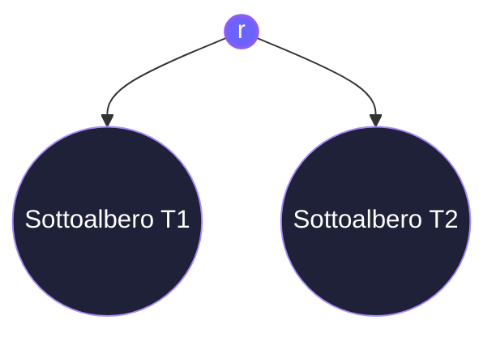
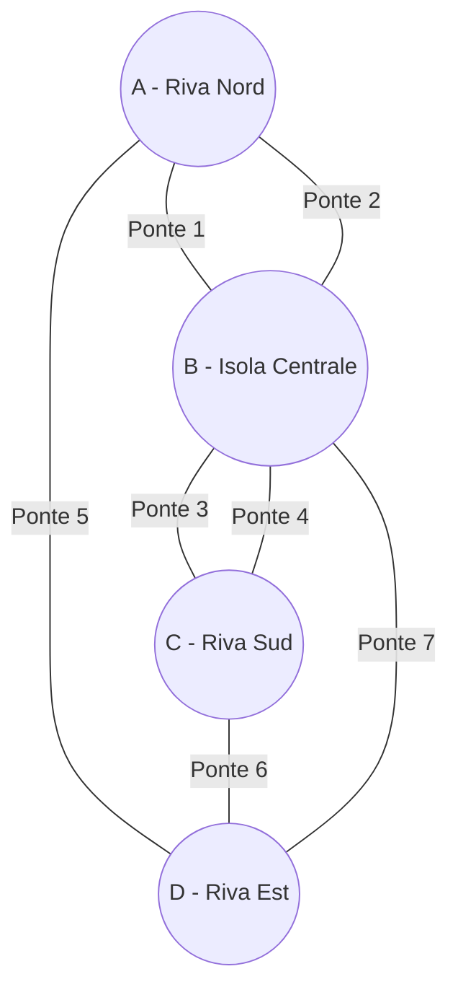
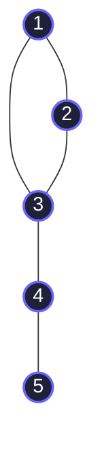
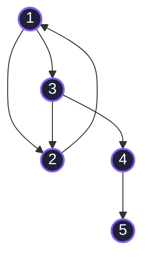
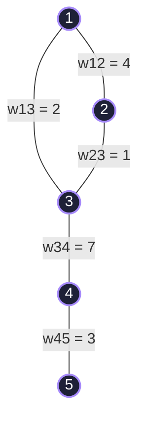
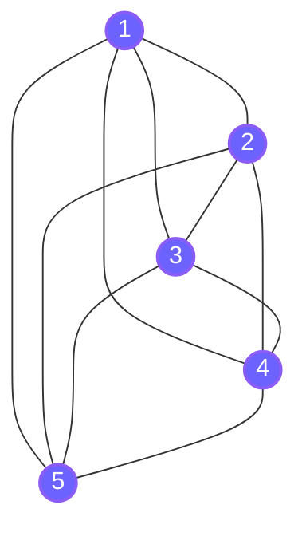
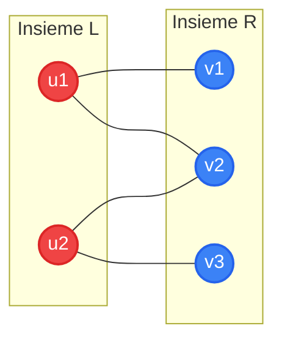
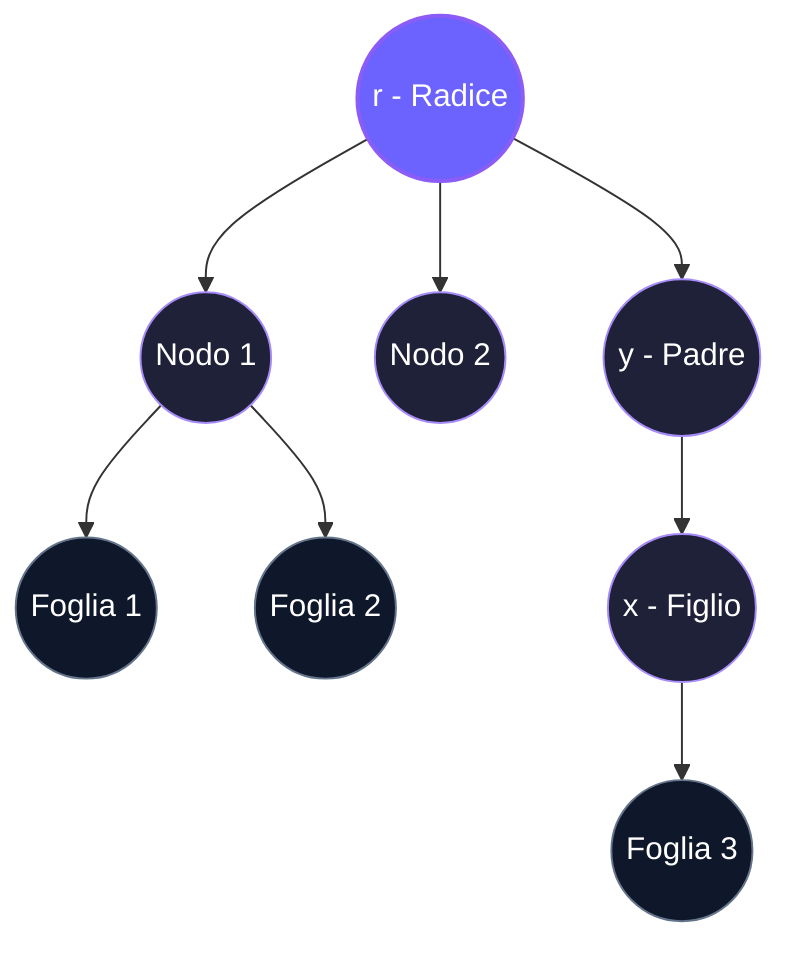
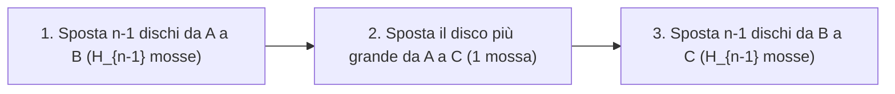

# Metodi Matematici per l'Informatica

> **Autore:** Emanuele Ragozzini

## Indice dei Contenuti

- [Capitolo 1 — Logica Proposizionale ed Equivalenze](#capitolo-1-logica-proposizionale-ed-equivalenze)
  - [1.1 Cos'è una Proposizione?](#11-cosè-una-proposizione)
  - [1.2 Connettivi Logici Fondamentali](#12-connettivi-logici-fondamentali)
  - [1.3 Implicazione Condizionale ($p \to q$)](#13-implicazione-condizionale-p-to-q)
  - [1.4 Bicondizionale o Doppia Implicazione ($p \leftrightarrow q$)](#14-bicondizionale-o-doppia-implicazione-p-leftrightarrow-q)
  - [1.5 Costruzione di Tavole di Verità per Formule Complesse](#15-costruzione-di-tavole-di-verità-per-formule-complesse)
  - [1.6 Tautologie, Contraddizioni e Contingenze](#16-tautologie-contraddizioni-e-contingenze)
  - [1.7 Tabella delle Equivalenze Proposizionali Notevoli](#17-tabella-delle-equivalenze-proposizionali-notevoli)
- [Capitolo 2 — Logica dei Predicati e Quantificatori](#capitolo-2-logica-dei-predicati-e-quantificatori)
  - [2.1 Predicati, Variabili e Domini di Discorso](#21-predicati-variabili-e-domini-di-discorso)
  - [2.2 Quantificatore Universale ($\forall$)](#22-quantificatore-universale-forall)
  - [2.3 Quantificatore Esistenziale ($\exists$)](#23-quantificatore-esistenziale-exists)
  - [2.4 Negazione dei Quantificatori (De Morgan per Predicati)](#24-negazione-dei-quantificatori-de-morgan-per-predicati)
  - [2.5 Quantificatori Multipli e Annidati](#25-quantificatori-multipli-e-annidati)
- [Capitolo 3 — Teoria degli Insiemi e Operazioni Insiemistiche](#capitolo-3-teoria-degli-insiemi-e-operazioni-insiemistiche)
  - [3.1 Rappresentazione degli Insiemi e Insiemi Notevoli](#31-rappresentazione-degli-insiemi-e-insiemi-notevoli)
  - [3.2 Sottoinsiemi, Cardinalità e Insieme delle Parti](#32-sottoinsiemi-cardinalità-e-insieme-delle-parti)
  - [3.3 Operazioni Fondamentali tra Insiemi](#33-operazioni-fondamentali-tra-insiemi)
  - [3.4 Prodotto Cartesiano ($A \times B$)](#34-prodotto-cartesiano-a-times-b)
  - [3.5 Isomorfismo tra Logica Proposizionale e Insiemistica](#35-isomorfismo-tra-logica-proposizionale-e-insiemistica)
- [Capitolo 4 — Metodi di Dimostrazione Matematica](#capitolo-4-metodi-di-dimostrazione-matematica)
  - [4.1 Anatomia di un Teorema e Definizioni di Base](#41-anatomia-di-un-teorema-e-definizioni-di-base)
  - [4.2 Dimostrazione Diretta](#42-dimostrazione-diretta)
  - [4.3 Dimostrazione per Contrapposizione (Contronominale)](#43-dimostrazione-per-contrapposizione-contronominale)
  - [4.4 Dimostrazione per Assurdo (per Contraddizione)](#44-dimostrazione-per-assurdo-per-contraddizione)
  - [4.5 Dimostrazione per Analisi dei Casi](#45-dimostrazione-per-analisi-dei-casi)
  - [4.6 Dimostrazioni di Esistenza e Unicità](#46-dimostrazioni-di-esistenza-e-unicità)
  - [4.7 Uso dei Controesempi](#47-uso-dei-controesempi)
- [Capitolo 5 — Principio di Induzione Matematica](#capitolo-5-principio-di-induzione-matematica)
  - [5.1 Il Principio di Induzione Semplice](#51-il-principio-di-induzione-semplice)
  - [5.2 Esempi Fondamentali Svolti Passo-Passo](#52-esempi-fondamentali-svolti-passo-passo)
  - [5.3 Principio di Induzione Forte (o Completa)](#53-principio-di-induzione-forte-o-completa)
- [Capitolo 6 — Definizioni Ricorsive e Induzione Strutturale](#capitolo-6-definizioni-ricorsive-e-induzione-strutturale)
  - [6.1 Funzioni Definite Ricorsivamente](#61-funzioni-definite-ricorsivamente)
  - [6.2 Insiemi e Strutture Dati Definiti Ricorsivamente](#62-insiemi-e-strutture-dati-definiti-ricorsivamente)
  - [6.3 Alberi Binari Pieni (Full Binary Trees)](#63-alberi-binari-pieni-full-binary-trees)
  - [6.4 Principio di Induzione Strutturale](#64-principio-di-induzione-strutturale)
  - [6.5 Teorema degli Alberi Binari Pieni per Induzione Strutturale](#65-teorema-degli-alberi-binari-pieni-per-induzione-strutturale)
- [Capitolo 7 — Teoria dei Grafi, Cammini e Alberi](#capitolo-7-teoria-dei-grafi-cammini-e-alberi)
  - [7.1 Origine Storica e il Problema dei Ponti di Königsberg](#71-origine-storica-e-il-problema-dei-ponti-di-königsberg)
  - [7.2 Grafi Non Direzionati](#72-grafi-non-direzionati)
  - [7.3 Grafi Direzionati (Digrafi)](#73-grafi-direzionati-digrafi)
  - [7.4 Grafi Pesati](#74-grafi-pesati)
  - [7.5 Cammini, Cicli e Metriche di Rete](#75-cammini-cicli-e-metriche-di-rete)
  - [7.6 Famiglie Speciali di Grafi](#76-famiglie-speciali-di-grafi)
  - [7.7 Alberi e Alberi Radicati](#77-alberi-e-alberi-radicati)
- [Capitolo 8 — Relazioni di Ricorrenza e Metodi Risolutivi](#capitolo-8-relazioni-di-ricorrenza-e-metodi-risolutivi)
  - [8.1 Definizione e Condizioni Iniziali](#81-definizione-e-condizioni-iniziali)
  - [8.2 Metodo di Srotolamento / Iterazione (Unrolling)](#82-metodo-di-srotolamento-iterazione-unrolling)
  - [8.3 Ricorrenze Lineari Omogenee a Coefficienti Costanti](#83-ricorrenze-lineari-omogenee-a-coefficienti-costanti)
  - [8.4 Esempio Risolto: La Formula Chiusa di Fibonacci (Formula di Binet)](#84-esempio-risolto-la-formula-chiusa-di-fibonacci-formula-di-binet)
  - [8.5 Quadro di Sintesi delle Ricorrenze Fondamentali](#85-quadro-di-sintesi-delle-ricorrenze-fondamentali)

---

## Capitolo 1 — Logica Proposizionale ed Equivalenze

La **logica matematica** costituisce il fondamento teorico su cui poggia l'intera informatica: dalla progettazione delle architetture hardware e dei circuiti digitali, fino alla semantica dei linguaggi di programmazione, alla verifica formale del software e all'intelligenza artificiale.

---

### 1.1 Cos'è una Proposizione?

> [!NOTE]
> Una **proposizione** (o *enunciato dichiarativo*) è un'asserzione linguistica che esprime un fatto suscettibile di essere univocamente **VERO** ($V$ o $1$) oppure **FALSO** ($F$ o $0$), ma non entrambi contemporaneamente.

La logica classica si basa su due principi cardine formulati fin dall'antichità:
1. **Principio di Non Contraddizione:** una proposizione non può essere contemporaneamente sia vera che falsa.
2. **Principio del Terzo Escluso (*Tertium non datur*):** una proposizione è necessariamente o vera o falsa; non esiste un terzo valore di verità intermedio.

**Esempi di Proposizioni:**
- *"Roma è la capitale d'Italia."* $\implies$ **Vero ($V$)**
- *"Il numero $7$ è pari."* $\implies$ **Falso ($F$)**
- *"$2 + 3 = 5$"* $\implies$ **Vero ($V$)**
- *"Nel linguaggio C, un array di dimensione $N$ ha indici da $0$ a $N-1$."* $\implies$ **Vero ($V$)**

**Frasi che NON sono Proposizioni:**
- *"Che ore sono?"* (Domanda)
- *"Chiudi la finestra!"* (Comando / Imperativo)
- *"Questa affermazione è falsa."* (Paradosso del mentitore: se fosse vera sarebbe falsa, se fosse falsa sarebbe vera)
- *"$x + 2 = 5$"* (Enunciato aperto: il valore di verità dipende dal valore della variabile $x$; diventerà una proposizione nella *Logica dei Predicati*).

Le proposizioni elementari sono indicate convenzionalmente con lettere minuscole: $p, q, r, s, \dots$.

---

### 1.2 Connettivi Logici Fondamentali

Combinando proposizioni semplici mediante i **connettivi logici** (o *operatori booleani*) si ottengono **proposizioni composte**.

#### 1. Negazione (NOT — $\neg p$ oppure $\sim p$)
La negazione inverte il valore di verità della proposizione: se $p$ è vera, $\neg p$ è falsa; se $p$ è falsa, $\neg p$ è vera.

| $p$ | $\neg p$ |
| :---: | :---: |
| $V$ | $F$ |
| $F$ | $V$ |

#### 2. Congiunzione (AND — $p \wedge q$)
La frase *"p e q"* è vera **se e solo se entrambe** le proposizioni $p$ e $q$ sono vere. Se almeno una delle due è falsa, l'intera congiunzione risulta falsa.

| $p$ | $q$ | $p \wedge q$ |
| :---: | :---: | :---: |
| $V$ | $V$ | $V$ |
| $V$ | $F$ | $F$ |
| $F$ | $V$ | $F$ |
| $F$ | $F$ | $F$ |

#### 3. Disgiunzione Inclusiva (OR — $p \vee q$)
La frase *"p o q"* (in senso inclusivo, dal latino *vel*) è vera se **almeno una** tra $p$ e $q$ è vera. Risulta falsa soltanto quando entrambe sono contemporaneamente false.

| $p$ | $q$ | $p \vee q$ |
| :---: | :---: | :---: |
| $V$ | $V$ | $V$ |
| $V$ | $F$ | $V$ |
| $F$ | $V$ | $V$ |
| $F$ | $F$ | $F$ |

#### 4. Disgiunzione Esclusiva (XOR — $p \oplus q$)
La disgiunzione esclusiva (dal latino *aut... aut*) è vera se **esattamente una sola** delle due proposizioni è vera (ovvero quando $p$ e $q$ hanno valori di verità discordi).

| $p$ | $q$ | $p \oplus q$ |
| :---: | :---: | :---: |
| $V$ | $V$ | $F$ |
| $V$ | $F$ | $V$ |
| $F$ | $V$ | $V$ |
| $F$ | $F$ | $F$ |

---

### 1.3 Implicazione Condizionale ($p \to q$)

L'**implicazione materiale** esprime l'asserzione *"Se p, allora q"*. 
- La proposizione $p$ è detta **antecedente** (o *ipotesi*).
- La proposizione $q$ è detta **conseguente** (o *tesi*).

> [!IMPORTANT]
> L'implicazione $p \to q$ è **FALSA in un solo caso**: quando l'ipotesi $p$ è VERA ma la tesi $q$ è FALSA. In tutti gli altri casi l'implicazione è convenzionalmente **VERA** (*verità per vacuità* quando l'antecedente è falso).

| $p$ | $q$ | $p \to q$ |
| :---: | :---: | :---: |
| $V$ | $V$ | $V$ |
| $V$ | $F$ | $F$ |
| $F$ | $V$ | $V$ |
| $F$ | $F$ | $V$ |

**Come si legge la formula $p \to q$ in linguaggio naturale:**
1. *"Se $p$, allora $q$"*
2. *"$p$ implica $q$"*
3. *"$p$ solo se $q$"* (se vale $p$, necessariamente deve valere $q$)
4. *"$p$ è condizione **sufficiente** per $q$"* (basta che sia vera $p$ per garantire che $q$ sia vera)
5. *"$q$ è condizione **necessaria** per $p$"* (se $q$ fosse falsa, $p$ non potrebbe essere vera).

---

### 1.4 Bicondizionale o Doppia Implicazione ($p \leftrightarrow q$)

La proposizione **bicondizionale** *"p se e solo se q"* (spesso abbreviato in *sse* o *iff*) esprime la reciproca equivalenza: è **VERA** quando $p$ e $q$ hanno lo **stesso identico valore di verità** (entrambe vere o entrambe false).

| $p$ | $q$ | $p \leftrightarrow q$ |
| :---: | :---: | :---: |
| $V$ | $V$ | $V$ |
| $V$ | $F$ | $F$ |
| $F$ | $V$ | $F$ |
| $F$ | $F$ | $V$ |

**Modi di lettura di $p \leftrightarrow q$:**
- *"$p$ se e solo se $q$"*
- *"$p$ è condizione **necessaria e sufficiente** per $q$"*
- *"$p$ è equivalente a $q$"*.

---

### 1.5 Costruzione di Tavole di Verità per Formule Complesse

Per analizzare il comportamento logico di un'espressione booleana complessa contenente $n$ variabili proposizionali indipendenti, si costruisce una tavola di verità con **$2^n$ righe**.

**Esempio Guidato:** Valutiamo la formula composta $(p \vee \neg q) \to (p \wedge q)$.

Poiché ci sono 2 variabili ($p, q$), la tabella avrà $2^2 = 4$ righe:

| $p$ | $q$ | $\neg q$ | $p \vee \neg q$ (A) | $p \wedge q$ (B) | $(p \vee \neg q) \to (p \wedge q)$ ($A \to B$) |
| :---: | :---: | :---: | :---: | :---: | :---: |
| $V$ | $V$ | $F$ | $V$ | $V$ | **$V$** |
| $V$ | $F$ | $V$ | $V$ | $F$ | **$F$** |
| $F$ | $V$ | $F$ | $F$ | $F$ | **$V$** |
| $F$ | $F$ | $V$ | $V$ | $F$ | **$F$** |

---

### 1.6 Tautologie, Contraddizioni e Contingenze

In base ai valori assunti nell'ultima colonna della tavola di verità, una proposizione composta si classifica in:

1. **Tautologia:** Una proposizione che risulta **sempre VERA** per qualsiasi combinazione di valori di verità delle variabili componenti (es. il principio del terzo escluso: $p \vee \neg p \equiv V$).
2. **Contraddizione (o Antilogia):** Una proposizione che risulta **sempre FALSA** per qualsiasi combinazione di valori di verità (es. $p \wedge \neg p \equiv F$).
3. **Contingenza:** Una proposizione che non è né una tautologia né una contraddizione (assume valore $V$ per alcune combinazioni e $F$ per altre, come la formula analizzata al paragrafo 1.5).

---

### 1.7 Tabella delle Equivalenze Proposizionali Notevoli

Due proposizioni composte $A$ e $B$ si dicono **logicamente equivalenti** (notazione $A \equiv B$ oppure $A \iff B$) se la proposizione bicondizionale $A \leftrightarrow B$ è una **tautologia**.

| Nome della Proprietà | Equivalenza Logica |
| :--- | :--- |
| **Leggi di Identità** | $p \wedge V \equiv p$   $p \vee F \equiv p$ |
| **Leggi di Dominazione (Annullamento)** | $p \vee V \equiv V$   $p \wedge F \equiv F$ |
| **Leggi di Idempotenza** | $p \vee p \equiv p$   $p \wedge p \equiv p$ |
| **Legge della Doppia Negazione** | $\neg(\neg p) \equiv p$ |
| **Leggi Commutative** | $p \vee q \equiv q \vee p$   $p \wedge q \equiv q \wedge p$ |
| **Leggi Associative** | $(p \vee q) \vee r \equiv p \vee (q \vee r)$   $(p \wedge q) \wedge r \equiv p \wedge (q \wedge r)$ |
| **Leggi Distributive** | $p \vee (q \wedge r) \equiv (p \vee q) \wedge (p \vee r)$   $p \wedge (q \vee r) \equiv (p \wedge q) \vee (p \wedge r)$ |
| **Leggi di De Morgan** | $\neg(p \wedge q) \equiv \neg p \vee \neg q$   $\neg(p \vee q) \equiv \neg p \wedge \neg q$ |
| **Leggi di Assorbimento** | $p \vee (p \wedge q) \equiv p$   $p \wedge (p \vee q) \equiv p$ |
| **Leggi del Complemento (Negazione)** | $p \vee \neg p \equiv V$   $p \wedge \neg p \equiv F$ |

#### Equivalenze Fondamentali dell'Implicazione:
- **Implicazione Materiale:**
  $$p \to q \equiv \neg p \vee q$$
- **Contrapposizione (Contronominale):**
  $$p \to q \equiv \neg q \to \neg p$$
- **Negazione dell'Implicazione:**
  $$\neg(p \to q) \equiv p \wedge \neg q$$
- **Bicondizionale come Doppia Implicazione:**
  $$p \leftrightarrow q \equiv (p \to q) \wedge (q \to p) \equiv (\neg p \vee q) \wedge (\neg q \vee p)$$

> [!TIP]
> **Implicazione, Inversa, Contraria e Contronominale:**
> Data l'implicazione diretta $p \to q$:
> - **Contronominale:** $\neg q \to \neg p$ $\implies$ **Equivalente** all'originale ($p \to q \equiv \neg q \to \neg p$).
> - **Inversa:** $q \to p$ $\implies$ **NON equivalente** all'originale.
> - **Contraria:** $\neg p \to \neg q$ $\implies$ **NON equivalente** all'originale (ma equivalente all'inversa).

---

## Capitolo 2 — Logica dei Predicati e Quantificatori

La logica proposizionale non è sufficiente per esprimere asserzioni matematiche generali del tipo *"Tutti gli interi pari sono divisibili per 2"* o *"Esiste un numero reale il cui quadrato è 2"*. Per superare questi limiti si introduce la **Logica del Primo Ordine** (o *Logica dei Predicati*).

---

### 2.1 Predicati, Variabili e Domini di Discorso

Consideriamo l'enunciato: *"x è maggiore di 3"*.
- L'enunciato è composto dalla variabile $x$ (il *soggetto*) e dalla proprietà *"è maggiore di 3"* (il **predicato** $P$).
- Indichiamo l'enunciato aperto come **funzione proposizionale** $P(x)$.

> [!NOTE]
> Una funzione proposizionale $P(x)$ non possiede un valore di verità finché alla variabile $x$ non viene assegnato un valore specifico appartenente al **Dominio del Discorso** (o *Universo* $U$).

**Esempio:** Sia $P(x) = \text{"}x > 3\text{"}$ con dominio $U = \mathbb{Z}$ (insieme degli interi):
- Per $x = 5 \implies P(5) = \text{"}5 > 3\text{"}$ è **Vero ($V$)**.
- Per $x = 2 \implies P(2) = \text{"}2 > 3\text{"}$ è **Falso ($F$)**.

Possiamo definire predicati a più variabili, come $Q(x, y) = \text{"}x + y = 10\text{"}$ su $U = \mathbb{N} \times \mathbb{N}$:
- $Q(3, 7) \implies 3 + 7 = 10$ è **Vero ($V$)**.
- $Q(4, 5) \implies 4 + 5 = 10$ è **Falso ($F$)**.

---

### 2.2 Quantificatore Universale ($\forall$)

> [!IMPORTANT]
> L'asserzione **$\forall x \, P(x)$** si legge *"Per ogni x, P(x)"* oppure *"Per tutti gli x, P(x)"*.
> - È **VERA** se e solo se $P(x)$ è vera per **OGNI** elemento $x$ appartenente al dominio $U$.
> - È **FALSA** se esiste anche **UN SOLO** elemento $x_0 \in U$ per cui $P(x_0)$ è falsa (tale elemento $x_0$ è detto **controesempio**).

**Legame con la Congiunzione su Domini Finiti:**
Se il dominio $U$ è un insieme finito $\{a_1, a_2, \dots, a_n\}$, allora:
$$\forall x \, P(x) \equiv P(a_1) \wedge P(a_2) \wedge \dots \wedge P(a_n)$$

**Esempi:**
1. Sia $P(x) = \text{"}x^2 \ge 0\text{"}$ con $U = \mathbb{R}$. Poiché il quadrato di qualunque numero reale è non negativo, $\forall x \, P(x)$ è **VERA**.
2. Sia $Q(x) = \text{"}x^2 > 0\text{"}$ con $U = \mathbb{R}$. Per $x = 0$ abbiamo $0^2 = 0 \not> 0$. Il valore $x = 0$ è un controesempio, quindi $\forall x \, Q(x)$ è **FALSA**.

---

### 2.3 Quantificatore Esistenziale ($\exists$)

> [!IMPORTANT]
> L'asserzione **$\exists x \, P(x)$** si legge *"Esiste un x tale che P(x)"* oppure *"Per qualche x vale P(x)"*.
> - È **VERA** se esiste **almeno un** elemento $x_0 \in U$ per il quale $P(x_0)$ è vera.
> - È **FALSA** se e solo se $P(x)$ è falsa per **TUTTI** gli elementi $x \in U$.

**Legame con la Disgiunzione su Domini Finiti:**
Se il dominio $U = \{a_1, a_2, \dots, a_n\}$ è finito:
$$\exists x \, P(x) \equiv P(a_1) \vee P(a_2) \vee \dots \vee P(a_n)$$

**Quantificatore di Unicità ($\exists!$):**
La notazione $\exists! x \, P(x)$ indica che esiste **uno ed un solo** elemento $x \in U$ per cui $P(x)$ è vera.

---

### 2.4 Negazione dei Quantificatori (De Morgan per Predicati)

Negare un'asserzione quantificata equivale a invertire il quantificatore e negare il predicato:

$$\neg \forall x \, P(x) \equiv \exists x \, \neg P(x)$$
$$\neg \exists x \, P(x) \equiv \forall x \, \neg P(x)$$

**Interpretazione Intuitiva:**
- Negare che *"Tutti gli studenti hanno superato l'esame"* equivale ad affermare che *"Esiste almeno uno studente che non ha superato l'esame"*.
- Negare che *"Esiste un corvo bianco"* equivale ad affermare che *"Tutti i corvi non sono bianchi"*.

---

### 2.5 Quantificatori Multipli e Annidati

Quando un'espressione logica contiene più variabili, l'ordine dei quantificatori è fondamentale per determinare il significato e il valore di verità.

| Quantificazione | Significato in Linguaggio Naturale | Condizione di Verità |
| :--- | :--- | :--- |
| **$\forall x \forall y \, P(x, y)$** | Per ogni coppia $(x, y)$, $P(x, y)$ è vera | Vera per tutte le coppie $(x, y)$ |
| **$\forall x \exists y \, P(x, y)$** | Per ogni $x$, esiste un $y$ (che può dipendere da $x$) tale che $P(x, y)$ è vera | Per ciascun $x$, troviamo almeno un $y$ adatto |
| **$\exists x \forall y \, P(x, y)$** | Esiste un $x$ globale tale che, per tutti gli $y$, $P(x, y)$ è vera | Un singolo $x$ funziona per tutti gli $y$ contemporaneamente |
| **$\exists x \exists y \, P(x, y)$** | Esiste almeno una coppia $(x, y)$ per cui $P(x, y)$ è vera | Basta trovare una singola coppia |

> [!WARNING]
> **Attenzione all'inversione dei quantificatori:**
> In generale, $\exists y \forall x \, P(x, y) \implies \forall x \exists y \, P(x, y)$, ma il viceversa **NON** è vero!
> 
> **Esempio su $U = \mathbb{R}$ con $P(x, y) = \text{"}x + y = 0\text{"}$:**
> - $\forall x \exists y \, (x + y = 0)$: **VERO** (per ogni numero $x$, basta scegliere il suo opposto $y = -x$).
> - $\exists y \forall x \, (x + y = 0)$: **FALSO** (non esiste un unico numero $y$ che sommato a *qualsiasi* $x$ dia sempre zero).

---

## Capitolo 3 — Teoria degli Insiemi e Operazioni Insiemistiche

Un **insieme** è una collezione ben definita di oggetti distinti e non ordinati, chiamati **elementi** dell'insieme. Se un elemento $x$ appartiene all'insieme $A$, scriviamo $x \in A$; se non vi appartiene, scriviamo $x \notin A$.

---

### 3.1 Rappresentazione degli Insiemi e Insiemi Notevoli

Un insieme può essere rappresentato in due modalità:
1. **Rappresentazione Estensionale (per elencazione):** si elencano esplicitamente tutti gli elementi tra parentesi graffe:
   $$A = \{1, 2, 3, 4, 5\}$$
2. **Rappresentazione Intensionale (per proprietà caratteristica):** si specifica la proprietà logica $P(x)$ che accomuna tutti e soli gli elementi dell'insieme:
   $$A = \{x \in \mathbb{N} \mid 1 \le x \le 5\}$$

#### Insiemi Numerici Fondamentali:
- $\mathbb{N} = \{0, 1, 2, 3, \dots\}$: Insieme dei numeri naturali.
- $\mathbb{Z} = \{\dots, -2, -1, 0, 1, 2, \dots\}$: Insieme dei numeri interi relativi.
- $\mathbb{Q} = \{\frac{a}{b} \mid a, b \in \mathbb{Z}, b \ne 0\}$: Insieme dei numeri razionali.
- $\mathbb{R}$: Insieme dei numeri reali.
- $\mathbb{C}$: Insieme dei numeri complessi.
- $\emptyset = \{\}$: **Insieme vuoto**, l'unico insieme privo di elementi ($|\emptyset| = 0$).
- $U$: **Insieme universo**, che racchiude tutti gli elementi considerati nel contesto d'indagine.

---

### 3.2 Sottoinsiemi, Cardinalità e Insieme delle Parti

- **Inclusione (Sottoinsieme):** $A \subseteq B \iff \forall x \, (x \in A \to x \in B)$.
- **Inclusione Stretta (Sottoinsieme Proprio):** $A \subset B \iff A \subseteq B \wedge A \ne B$.
- **Uguaglianza tra Insiemi:** Due insiemi sono uguali se e solo se contengono gli stessi elementi:
  $$A = B \iff A \subseteq B \wedge B \subseteq A$$

#### Cardinalità ($|A|$):
La **cardinalità** di un insieme finito $A$ rappresenta il numero dei suoi elementi distinti (es. se $A = \{a, b, c\}$, allora $|A| = 3$).

#### Insieme delle Parti (Power Set — $\mathcal{P}(A)$):
L'insieme delle parti di $A$ è l'insieme formato da **tutti i possibili sottoinsiemi** di $A$, inclusi l'insieme vuoto $\emptyset$ e $A$ stesso:
$$\mathcal{P}(A) = \{S \mid S \subseteq A\}$$

> [!IMPORTANT]
> Se un insieme finito ha cardinalità $|A| = n$, allora la cardinalità dell'insieme delle parti è una potenza di 2:
> $$|\mathcal{P}(A)| = 2^n$$

**Esempio:** Sia $A = \{1, 2\}$ con $|A| = 2$:
$$\mathcal{P}(A) = \{\emptyset, \{1\}, \{2\}, \{1, 2\}\} \implies |\mathcal{P}(A)| = 2^2 = 4$$

---

### 3.3 Operazioni Fondamentali tra Insiemi

Siano $A$ e $B$ sottoinsiemi di un universo $U$:

#### 1. Unione ($A \cup B$)
L'insieme contenente tutti gli elementi che appartengono ad $A$, a $B$ o a entrambi:
$$A \cup B = \{x \mid x \in A \vee x \in B\}$$

#### 2. Intersezione ($A \cap B$)
L'insieme contenente solo gli elementi che appartengono **contemporaneamente** sia ad $A$ sia a $B$:
$$A \cap B = \{x \mid x \in A \wedge x \in B\}$$

#### 3. Insiemi Disgiunti
Due insiemi $A$ e $B$ si dicono **disgiunti** se non hanno elementi in comune:
$$A \cap B = \emptyset$$

#### 4. Differenza Relativa ($A \setminus B$ oppure $A - B$)
L'insieme degli elementi che appartengono ad $A$ ma **non** appartengono a $B$:
$$A \setminus B = \{x \mid x \in A \wedge x \notin B\}$$

#### 5. Complementare Assoluto ($\overline{A}$ o $A^c$)
L'insieme di tutti gli elementi dell'universo $U$ che non appartengono ad $A$:
$$\overline{A} = U \setminus A = \{x \in U \mid x \notin A\}$$

---

### 3.4 Prodotto Cartesiano ($A \times B$)

Il **prodotto cartesiano** di due insiemi $A$ e $B$ è l'insieme di tutte le **coppie ordinate** $(a, b)$ con $a \in A$ e $b \in B$:
$$A \times B = \{(a, b) \mid a \in A \wedge b \in B\}$$

- La cardinalità del prodotto cartesiano è data dal prodotto delle cardinalità:
  $$|A \times B| = |A| \cdot |B|$$

**Esempio:** Siano $A = \{1, 2\}$ e $B = \{x, y, z\}$:
$$A \times B = \{(1, x), (1, y), (1, z), (2, x), (2, y), (2, z)\} \implies |A \times B| = 2 \cdot 3 = 6$$

---

### 3.5 Isomorfismo tra Logica Proposizionale e Insiemistica

Esiste una corrispondenza diretta tra i connettivi della logica proposizionale e le operazioni insiemistiche:

| Logica Proposizionale | Teoria degli Insiemi |
| :--- | :--- |
| Disgiunzione ($\vee$) | Unione ($\cup$) |
| Congiunzione ($\wedge$) | Intersezione ($\cap$) |
| Negazione ($\neg$) | Complementare ($\overline{A}$) |
| Tautologia ($V$) | Insieme Universo ($U$) |
| Contraddizione ($F$) | Insieme Vuoto ($\emptyset$) |
| Implicazione ($p \to q$) | Inclusione ($A \subseteq B$) |
| Equivalenza ($p \equiv q$) | Uguaglianza ($A = B$) |

**Leggi di De Morgan per gli Insiemi:**
$$\overline{A \cup B} = \overline{A} \cap \overline{B}$$
$$\overline{A \cap B} = \overline{A} \cup \overline{B}$$

---

## Capitolo 4 — Metodi di Dimostrazione Matematica

Una **dimostrazione** è una sequenza rigorosa e formalmente corretta di passaggi logici che stabilisce la verità inconfutabile di un enunciato matematico (detto **teorema**), partendo da una serie di premesse vere (dette **ipotesi** o **assiomi**).

---

### 4.1 Anatomia di un Teorema e Definizioni di Base

Un teorema ha generalmente la forma logica di un'implicazione:
$$H \implies T \quad (\text{Ipotesi} \to \text{Tesi})$$

- **Assioma / Postulato:** Proposizione assunta come vera a priori senza bisogno di dimostrazione.
- **Teorema:** Asserzione la cui veridicità viene accertata tramite una dimostrazione.
- **Lemma:** "Teorema ausiliario" o propedeutico, utile per dimostrare un teorema principale più complesso.
- **Corollario:** Conseguenza immediata e diretta derivata da un teorema già dimostrato.
- **Congettura:** Asserzione che si presume vera ma per la quale non è ancora stata trovata una dimostrazione né un controesempio (es. la congettura di Goldbach).

---

### 4.2 Dimostrazione Diretta

> [!NOTE]
> Nella **dimostrazione diretta**, si assume che l'ipotesi $p$ sia vera e, attraverso definizioni matematiche, assiomi e teoremi precedentemente accertati, si deduce passo-passo la verità della tesi $q$.

**Esempio Svolto:** Dimostrare che *"Se $n$ è un intero dispari, allora $n^2$ è dispari."*
1. **Ipotesi:** $n$ è dispari $\implies$ per definizione di numero dispari, esiste un intero $k$ tale che $n = 2k + 1$.
2. **Passaggi algebrici:** Calcoliamo il quadrato di $n$:
   $$n^2 = (2k + 1)^2 = 4k^2 + 4k + 1 = 2(2k^2 + 2k) + 1$$
3. **Deduzione:** Ponendo $m = 2k^2 + 2k$ (che è un intero, poiché $k$ è intero), possiamo scrivere:
   $$n^2 = 2m + 1$$
4. **Conclusione:** Per definizione, $n^2$ è un numero dispari. Q.E.D. (*Quod Erat Demonstrandum*).

---

### 4.3 Dimostrazione per Contrapposizione (Contronominale)

> [!IMPORTANT]
> Sfrutta l'equivalenza logica $p \to q \equiv \neg q \to \neg p$.
> Si assume che la tesi sia **falsa** ($\neg q$) e si dimostra in modo diretto che allora anche l'ipotesi deve essere **falsa** ($\neg p$).

**Esempio Svolto:** Dimostrare che *"Per ogni intero $n$, se $3n + 2$ è dispari, allora $n$ è dispari."*
1. **Enunciato diretto:** $p = \text{"}3n + 2 \text{ è dispari"}$, $q = \text{"}n \text{ è dispari"}$.
2. **Formulazione contronominale ($\neg q \to \neg p$):** *"Se $n$ è pari, allora $3n + 2$ è pari."*
3. **Dimostrazione diretta della contronominale:**
   - Se $n$ è pari, allora $n = 2k$ per qualche intero $k$.
   - Sostituendo nell'espressione:
     $$3n + 2 = 3(2k) + 2 = 6k + 2 = 2(3k + 1)$$
   - Ponendo $m = 3k + 1$ (intero), abbiamo $3n + 2 = 2m$, che è pari per definizione ($\neg p$ è vera).
4. **Conclusione:** Avendo provato $\neg q \to \neg p$, per contrapposizione resta dimostrato che $p \to q$.

---

### 4.4 Dimostrazione per Assurdo (per Contraddizione)

> [!IMPORTANT]
> Si vuole dimostrare la veridicità di una proposizione $P$.
> Si assume per assurdo che $P$ sia **FALSA** (ossia che valga $\neg P$). Se da questa premessa si deriva logicamente una contraddizione palese ($R \wedge \neg R$, come $0 = 1$ oppure che un numero sia contemporaneamente sia pari che dispari), allora l'ipotesi per assurdo $\neg P$ deve essere falsa, e dunque $P$ è necessariamente **VERA**.

**Esempio Classico: Dimostrazione dell'irrazionalità di $\sqrt{2}$**
1. **Assunzione per assurdo:** Supponiamo che $\sqrt{2}$ sia un numero razionale.
2. Esistono allora due interi positivi $a, b$ primi tra loro (frazione ridotta ai minimi termini, $\text{MCD}(a, b) = 1$) tali che:
   $$\sqrt{2} = \frac{a}{b}$$
3. Elevando entrambi i membri al quadrato:
   $$2 = \frac{a^2}{b^2} \implies a^2 = 2b^2$$
4. Poiché $a^2 = 2b^2$, $a^2$ è un numero pari. Ma se il quadrato di un numero è pari, anche il numero stesso $a$ deve essere pari, quindi $a = 2k$ per qualche intero $k$.
5. Sostituendo $a = 2k$ nell'equazione:
   $$(2k)^2 = 2b^2 \implies 4k^2 = 2b^2 \implies b^2 = 2k^2$$
6. Quindi anche $b^2$ è pari, il che implica che anche $b$ è pari.
7. **Contraddizione:** Se sia $a$ che $b$ sono pari, entrambi sono divisibili per $2$, contraddicendo l'ipotesi iniziale che la frazione $\frac{a}{b}$ fosse ridotta ai minimi termini ($\text{MCD}(a, b) = 1$).
8. **Conclusione:** L'ipotesi per assurdo è falsa; dunque $\sqrt{2}$ è irrazionale.

---

### 4.5 Dimostrazione per Analisi dei Casi

Quando un teorema ha un'ipotesi formata da una disgiunzione di condizioni $(p_1 \vee p_2 \vee \dots \vee p_k) \to q$, la dimostrazione si effettua provando separatamente che ciascun singolo caso implica la tesi:
$$(p_1 \to q) \wedge (p_2 \to q) \wedge \dots \wedge (p_k \to q)$$

**Esempio Svolto:** Dimostrare che per ogni intero $n$, il numero $n^2 + n$ è pari.
- **Caso 1 ($n$ è pari):** $n = 2k$.
  $$n^2 + n = (2k)^2 + 2k = 4k^2 + 2k = 2(2k^2 + k) \implies \text{Pari}$$
- **Caso 2 ($n$ è dispari):** $n = 2k + 1$.
  $$n^2 + n = (2k + 1)^2 + (2k + 1) = 4k^2 + 4k + 1 + 2k + 1 = 4k^2 + 6k + 2 = 2(2k^2 + 3k + 1) \implies \text{Pari}$$
In entrambi i casi esaustivi possibili per gli interi, l'espressione è pari.

---

### 4.6 Dimostrazioni di Esistenza e Unicità

- **Dimostrazione di Esistenza Costruttiva:** Per provare $\exists x \, P(x)$, si esibisce esplicitamente un elemento $x_0$ che soddisfa $P(x_0)$.
- **Dimostrazione di Esistenza Non Costruttiva:** Si dimostra che deve esistere un tale elemento (ad esempio per assurdo) senza però calcolarlo esplicitamente.
- **Dimostrazione di Unicità ($\exists! x \, P(x)$):** Si compone di due passi:
  1. *Esistenza:* Si mostra che esiste almeno un elemento $x$ con $P(x)$.
  2. *Unicità:* Si suppone che esistano due elementi $x$ e $y$ che soddisfano la proprietà ($P(x) \wedge P(y)$) e si dimostra che necessariamente $x = y$.

---

### 4.7 Uso dei Controesempi

> [!TIP]
> Per dimostrare che un'asserzione universale $\forall x \, P(x)$ è **FALSA**, non serve una lunga argomentazione teorica: è sufficiente trovare un **singolo controesempio** $x_0 \in U$ tale che $P(x_0)$ sia falsa.

**Esempio:** *"Tutti i numeri primi sono dispari."*
- **Controesempio:** Il numero $2$ è un numero primo, ma è pari. L'asserzione è dunque confutata.

---

## Capitolo 5 — Principio di Induzione Matematica

L'**induzione matematica** è una delle tecniche di dimostrazione più potenti e pervasive dell'informatica, utilizzata per provare proprietà su insiemi discreti, correttezza di algoritmi iterativi e ricorsivi, formule di sommatoria e complessità computazionale.

---

### 5.1 Il Principio di Induzione Semplice

L'induzione matematica si basa sull'ordinamento naturale dei numeri interi:

> [!IMPORTANT]
> Per dimostrare che un predicato $P(n)$ è vero per ogni intero $n \ge 1$ (o $n \ge 0$), il **Principio di Induzione Matematica** richiede due passi:
> 1. **Passo Base:** Dimostrare che $P(1)$ è vera.
> 2. **Passo Induttivo:** Dimostrare che, per ogni generico intero $k \ge 1$, **SE** $P(k)$ è vera (*Ipotesi Induttiva*), **ALLORA** anche $P(k+1)$ è vera.
> 
> Soddisfatti entrambi i passi, $P(n)$ è vera per tutti gli interi $n \ge 1$.

**Analogia del Domino:**
Se la prima tessera cade (*Passo Base*) e ogni volta che una tessera $k$ cade fa cadere la successiva $k+1$ (*Passo Induttivo*), allora cadranno tutte le tessere della fila.

---

### 5.2 Esempi Fondamentali Svolti Passo-Passo

#### Esempio 1: Somma dei primi $n$ numeri interi positivi
Dimostrare per induzione che per ogni $n \ge 1$:
$$\sum_{i=1}^n i = 1 + 2 + 3 + \dots + n = \frac{n(n+1)}{2}$$

1. **Passo Base ($n = 1$):**
   - Membro sinistro: $\sum_{i=1}^1 i = 1$
   - Membro destro: $\frac{1(1+1)}{2} = \frac{2}{2} = 1$
   - Poiché $1 = 1$, il passo base $P(1)$ è **verificato**.

2. **Passo Induttivo:**
   - **Ipotesi Induttiva:** Assumiamo che la formula sia vera per $n = k$:
     $$\sum_{i=1}^k i = \frac{k(k+1)}{2}$$
   - **Tesi Induttiva:** Dobbiamo dimostrare che la formula è vera per $n = k+1$, ovvero che:
     $$\sum_{i=1}^{k+1} i = \frac{(k+1)((k+1)+1)}{2} = \frac{(k+1)(k+2)}{2}$$
   - **Dimostrazione:**
     Spezziamo la sommatoria fino a $k+1$ isolando l'ultimo termine:
     $$\sum_{i=1}^{k+1} i = \left(\sum_{i=1}^k i\right) + (k+1)$$
     Applicando l'ipotesi induttiva al primo blocco:
     $$\sum_{i=1}^{k+1} i = \frac{k(k+1)}{2} + (k+1)$$
     Mettiamo a fattor comune $(k+1)$:
     $$= (k+1) \left(\frac{k}{2} + 1\right) = (k+1) \left(\frac{k+2}{2}\right) = \frac{(k+1)(k+2)}{2}$$
   - La tesi induttiva $P(k+1)$ è dimostrata.
3. **Conclusione:** Per il principio di induzione matematica, la formula vale per ogni $n \ge 1$.

---

#### Esempio 2: Somma delle potenze di 2 (Progressione Geometrica)
Dimostrare che per ogni $n \ge 0$:
$$\sum_{i=0}^n 2^i = 1 + 2 + 4 + \dots + 2^n = 2^{n+1} - 1$$

1. **Passo Base ($n = 0$):**
   - Membro sinistro: $2^0 = 1$
   - Membro destro: $2^{0+1} - 1 = 2 - 1 = 1$ $\implies$ **Verificato**.
2. **Passo Induttivo:**
   - Ipotesi induttiva: $\sum_{i=0}^k 2^i = 2^{k+1} - 1$.
   - Dimostriamo per $k+1$:
     $$\sum_{i=0}^{k+1} 2^i = \left(\sum_{i=0}^k 2^i\right) + 2^{k+1} = (2^{k+1} - 1) + 2^{k+1}$$
     $$= 2 \cdot 2^{k+1} - 1 = 2^{k+2} - 1 = 2^{(k+1)+1} - 1$$
3. La formula è verificata per tutti gli $n \ge 0$.

---

#### Esempio 3: Disuguaglianze per Induzione
Dimostrare che $2^n > n^2$ per ogni intero $n \ge 5$.

1. **Passo Base ($n = 5$):**
   - $2^5 = 32$
   - $5^2 = 25$
   - Poiché $32 > 25$, $P(5)$ è **vera**.
2. **Passo Induttivo ($k \ge 5$):**
   - Ipotesi: $2^k > k^2$.
   - Dobbiamo provare che $2^{k+1} > (k+1)^2$.
   - Riscriviamo $2^{k+1}$:
     $$2^{k+1} = 2 \cdot 2^k > 2k^2 = k^2 + k^2$$
   - Poiché $k \ge 5$, sappiamo che $k^2 \ge 5k > 2k + 1$ (infatti per $k \ge 5$: $k(k-2) \ge 15 > 1$).
   - Sostituendo:
     $$2^{k+1} > k^2 + k^2 > k^2 + 2k + 1 = (k+1)^2$$
3. La disuguaglianza $2^n > n^2$ vale per ogni $n \ge 5$.

---

### 5.3 Principio di Induzione Forte (o Completa)

Nel principio di **induzione forte**, l'ipotesi induttiva viene estesa assumendo che la proprietà sia vera per **TUTTI** gli interi da $1$ fino a $k$, e non solo per l'ultimo intero $k$:

> [!NOTE]
> 1. **Passo Base:** Si dimostra che $P(1)$ (o $P(b)$) è vera.
> 2. **Passo Induttivo:** Si dimostra che se $P(j)$ è vera per tutti i $j$ tali che $1 \le j \le k$, allora $P(k+1)$ è vera:
>    $$\left[\bigwedge_{j=1}^k P(j)\right] \implies P(k+1)$$

**Quando si usa?** L'induzione forte è fondamentale quando il valore di $P(k+1)$ dipende non solo dal predecessore immediato $k$, ma da uno o più predecessori remoti (es. analisi degli algoritmi Divide et Impera, numeri di Fibonacci o proprietà dei numeri primi).

---

## Capitolo 6 — Definizioni Ricorsive e Induzione Strutturale

In informatica, molti oggetti (strutture dati, linguaggi di programmazione, alberi, espressioni) possiedono una natura intrinsecamente ricorsiva: contengono al loro interno istanze più piccole dello stesso tipo di oggetto.

---

### 6.1 Funzioni Definite Ricorsivamente

Una definizione ricorsiva di una funzione con dominio sui numeri naturali si articola in due componenti:
1. **Passo Base:** Specifica il valore della funzione all'indice zero (o a uno o più valori iniziali).
2. **Passo Ricorsivo:** Fornisce una regola algebrica per calcolare il valore della funzione a un indice successivo $n+1$ a partire dai suoi valori precedentemente calcolati.

#### Esempi di Funzioni Ricorsive:

1. **Funzione Fattoriale ($n!$):**
   - *Base:* $0! = 1$
   - *Ricorsione:* $(n+1)! = (n+1) \cdot n!$

2. **Successione di Fibonacci ($F_n$):**
   - *Base:* $F_0 = 0, \quad F_1 = 1$
   - *Ricorsione:* $F_n = F_{n-1} + F_{n-2} \quad \text{per } n \ge 2$

3. **Potenza intera ($a^n$):**
   - *Base:* $a^0 = 1$
   - *Ricorsione:* $a^{n+1} = a \cdot a^n$

---

### 6.2 Insiemi e Strutture Dati Definiti Ricorsivamente

Un insieme $S$ può essere specificato fornendo gli elementi atomici di partenza e le regole di composizione:

#### Esempio 1: L'insieme delle Stringhe $\Sigma^*$ su un alfabeto $\Sigma$
- **Passo Base:** La stringa vuota appartiene all'insieme: $\lambda \in \Sigma^*$.
- **Passo Ricorsivo:** Se $w \in \Sigma^*$ e $x \in \Sigma$, allora la concatenazione $wx \in \Sigma^*$.

#### Esempio 2: Espressioni Aritmetiche Ben Formate
- **Passo Base:** Qualsiasi costante numerica $c$ o variabile $x$ è un'espressione aritmetica.
- **Passo Ricorsivo:** Se $E_1$ ed $E_2$ sono espressioni aritmetiche, allora sono espressioni anche:
  $$(E_1 + E_2), \quad (E_1 - E_2), \quad (E_1 \cdot E_2), \quad (E_1 / E_2)$$

---

### 6.3 Alberi Binari Pieni (Full Binary Trees)

> [!NOTE]
> Un **albero binario pieno** è un albero radicato in cui ogni vertice ha **esattamente 0 oppure 2 figli** (nessun vertice ha 1 solo figlio). I due figli sono detti *figlio sinistro* e *figlio destro*.

**Definizione Ricorsiva dell'Albero Binario Pieno:**
- **Passo Base:** Un singolo vertice $r$ costituisce un albero binario pieno (albero banale con solo la radice).
- **Passo Ricorsivo:** Se $T_1$ e $T_2$ sono alberi binari pieni disgiunti, allora la struttura $T = r \cdot (T_1, T_2)$ ottenuta collegando una nuova radice $r$ alla radice di $T_1$ come figlio sinistro e alla radice di $T_2$ come figlio destro è un albero binario pieno.

#### Funzioni Ricorsive su Alberi Binari Pieni:
Definiamo due grandezze fondamentali per un albero $T$:
1. **Numero di vertici interni con due figli $d(T)$:**
   - *Base:* $d(r) = 0$
   - *Ricorsione:* $d(T) = 1 + d(T_1) + d(T_2)$
2. **Numero di foglie $f(T)$:**
   - *Base:* $f(r) = 1$
   - *Ricorsione:* $f(T) = f(T_1) + f(T_2)$

---

### 6.4 Principio di Induzione Strutturale

Per dimostrare che una data proprietà $P(x)$ vale per **tutti** gli elementi di un insieme o struttura definita ricorsivamente, si utilizza l'**Induzione Strutturale**:

> [!IMPORTANT]
> 1. **Passo Base:** Dimostrare che la proprietà $P$ è vera per tutti gli elementi specificati nel passo base della definizione ricorsiva.
> 2. **Passo Ricorsivo:** Dimostrare che, se la proprietà $P$ è vera per gli elementi esistenti utilizzati nelle regole di costruzione (*Ipotesi Induttiva*), allora $P$ rimane vera anche per il nuovo elemento generato.

---

### 6.5 Teorema degli Alberi Binari Pieni per Induzione Strutturale

> [!IMPORTANT]
> **Teorema:** In ogni albero binario pieno $T$, il numero di foglie $f(T)$ è sempre uguale al numero di vertici interni con due figli $d(T)$ aumentato di uno:
> $$f(T) = d(T) + 1$$

**Dimostrazione per Induzione Strutturale:**

1. **Passo Base:**
   - Sia $T$ l'albero banale formato da un singolo vertice $r$.
   - Dalle definizioni: $d(r) = 0$ e $f(r) = 1$.
   - Verifichiamo la formula: $f(r) = d(r) + 1 \implies 1 = 0 + 1 = 1$.
   - Il passo base è **verificato**.

2. **Passo Ricorsivo:**
   - **Ipotesi Induttiva:** Assumiamo che la proprietà sia valida per due alberi binari pieni $T_1$ e $T_2$:
     $$f(T_1) = d(T_1) + 1 \quad \text{e} \quad f(T_2) = d(T_2) + 1$$
   - **Tesi Induttiva:** Dobbiamo dimostrare che la proprietà vale per l'albero composto $T = r \cdot (T_1, T_2)$, ovvero che $f(T) = d(T) + 1$.
   - **Dimostrazione:**
     Calcoliamo il numero totale di foglie $f(T)$ usando la definizione ricorsiva e sostituendo l'ipotesi induttiva:
     $$f(T) = f(T_1) + f(T_2) = (d(T_1) + 1) + (d(T_2) + 1) = d(T_1) + d(T_2) + 2$$
     Dalla definizione ricorsiva di $d(T)$, sappiamo che:
     $$d(T) = 1 + d(T_1) + d(T_2) \implies d(T_1) + d(T_2) = d(T) - 1$$
     Sostituendo questa relazione nell'espressione delle foglie:
     $$f(T) = (d(T) - 1) + 2 = d(T) + 1$$
3. La relazione $f(T) = d(T) + 1$ è dimostrata per qualsiasi albero binario pieno $T$. Q.E.D.

---

## Capitolo 7 — Teoria dei Grafi, Cammini e Alberi

I **grafi** sono strutture matematiche discrete che consentono di modellare relazioni a coppie tra oggetti. Trovano applicazione nell'analisi delle reti informatiche, nel routing dei pacchetti, nell'ottimizzazione dei database, nella rappresentazione di social network e nell'allocazione dei registri.

---

### 7.1 Origine Storica e il Problema dei Ponti di Königsberg

La nascita della teoria dei grafi risale al **1736**, quando **Leonhard Euler (Eulero)** risolse il celebre enigma dei *Ponti di Königsberg*:
- La città di Königsberg era attraversata dal fiume Pregel, che divideva il territorio in 4 zone di terraferma collegate da 7 ponti.
- Il problema chiedeva se fosse possibile partire da una qualsiasi zona, compiere una passeggiata che attraversasse **ogni ponte una e una sola volta** e tornare al punto di partenza.

Eulero astrasse il problema trasformando le 4 masse di terra in **vertici (nodi)** e i 7 ponti in **archi (link)**:
- Contando il grado di ciascun vertice (numero di ponti incidenti):
  - $d(A) = 3$ (dispari)
  - $d(B) = 5$ (dispari)
  - $d(C) = 3$ (dispari)
  - $d(D) = 3$ (dispari)
- **Teorema di Eulero:** Un grafo ammette un circuito euleriano chiuso se e solo se è connesso e **tutti i suoi vertici hanno grado pari**. Poiché tutti e 4 i vertici hanno grado dispari, il percorso cercato è **impossibile**.

---

### 7.2 Grafi Non Direzionati

> [!NOTE]
> Un **grafo non direzionato** $G = (V, E)$ è una coppia ordinata costituita da:
> - $V$: un insieme non vuoto di **vertici** (o *nodi*).
> - $E$: un insieme di **archi** (o *link*), dove ciascun arco è una coppia non ordinata di vertici distinti $\{u, v\}$ (spesso indicata come $(u, v)$).

Consideriamo il grafo $G = (V, E)$ con $V = \{1, 2, 3, 4, 5\}$ ed $E = \{(1,2), (1,3), (2,3), (3,4), (4,5)\}$:

#### Definizioni Fondamentali:
1. **Adiacenza:** Due vertici $u$ e $v$ sono *adiacenti* (o *vicini*) se sono uniti da un arco $(u, v) \in E$.
2. **Incidenza:** L'arco $(u, v)$ è *incidente* nei vertici $u$ e $v$.
3. **Intorno (Neighborhood — $N(v)$):** L'insieme dei nodi adiacenti al vertice $v$:
   $$N(v) = \{u \in V \mid (u, v) \in E\}$$
   Nel grafo di esempio: $N(3) = \{1, 2, 4\}$, $N(5) = \{4\}$.
4. **Grado di un Vertice ($d(v)$ o $\text{deg}(v)$):** Il numero di archi incidenti in $v$, equivalente alla cardinalità del suo intorno: $d(v) = |N(v)|$.
   - $d(1) = 2, \quad d(2) = 2, \quad d(3) = 3, \quad d(4) = 2, \quad d(5) = 1$.

> [!IMPORTANT]
> **Handshaking Lemma (Lemma delle Strette di Mano):**
> In ogni grafo non orientato $G = (V, E)$, la somma dei gradi di tutti i vertici è pari al **doppio del numero totale di archi**:
> $$\sum_{v \in V} d(v) = 2 |E|$$
> 
> *Verifica sull'esempio:* $\sum d(v) = 2 + 2 + 3 + 2 + 1 = 10 = 2 \times 5 \implies |E| = 5$.
> 
> **Corollario:** In ogni grafo non orientato, il numero di vertici di grado dispari è sempre **PARI** (nell'esempio, i vertici con grado dispari sono il nodo $3$ e il nodo $5$, esattamente 2 vertici).

---

### 7.3 Grafi Direzionati (Digrafi)

In un **grafo direzionato** (o *digrafo*), ogni arco è una coppia ordinata $\langle u, v \rangle$ dotata di direzione: l'arco parte dal nodo sorgente $u$ e punta al nodo destinazione $v$.

Consideriamo il digrafo con $V = \{1, 2, 3, 4, 5\}$ ed $E = \{\langle 1,2 \rangle, \langle 2,1 \rangle, \langle 1,3 \rangle, \langle 3,2 \rangle, \langle 3,4 \rangle, \langle 4,5 \rangle\}$:

- **In-degree ($d_{in}(v)$ — Grado Entrante):** Numero di archi che entrano nel nodo $v$.
  - $d_{in}(1) = 1, \quad d_{in}(2) = 2, \quad d_{in}(3) = 1, \quad d_{in}(4) = 1, \quad d_{in}(5) = 1$.
- **Out-degree ($d_{out}(v)$ — Grado Uscente):** Numero di archi che escono dal nodo $v$.
  - $d_{out}(1) = 2, \quad d_{out}(2) = 1, \quad d_{out}(3) = 2, \quad d_{out}(4) = 1, \quad d_{out}(5) = 0$.

> [!NOTE]
> In qualsiasi digrafo, la somma di tutti i gradi entranti è uguale alla somma di tutti i gradi uscenti ed è pari al numero totale di archi:
> $$\sum_{v \in V} d_{in}(v) = \sum_{v \in V} d_{out}(v) = |E| = 6$$

---

### 7.4 Grafi Pesati

Un **grafo pesato** è una terna $G = (V, E, w)$ in cui a ogni arco $e = (u, v) \in E$ viene associato un valore numerico reale $w(e)$ (detto **peso** o *costo*):

I pesi possono rappresentare distanze chilometriche, latenze di rete in millisecondi, costi monetari di cablaggio o capacità di flusso.

---

### 7.5 Cammini, Cicli e Metriche di Rete

1. **Cammino (Path):** Una sequenza di vertici $(v_0, v_1, v_2, \dots, v_k)$ tale che $(v_{i-1}, v_i) \in E$ per ogni $i = 1, \dots, k$.
2. **Lunghezza di un Cammino:** Il numero di archi che compongono il cammino (pari a $k$).
3. **Nodi Connessi:** Due nodi $u$ e $v$ si dicono *connessi* se esiste almeno un cammino tra $u$ e $v$. Un grafo è **connesso** se ogni coppia di vertici è connessa.
4. **Ciclo:** Un cammino chiuso in cui il nodo iniziale coincide con quello finale ($v_0 = v_k$) e tutti i vertici intermedi sono distinti.
5. **Cammino Minimo (Shortest Path):** Il cammino di lunghezza minima (o di peso totale minimo) tra due vertici $u$ e $v$.
6. **Diametro di un Grafo:** La lunghezza del cammino minimo più lungo tra tutte le possibili coppie di vertici del grafo:
   $$\text{Diametro}(G) = \max_{u, v \in V} d(u, v)$$

---

### 7.6 Famiglie Speciali di Grafi

#### 1. Grafo Completo o Clique ($K_n$)
Un grafo non orientato di $n$ vertici in cui **ogni coppia di vertici distinti è collegata da un arco**:

- Numero di archi in $K_n$: $|E| = \binom{n}{2} = \frac{n(n-1)}{2}$. Per $K_5$: $|E| = \frac{5 \cdot 4}{2} = 10$.
- Grado di ciascun vertice: $d(v) = n - 1$.

---

#### 2. Grafo Linea ($L_n$ o $P_n$)
Un grafo costituito da un singolo cammino semplice che unisce $n$ vertici in sequenza:

- Numero di archi: $|E| = n - 1$.
- Diametro: $n - 1$.

---

#### 3. Grafo Ciclo ($C_n$)
Un grafo chiuso composto da una catena circolare di $n \ge 3$ vertici:

- Numero di archi: $|E| = n$.
- È un grafo **2-regolare** (tutti i vertici hanno grado $d(v) = 2$).

---

#### 4. Grafo Bipartito
Un grafo $G = (V, E)$ in cui l'insieme dei vertici $V$ può essere partizionato in due insiemi disgiunti $L$ ed $R$ ($V = L \cup R$ con $L \cap R = \emptyset$) tali che ogni arco collega un vertice di $L$ con un vertice di $R$. Non esistono archi che colleghino tra loro due vertici appartenenti allo stesso insieme.

> [!TIP]
> **Teorema di Kőnig:** Un grafo è bipartito se e solo se **NON contiene cicli di lunghezza dispari** (è 2-colorabile).

---

### 7.7 Alberi e Alberi Radicati

> [!NOTE]
> Un **albero** è un grafo non orientato, **connesso e privo di cicli** (aciclico).

Un albero con $n$ vertici possiede sempre esattamente **$n - 1$ archi**.

#### Albero Radicato (Rooted Tree):
Un albero in cui un vertice viene designato in modo univoco come **Radice ($r$)** al livello 0. La radice definisce un orientamento gerarchico naturale:

**Terminologia degli Alberi Radicati:**
- **Padre (Parent):** Il primo vertice $y$ incontrato risalendo dal nodo $x$ verso la radice $r$.
- **Figlio (Child):** Un vertice di cui $y$ è padre.
- **Fratelli (Siblings):** Vertici che condividono lo stesso genitore.
- **Foglia (Leaf):** Un nodo privo di figli.
- **Nodo Interno:** Un vertice che possiede almeno un figlio (non è una foglia).
- **Profondità (o Livello) di un Nodo:** Il numero di archi che compongono il cammino unico dalla radice $r$ al nodo considerato.
- **Altezza dell'Albero ($h(T)$):** La massima profondità raggiunta da un vertice dell'albero.
- **Sottoalbero:** La porzione di albero costituita da un vertice $v$ e da tutti i suoi discendenti.

---

## Capitolo 8 — Relazioni di Ricorrenza e Metodi Risolutivi

In informatica, l'analisi del tempo di esecuzione e del consumo di memoria degli algoritmi ricorsivi (come Merge Sort, Binary Search o algoritmi Divide et Impera) porta alla formulazione di **relazioni di ricorrenza**.

---

### 8.1 Definizione e Condizioni Iniziali

> [!NOTE]
> Una **relazione di ricorrenza** per una sequenza di numeri $a_0, a_1, a_2, \dots, a_n$ è un'equazione che esprime il termine generico $a_n$ in funzione di uno o più termini precedenti della sequenza ($a_{n-1}, a_{n-2}, \dots$).

Per determinare una soluzione univoca alla ricorrenza, è indispensabile specificare una o più **condizioni iniziali** (i valori della sequenza per gli indici base $a_0, a_1, \dots$).

---

### 8.2 Metodo di Srotolamento / Iterazione (Unrolling)

Il metodo di srotolamento (*backward substitution*) consiste nel riespandere ricorsivamente la relazione per un certo numero di passi fino a intuire il pattern algebrico generale in funzione dell'indice iniziale.

#### Esempio 1: Ricorrenza Aritmetica Semplice
Risolvere la relazione:
$$a_n = a_{n-1} + 3 \quad \text{con } a_0 = 2$$

Srotoliamo i primi passi:
- $a_1 = a_0 + 3 = 2 + 3(1)$
- $a_2 = a_1 + 3 = (a_0 + 3) + 3 = 2 + 3(2)$
- $a_3 = a_2 + 3 = 2 + 3(3)$
- $\dots$
- **Forma Chiusa:** $a_n = 2 + 3n$.

---

#### Esempio 2: Il Problema della Torre di Hanoi
Il rompicapo della Torre di Hanoi richiede di spostare $n$ dischi di diametro decrescente da un piolo $A$ a un piolo $C$ utilizzando un piolo ausiliario $B$, senza mai poggiare un disco più grande sopra uno più piccolo.

La relazione di ricorrenza che descrive il numero minimo di mosse $H_n$ è:
$$H_n = 2H_{n-1} + 1 \quad \text{con condizione iniziale } H_1 = 1$$

**Risoluzione per Srotolamento:**
$$H_n = 2 H_{n-1} + 1$$
$$= 2(2 H_{n-2} + 1) + 1 = 2^2 H_{n-2} + 2 + 1$$
$$= 2^2(2 H_{n-3} + 1) + 2 + 1 = 2^3 H_{n-3} + 2^2 + 2^1 + 1$$
Procedendo fino al passo base $H_1$:
$$H_n = 2^{n-1} H_1 + 2^{n-2} + \dots + 2^1 + 2^0$$
Poiché $H_1 = 1$:
$$H_n = \sum_{i=0}^{n-1} 2^i = 2^n - 1$$

> [!TIP]
> Per spostare $n = 64$ dischi dorati nella leggenda dei monaci di Hanoi occorrono $2^{64} - 1 \approx 1.84 \times 10^{19}$ mosse. Eseguendo una mossa al secondo, occorrerebbero circa **584 miliardi di anni**!

---

### 8.3 Ricorrenze Lineari Omogenee a Coefficienti Costanti

Una relazione di ricorrenza lineare omogenea di grado 2 a coefficienti costanti ha la forma:
$$a_n = c_1 a_{n-1} + c_2 a_{n-2} \quad \text{con } c_2 \ne 0$$

Per risolverla, cerchiamo soluzioni esponenziali del tipo $a_n = r^n$. Sostituendo nella relazione:
$$r^n = c_1 r^{n-1} + c_2 r^{n-2} \implies r^{n-2}(r^2 - c_1 r - c_2) = 0$$

Otteniamo l'**Equazione Caratteristica** associata:
$$r^2 - c_1 r - c_2 = 0$$

#### Teorema di Risoluzione:

1. **Caso 1: Due radici reali distinte ($r_1 \ne r_2$):**
   La soluzione generale è una combinazione lineare:
   $$a_n = \alpha_1 r_1^n + \alpha_2 r_2^n$$
   dove le costanti $\alpha_1, \alpha_2$ sono determinate imponendo i valori iniziali $a_0, a_1$.

2. **Caso 2: Una radice reale doppia ($r_1 = r_2 = r$):**
   La soluzione generale è:
   $$a_n = (\alpha_1 + \alpha_2 n) r^n$$

---

### 8.4 Esempio Risolto: La Formula Chiusa di Fibonacci (Formula di Binet)

Determiniamo la formula chiusa per la successione di Fibonacci:
$$F_n = F_{n-1} + F_{n-2} \quad \text{con } F_0 = 0, \quad F_1 = 1$$

1. **Equazione Caratteristica:**
   $$r^2 - r - 1 = 0$$
   Risolvendo con la formula quadratica:
   $$r = \frac{1 \pm \sqrt{1 - 4(1)(-1)}}{2} = \frac{1 \pm \sqrt{5}}{2}$$
   Abbiamo due radici distinte:
   $$r_1 = \frac{1 + \sqrt{5}}{2} = \phi \quad (\text{Rapporto Aureo}), \qquad r_2 = \frac{1 - \sqrt{5}}{2}$$

2. **Forma Generale della Soluzione:**
   $$F_n = \alpha_1 \left(\frac{1 + \sqrt{5}}{2}\right)^n + \alpha_2 \left(\frac{1 - \sqrt{5}}{2}\right)^n$$

3. **Determinazione dei Coefficienti con le Condizioni Iniziali:**
   - Per $n = 0$: $F_0 = \alpha_1 + \alpha_2 = 0 \implies \alpha_2 = -\alpha_1$.
   - Per $n = 1$:
     $$F_1 = \alpha_1 \left(\frac{1 + \sqrt{5}}{2}\right) - \alpha_1 \left(\frac{1 - \sqrt{5}}{2}\right) = 1$$
     $$\alpha_1 \left(\frac{1 + \sqrt{5} - 1 + \sqrt{5}}{2}\right) = 1 \implies \alpha_1 \sqrt{5} = 1 \implies \alpha_1 = \frac{1}{\sqrt{5}}, \quad \alpha_2 = -\frac{1}{\sqrt{5}}$$

4. **Formula Finale di Binet:**
   $$F_n = \frac{1}{\sqrt{5}} \left[ \left(\frac{1 + \sqrt{5}}{2}\right)^n - \left(\frac{1 - \sqrt{5}}{2}\right)^n \right]$$

---

### 8.5 Quadro di Sintesi delle Ricorrenze Fondamentali

| Algoritmo / Problema | Relazione di Ricorrenza | Soluzione in Forma Chiusa |
| :--- | :--- | :--- |
| **Ricerca Binaria** | $T(n) = T(n/2) + O(1)$ | $T(n) = c \log_2 n + d$ |
| **Merge Sort** | $T(n) = 2T(n/2) + O(n)$ | $T(n) = c n \log_2 n + d n$ |
| **Torre di Hanoi** | $H(n) = 2H(n-1) + 1$ | $H(n) = 2^n - 1$ |
| **Successione di Fibonacci** | $F(n) = F(n-1) + F(n-2)$ | Formula di Binet |
