# Elementi di Teoria della Computazione

> **Autore**: Emanuele Ragozzini

---

## Indice Generale

- [Capitolo 1 — Introduzione alla Teoria della Computazione](#capitolo-1-introduzione-alla-teoria-della-computazione)
- [Capitolo 2 — Automi Finiti Deterministici (DFA)](#capitolo-2-automi-finiti-deterministici-dfa)
- [Capitolo 3 — Automi Finiti Non Deterministici (NFA)](#capitolo-3-automi-finiti-non-deterministici-nfa)
- [Capitolo 4 — Proprietà di Chiusura dei Linguaggi Regolari](#capitolo-4-proprietà-di-chiusura-dei-linguaggi-regolari)
- [Capitolo 5 — Espressioni Regolari (RegEx)](#capitolo-5-espressioni-regolari-regex)
- [Capitolo 6 — Il Pumping Lemma per Linguaggi Regolari](#capitolo-6-il-pumping-lemma-per-linguaggi-regolari)
- [Capitolo 7 — Macchine di Turing (MdT)](#capitolo-7-macchine-di-turing-mdt)
- [Capitolo 8 — Decidibilità e Limiti della Computazione](#capitolo-8-decidibilità-e-limiti-della-computazione)
- [Capitolo 9 — Teoria della Complessità Computazionale](#capitolo-9-teoria-della-complessità-computazionale)
- [Capitolo 10 — Formulario: Codifiche, Classificazioni e Riduzioni Notevoli](#capitolo-10-formulario-codifiche-classificazioni-e-riduzioni-notevoli)

---

# Capitolo 1 — Introduzione alla Teoria della Computazione

La **Teoria della Computazione** costituisce il pilastro matematico dell'Informatica: si interroga sulle capacità intrinseche e sui limiti invalicabili di qualsiasi dispositivo di calcolo presente, passato o futuro.

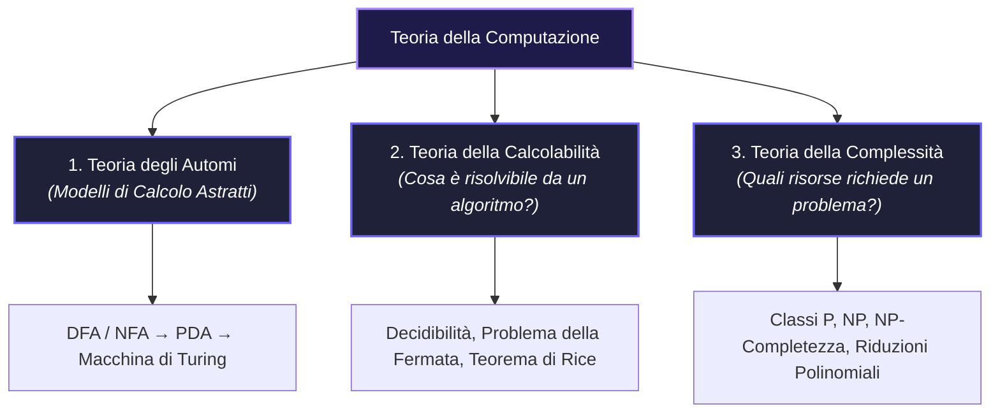

---

## 1.1 I Tre Pilastri Fondamentali

1. **Teoria degli Automi**: Studia la formalizzazione matematica dei sistemi di calcolo (automi finiti deterministici e non deterministici, automi a pila, macchine di Turing) e delle famiglie di linguaggi formali che essi sono in grado di riconoscere.
2. **Teoria della Calcolabilità**: Stabilisce il confine netto tra ciò che è **risolvibile mediante un algoritmo** (problemi decidibili) e ciò che è **intrinsecamente impossibile da calcolare** (problemi indecidibili), indipendentemente dal tempo o dalla potenza di calcolo a disposizione.
3. **Teoria della Complessità**: Classifica i problemi algoritmicamente decidibili in base alla quantità di risorse fisiche (**tempo di computazione** e **spazio di memoria**) necessarie per ottenere una soluzione.

---

## 1.2 Gerarchia dei Modelli di Calcolo

La potenza computazionale dei modelli cresce all'aumentare delle capacità della memoria:

| Modello di Calcolo | Struttura di Memoria | Classe di Linguaggi Riconosciuta |
| :--- | :--- | :--- |
| **DFA / NFA** (Automa a Stati Finiti) | Memoria strettamente finita ($|Q|$ stati) | **Linguaggi Regolari** ($\mathcal{REG}$) |
| **PDA** (Pushdown Automaton) | Memoria a pila LIFO illimitata | **Linguaggi Contestuali Liberi** (Context-Free) |
| **Macchina di Turing (MdT)** | Nastro sequenziale bidirezionale infinito | **Linguaggi Turing-Riconoscibili** ($\mathcal{RE}$) |

---
---

# Capitolo 2 — Automi Finiti Deterministici (DFA)

Un **Automa Finito Deterministico** (*Deterministic Finite Automaton*, DFA) è il modello di calcolo più elementare. Dispone unicamente di una **memoria finita**, rappresentata dall'insieme dei suoi stati interni, e consuma la stringa di input un simbolo alla volta da sinistra verso destra senza possibilità di tornare indietro.

---

## 2.1 Definizione Formale della Quintupla

> [!NOTE]
> Formalmente, un DFA è definito da una **quintupla** matematica:
> $$M = (Q, \Sigma, \delta, q_0, F)$$

I componenti della quintupla sono definiti come segue:
- $Q$: un insieme **finito e non vuoto di stati**.
- $\Sigma$: l'**alfabeto finito** dei simboli di input.
- $\delta: Q \times \Sigma \to Q$: la **funzione di transizione**. Dato lo stato corrente $q \in Q$ e il simbolo letto $a \in \Sigma$, restituisce in modo deterministico e univoco il prossimo stato $\delta(q, a) \in Q$. In un DFA, $\delta$ è una **funzione totale** (definita per ogni possibile coppia stato-simbolo).
- $q_0 \in Q$: lo **stato iniziale** in cui si trova l'automa all'avvio della computazione.
- $F \subseteq Q$: l'insieme degli **stati finali** (o *stati di accettazione*).

---

## 2.2 Rappresentazione Grafica e Diagrammi di Transizione

Un DFA si rappresenta visivamente mediante un grafo orientato ed etichettato (*diagramma di transizione*):
- I **vertici** rappresentano gli stati $Q$.
- Lo **stato iniziale** $q_0$ è contrassegnato da una freccia entrante senza nodo sorgente.
- Gli **stati finali** $F$ sono denotati da un **doppio cerchio**.
- Gli **archi orientati** rappresentano le transizioni: un arco da $p$ a $q$ con etichetta $a$ indica che $\delta(p, a) = q$.

### Esempio: DFA per stringhe binarie che terminano con `1`

Sia $\Sigma = \{0, 1\}$. Il seguente automa accetta tutte e sole le stringhe che finiscono per `1`:

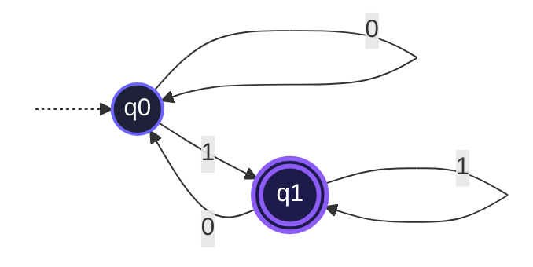

- In $q_0$ (stato non finale): l'ultimo simbolo letto è stato `0` (oppure nessun simbolo).
- In $q_1$ (stato finale): l'ultimo simbolo letto è stato `1`.

---

## 2.3 Funzione di Transizione Estesa e Linguaggio Accettato

Per descrivere la computazione di una stringa completa $w \in \Sigma^*$ (anziché di un singolo carattere), si estende il dominio della funzione di transizione definendo la **funzione di transizione estesa** $\hat{\delta}: Q \times \Sigma^* \to Q$ per induzione sulla lunghezza della stringa:

1. **Passo Base (Stringa vuota $\epsilon$):**
   $$\forall q \in Q, \quad \hat{\delta}(q, \epsilon) = q$$
   *(Leggendo la stringa vuota, l'automa rimane nello stato di partenza).*

2. **Passo Ricorsivo (Stringa $wa$ con $w \in \Sigma^*$ e $a \in \Sigma$):**
   $$\forall q \in Q, \forall w \in \Sigma^*, \forall a \in \Sigma, \quad \hat{\delta}(q, wa) = \delta(\hat{\delta}(q, w), a)$$
   *(L'automa elabora prima il prefisso $w$ per giungere in uno stato intermedio, e applica infine $\delta$ sul simbolo finale $a$).*

> [!IMPORTANT]
> **Linguaggio Riconosciuto da un DFA ($L(M)$)**:
> $$L(M) = \{w \in \Sigma^* \mid \hat{\delta}(q_0, w) \in F\}$$
> Una stringa $w$ è **accettata** da $M$ se la computazione avviata in $q_0$ termina in uno stato appartenente ad $F$. In caso contrario, la stringa viene **rifiutata**.

> [!NOTE]
> **Definizione (Linguaggio Regolare)**:
> Un linguaggio $L \subseteq \Sigma^*$ si dice **regolare** se e solo se esiste un Automa Finito Deterministico $M$ tale che $L = L(M)$.

---

## 2.4 I Limiti di un DFA e la Memoria Finita

Il limite architetturale invalicabile di un DFA risiede nella sua **memoria finita**. Avendo a disposizione un numero prefissato $|Q| = k$ di stati, un DFA non può conteggiare simboli in modo arbitrariamente grande.

Ad esempio, il linguaggio:
$$L = \{0^n 1^n \mid n \ge 0\}$$
**NON è regolare**. Per verificare che il numero di `0` sia esattamente pari al numero di `1`, l'automa dovrebbe memorizzare un intero $n$ potenzialmente infinito, richiedendo un numero infinito di stati distinti.

---

## 2.5 In Sintesi: DFA e Linguaggi Regolari

> [!TIP]
> ### Punti Chiave da Ricordare
> - **Determinismo Assoluto**: Per ogni coppia $(\text{stato}, \text{simbolo})$ esiste **una e una sola** transizione definita. Nessuna ambiguità, nessun salto vuoto.
> - **Memoria a Stati**: La memoria dell'automa è racchiusa interamente nell'informazione registrata dallo stato attuale.
> - **Accettazione**: Dipende esclusivamente dallo stato in cui si trova la macchina una volta consumato l'ultimo carattere dell'input.

---
---

# Capitolo 3 — Automi Finiti Non Deterministici (NFA)

Gli **Automi Finiti Non Deterministici** (*Non-Deterministic Finite Automata*, NFA) generalizzano i DFA introducendo due caratteristiche fondamentali:
1. Da un medesimo stato, leggendo un simbolo, possono partire **zero, una o molteplici transizioni verso stati diversi**.
2. **$\epsilon$-transizioni**: possibilità di transitare spontaneamente tra stati senza consumare alcun simbolo dall'input.

---

## 3.1 Definizione Formale e Transizioni con Epsilon

> [!NOTE]
> Formalmente, un NFA è una quintupla:
> $$M = (Q, \Sigma, \delta, q_0, F)$$
> dove $Q, \Sigma, q_0, F$ mantengono il significato classico, mentre la funzione di transizione è definita come:
> $$\delta: Q \times \Sigma_\epsilon \to \mathcal{P}(Q)$$
> con $\Sigma_\epsilon = \Sigma \cup \{\epsilon\}$ e $\mathcal{P}(Q)$ indicante l'**insieme delle parti** (Power Set) di $Q$.

L'output di $\delta(q, a)$ è un **sottoinsieme di stati** $\subseteq Q$:
- Se $\delta(q, a) = \{p_1, p_2\}$, l'automa si sdoppia e prosegue in entrambi gli stati.
- Se $\delta(q, a) = \emptyset$, il ramo di calcolo corrente termina (*muore*).

---

## 3.2 Interpretazione della Computazione: Albero degli Universi Paralleli

La computazione di un NFA su una stringa $w$ genera un **albero di configurazioni**:
- A ogni scelta multipla, l'automa esplora tutti i percorsi simultaneamente.
- **Condizione di Accettazione**: L'NFA accetta $w$ se **almeno una foglia** dell'albero di computazione termina in uno stato di accettazione $q \in F$ alla fine della stringa.
- **Condizione di Rifiuto**: L'NFA rifiuta $w$ se **tutti i rami** terminano in stati non finali o muoiono prima di consumare l'intero input.

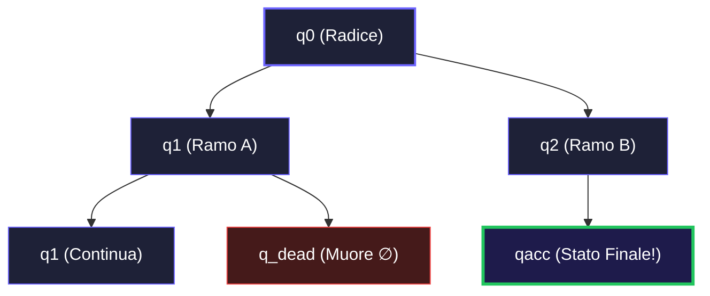

---

## 3.3 Esempio di NFA con Epsilon-Transizioni

Consideriamo un NFA sull'alfabeto $\Sigma = \{0, 1\}$ che accetta le stringhe contenenti `01` oppure `00`:

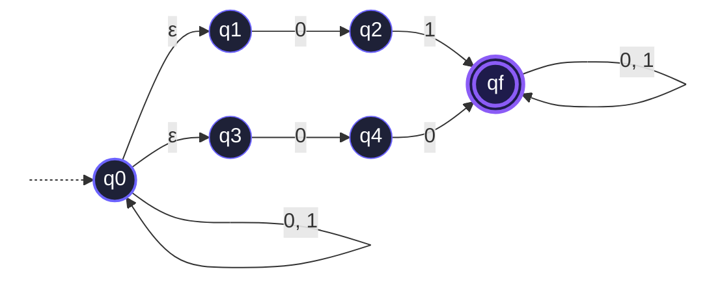

---

## 3.4 Teorema di Equivalenza NFA-DFA: Costruzione per Sottoinsiemi (Subset Construction)

> [!IMPORTANT]
> **Teorema Fondamentale di Equivalenza**:
> Un linguaggio $L$ è riconosciuto da un NFA se e solo se è riconosciuto da un DFA. I due modelli possiedono lo **stesso potere espressivo** e caratterizzano esattamente la classe dei **Linguaggi Regolari**.

Dato un NFA $N = (Q, \Sigma, \delta, q_0, F)$, è possibile costruire un DFA deterministico equivalente $D = (Q', \Sigma, \delta', q_0', F')$ mediante l'algoritmo della **Costruzione per Sottoinsiemi**:

1. **Insieme degli Stati del DFA**:
   $$Q' = \mathcal{P}(Q)$$
   *(Se l'NFA ha $n$ stati, il DFA equivalente conterrà nel caso peggiore fino a $2^n$ stati).*

2. **$\epsilon$-Chiusura ($E(R)$)**:
   Per ogni sottoinsieme $R \subseteq Q$, $E(R)$ è l'insieme di tutti gli stati raggiungibili da qualsiasi stato in $R$ seguendo esclusivamente zero o più archi etichettati con $\epsilon$.

3. **Stato Iniziale del DFA**:
   $$q_0' = E(\{q_0\})$$

4. **Funzione di Transizione del DFA $\delta'$**:
   Per ogni macro-stato $R \in Q'$ e ogni simbolo $a \in \Sigma$:
   $$\delta'(R, a) = \bigcup_{r \in R} E(\delta(r, a))$$

5. **Insieme degli Stati Finali del DFA $F'$**:
   $$F' = \{R \in Q' \mid R \cap F \neq \emptyset\}$$
   *(Un macro-stato è accettante per il DFA se contiene **almeno uno** stato finale dell'NFA originario).*

---

## 3.5 In Sintesi: NFA e Non-Determinismo

> [!TIP]
> ### Concetti Chiave
> - **Esplorazione in Parallelo**: Il non-determinismo consente di formulare scelte "ipotetiche" (oracoli) semplificando radicalmente il design degli automi.
> - **Equivalenza di Potere**: $\mathcal{L}(\text{NFA}) \equiv \mathcal{L}(\text{DFA})$. Non esiste alcun linguaggio riconosciuto da un NFA che non possa essere riconosciuto da un DFA.
> - **Esplosione degli Stati**: La conversione da NFA a DFA può comportare una crescita esponenziale del numero di stati ($O(2^n)$).

---
---

# Capitolo 4 — Proprietà di Chiusura dei Linguaggi Regolari

La classe dei linguaggi regolari gode di importanti **proprietà di chiusura**: combinando linguaggi regolari mediante operazioni algebriche o insiemistiche, si ottengono ancora linguaggi regolari.

---

## 4.1 Chiusura tramite DFA (Operazioni Booleane)

Le dimostrazioni per le operazioni insiemistiche booleane si conducono in modo costruttivo e rigoroso sui **DFA**.

### 4.1.1 Complemento
Se $L$ è regolare, allora il suo complemento $\overline{L} = \Sigma^* \setminus L$ è regolare.

> [!IMPORTANT]
> **Costruzione**:
> Sia $M = (Q, \Sigma, \delta, q_0, F)$ un DFA per $L$. Il DFA $\overline{M}$ che riconosce $\overline{L}$ è:
> $$\overline{M} = (Q, \Sigma, \delta, q_0, Q \setminus F)$$
> È sufficiente **invertire gli stati finali con gli stati non finali**.
> 
> *Attenzione*: Questa tecnica è corretta **solo sui DFA** perché la funzione $\delta$ è totale e deterministica (ogni stringa genera un unico percorso). Applicata a un NFA produrrebbe un automa errato!

### 4.1.2 Intersezione (Costruzione del Prodotto Cartesiano)
Se $L_1$ e $L_2$ sono regolari, allora $L_1 \cap L_2$ è regolare.

**Dimostrazione Costruttiva**:
Siano $M_1 = (Q_1, \Sigma, \delta_1, q_{01}, F_1)$ e $M_2 = (Q_2, \Sigma, \delta_2, q_{02}, F_2)$ due DFA. Costruiamo l'automa prodotto $M_{\cap} = (Q', \Sigma, \delta', q_0', F_{\cap})$:
- $Q' = Q_1 \times Q_2$
- $q_0' = (q_{01}, q_{02})$
- $\delta'((r_1, r_2), a) = (\delta_1(r_1, a), \delta_2(r_2, a))$
- $F_{\cap} = F_1 \times F_2 = \{(r_1, r_2) \mid r_1 \in F_1 \wedge r_2 \in F_2\}$

L'automa simula in sincrono entrambi i DFA: accetta se e solo se **entrambi** gli automi raggiungono uno stato finale.

### 4.1.3 Unione tramite Prodotto Cartesiano
La costruzione è identica all'intersezione, modificando unicamente la regola di accettazione:
$$F_{\cup} = \{(r_1, r_2) \mid r_1 \in F_1 \vee r_2 \in F_2\} = (F_1 \times Q_2) \cup (Q_1 \times F_2)$$

---

## 4.2 Chiusura tramite NFA (Operazioni Regolari)

Grazie alle $\epsilon$-transizioni degli NFA, le operazioni di Unione, Concatenazione e Stella di Kleene si dimostrano mediante eleganti **gadget grafici**.

### 4.2.1 Unione Rapida tramite Gadget NFA
Dati due NFA $M_1$ e $M_2$, si introduce un **nuovo stato iniziale** $q_{start}$ collegato con $\epsilon$-transizioni ai vecchi stati iniziali:

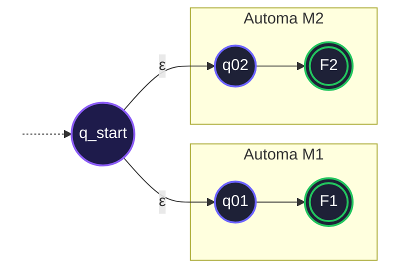

### 4.2.2 Concatenazione ($L_1 \circ L_2$)
Si collegano tutti gli stati finali di $M_1$ allo stato iniziale di $M_2$ mediante $\epsilon$-transizioni. Gli stati finali di $M_1$ perdono il loro stato di accettazione; gli unici stati finali del nuovo NFA sono quelli di $M_2$:

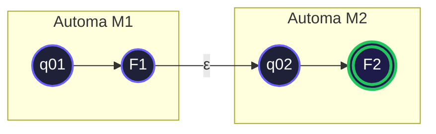

### 4.2.3 Stella di Kleene ($L_1^*$)
La Stella di Kleene rappresenta la ripetizione di stringhe del linguaggio zero o più volte ($L^* = \bigcup_{i=0}^\infty L^i$ con $L^0 = \{\epsilon\}$):

> [!IMPORTANT]
> **Costruzione Formale**:
> 1. Si aggiunge un **nuovo stato iniziale** $q_{new}$ che è anche **stato di accettazione** (per garantire l'accettazione della stringa vuota $\epsilon$).
> 2. Si aggiunge una $\epsilon$-transizione da $q_{new}$ al vecchio stato iniziale $q_{01}$.
> 3. Si aggiungono $\epsilon$-transizioni da ciascuno stato finale $f \in F_1$ a ritroso verso il vecchio stato iniziale $q_{01}$.
> 4. L'insieme degli stati finali diventa $F' = F_1 \cup \{q_{new}\}$.

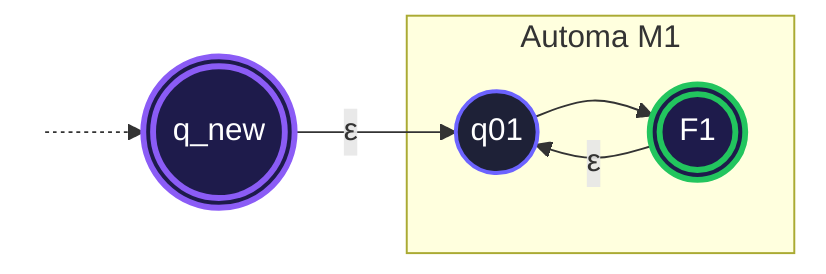

---
---

# Capitolo 5 — Espressioni Regolari (RegEx)

Le **Espressioni Regolari** forniscono una notazione algebrica e dichiarativa per descrivere i linguaggi regolari, specificando i pattern delle stringhe ammesse.

---

## 5.1 Definizione Formale Induttiva

Data la sintassi su un alfabeto $\Sigma$, $R$ è un'espressione regolare se rispetta una delle seguenti regole:

### Casi Base:
1. $R = \emptyset$: denota il **linguaggio vuoto** $\mathcal{L}(\emptyset) = \emptyset$.
2. $R = \epsilon$: denota il linguaggio contenente la sola **stringa vuota** $\mathcal{L}(\epsilon) = \{\epsilon\}$.
3. $R = a$ (con $a \in \Sigma$): denota il linguaggio singleton $\mathcal{L}(a) = \{a\}$.

### Casi Induttivi:
Dati $R_1$ e $R_2$ con linguaggi $\mathcal{L}(R_1)$ e $\mathcal{L}(R_2)$:
1. **Unione**: $R = R_1 \cup R_2$ (oppure $R_1 + R_2$), con $\mathcal{L}(R) = \mathcal{L}(R_1) \cup \mathcal{L}(R_2)$.
2. **Concatenazione**: $R = R_1 \cdot R_2$ (oppure $R_1 R_2$), con $\mathcal{L}(R) = \mathcal{L}(R_1) \cdot \mathcal{L}(R_2)$.
3. **Stella di Kleene**: $R = R_1^*$, con $\mathcal{L}(R) = (\mathcal{L}(R_1))^*$.

---

## 5.2 Equivalenza con gli Automi: Il Teorema di Kleene

> [!NOTE]
> **Teorema di Kleene (1956)**:
> Un linguaggio è regolare se e solo se può essere descritto da un'espressione regolare:
> $$\mathcal{L}(\text{DFA}) \equiv \mathcal{L}(\text{NFA}) \equiv \mathcal{L}(\text{RegEx})$$

- **Da RegEx a NFA**: Algoritmo di *McNaughton-Yamada-Thompson* (costruzione induttiva a blocchi mediante i gadget $\epsilon$-NFA).
- **Da DFA a RegEx**: Algoritmo di *Eliminazione degli Stati* (tramite *Generalized Non-Deterministic Finite Automata*, GNFA).

---

## 5.3 Precedenza degli Operatori

Per eliminare ambiguità sintattiche senza ricorrere a parentesi superflue, si adotta la seguente convenzione di priorità decrescente:

1. **Stella di Kleene ($*$)** — Massima priorità
2. **Concatenazione ($\cdot$)** — Priorità intermedia
3. **Unione ($\cup$)** — Minima priorità

**Esempio**:
$$a \cup bc^* \equiv a \cup (b \cdot (c^*))$$

---

## 5.4 In Sintesi: Espressioni Regolari

> [!TIP]
> ### Concetti Fondamentali
> - **Differenza tra $\emptyset$ ed $\epsilon$**: $\emptyset$ è l'insieme vuoto (zero stringhe, $|\emptyset| = 0$), mentre $\{\epsilon\}$ è un linguaggio che contiene una stringa di lunghezza zero ($|\{\epsilon\}| = 1$).
> - **Potenza Espressiva**: Qualsiasi linguaggio descrivibile con un automa può essere compresso in una RegEx e viceversa.

---
---

# Capitolo 6 — Il Pumping Lemma per Linguaggi Regolari

Il **Pumping Lemma** (Lemma del Pompaggio) è lo strumento matematico per dimostrare, mediante **dimostrazione per assurdo**, che un dato linguaggio **NON è regolare**.

---

## 6.1 L'Enunciato Formale

> [!IMPORTANT]
> **Teorema (Pumping Lemma)**:
> Se $L$ è un linguaggio regolare, allora esiste un intero positivo $p \ge 1$ (denominato *lunghezza di pumping*) tale che ogni stringa $w \in L$ di lunghezza $|w| \ge p$ può essere suddivisa in tre sottostringhe $w = xyz$ soddisfacendo le tre condizioni:
> 
> 1. **Pompabilità**: $\forall i \ge 0, \quad xy^i z \in L$
> 2. **Non vacuità del ciclo**: $|y| > 0$
> 3. **Localizzazione del ciclo**: $|xy| \le p$

---

## 6.2 Spiegazione Intuitiva: Il Principio dei Cassetti (Pigeonhole Principle)

Sia $M$ un DFA con $p$ stati che riconosce $L$. 
- Se diamo in input una stringa $w$ con lunghezza $|w| \ge p$, l'automa attraversa una sequenza di almeno $p+1$ stati.
- Avendo solo $p$ stati distinti a disposizione nel suo insieme $Q$, per il **Principio dei Cassetti** l'automa deve necessariamente visitare **lo stesso stato almeno due volte**.
- La porzione di stringa letta tra la prima e la seconda visita dello stato ripetuto costituisce un **ciclo** (la sottostringa $y$).
- L'automa non può contare quante volte percorre il ciclo: possiamo farglielo percorrere $0$ volte ($xy^0z = xz$), $1$ volta ($xyz$), $2$ volte ($xyyz$) o $i$ volte ($xy^iz$), atterrando sempre nel medesimo stato finale.

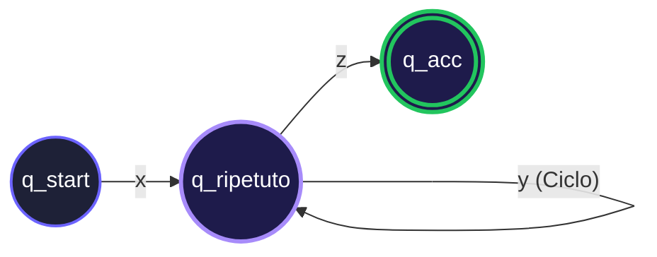

---

## 6.3 Algoritmo di Dimostrazione per Assurdo (Il Gioco del Demone)

Per dimostrare che un linguaggio $L$ non è regolare, si imposta un gioco logico contro un avversario ipotetico (il *Demone*):

1. **Ipotesi per Assurdo**: Si assume per assurdo che $L$ sia regolare.
2. **Mossa del Demone**: Esiste una costante di pumping $p \ge 1$ fissata dall'avversario (di cui non conosciamo il valore numerico).
3. **La Nostra Scelta Strategica**: Scegliamo una stringa specifica $w \in L$ tale che $|w| \ge p$, espressa in funzione simbolica di $p$ (es. $w = 0^p 1^p$).
4. **Mossa del Demone**: L'avversario suddivide $w = xyz$ rispettando i vincoli $|xy| \le p$ e $|y| > 0$. Dobbiamo analizzare tutti i modi possibili in cui $y$ può essere collocata.
5. **Scacco Matto**: Selezioniamo un opportuno valore dell'esponente $i$ (tipicamente $i=0$ per il *pumping down* o $i=2$ per il *pumping up*) tale che la stringa risultante $xy^i z \notin L$.
6. **Conclusione**: Avendo ottenuto una contraddizione logica, l'ipotesi iniziale cade: **$L$ non è regolare**.

---

## 6.4 Esempi Pratici Svolti Passo-Passo

Ecco i pattern classici di applicazione del Pumping Lemma con risoluzioni rigorose e commentate:

### Esempio 1 — Conteggio e Bilanciamento Simboli: $L_1 = \{0^n 1^n \mid n \ge 0\}$

Dimostrare che $L_1$ non è regolare su $\Sigma = \{0, 1\}$.

1. **Ipotesi per assurdo**: Assumiamo che $L_1$ sia regolare.
2. **Costante di pumping**: Esiste una costante $p \ge 1$.
3. **Scelta della stringa**: Scegliamo $w = 0^p 1^p$. Chiaramente $w \in L_1$ e $|w| = 2p \ge p$.
4. **Analisi della suddivisione $w = xyz$**:
   - Per la condizione 3 ($|xy| \le p$), i primi $p$ caratteri di $w$ sono esclusivamente zeri ($0$). Pertanto, sia $x$ che $y$ sono composte solo da zeri:
     $$x = 0^a, \quad y = 0^b, \quad z = 0^{p - a - b} 1^p \quad \text{con } a \ge 0, b > 0, a+b \le p$$
   - Per la condizione 2 ($|y| > 0$), sappiamo che $b \ge 1$.
5. **Pompaggio ($i = 2$, Pumping Up)**:
   - Consideriamo la stringa pompata $xy^2 z$:
     $$xy^2 z = 0^a (0^b)^2 0^{p-a-b} 1^p = 0^{a + 2b + p - a - b} 1^p = 0^{p + b} 1^p$$
   - Poiché $b \ge 1$, abbiamo $p + b > p$.
   - Il numero di zeri ($p+b$) è strettamente maggiore del numero di uni ($p$).
   - Di conseguenza, $xy^2 z \notin L_1$.
6. **Conclusione**: Contraddizione con la condizione di pompabilità $\forall i \ge 0, xy^i z \in L_1$. Dunque **$L_1$ non è regolare**.

---

### Esempio 2 — Duplicazione di Stringhe Arbitrarie: $L_2 = \{w w \mid w \in \{0, 1\}^*\}$

Dimostrare che $L_2$ (il linguaggio delle parole duplicate) non è regolare.

1. **Ipotesi per assurdo**: Assumiamo che $L_2$ sia regolare.
2. **Costante di pumping**: Esiste una costante $p \ge 1$.
3. **Scelta della stringa**:

> [!WARNING]
> Scegliere $w = (01)^p (01)^p$ o $0^p 0^p$ è errato, poiché consentirebbe all'avversario di pompare cicli pari preservando la duplicazione.
   
Scegliamo strategicamente:
$$s = 0^p 1 0^p 1 \in L_2 \quad \text{con } |s| = 2p + 2 \ge p \quad (\text{qui } w = 0^p 1)$$
4. **Analisi della suddivisione $s = xyz$**:
   - Poiché $|xy| \le p$, la porzione $xy$ ricade interamente nel **primo blocco di zeri** ($0^p$).
   - Dunque $y = 0^k$ con $1 \le k \le p$.
5. **Pompaggio ($i = 2$ o $i = 0$)**:
   - Se pompiamo con $i = 2$, otteniamo:
     $$xy^2 z = 0^{p+k} 1 0^p 1$$
   - Per appartenere a $L_2$, la nuova stringa dovrebbe potersi dividere a metà in due parti identiche $u u$.
   - La lunghezza totale è $2p + k + 2$. La metà esatta è $p + \frac{k}{2} + 1$.
   - Il primo simbolo $1$ si troverebbe alla posizione $p + k + 1$, mentre nel secondo tempo il secondo $1$ si trova in fondo. È impossibile tagliare la stringa in due metà identiche poiché la prima metà conterrebbe più zeri prima dell'1 rispetto alla seconda.
   - Quindi $xy^2 z \notin L_2$.
6. **Conclusione**: **$L_2$ non è regolare**.

---

### Esempio 3 — Crescita Non Lineare (Esponenti Quadratici): $L_3 = \{0^{n^2} \mid n \ge 0\}$

Dimostrare che $L_3 = \{0^0, 0^1, 0^4, 0^9, 0^{16}, \dots\}$ non è regolare.

1. **Ipotesi per assurdo**: Assumiamo che $L_3$ sia regolare con costante di pumping $p$.
2. **Scelta della stringa**: Scegliamo $w = 0^{p^2} \in L_3$, con $|w| = p^2 \ge p$.
3. **Suddivisione $w = xyz$**:
   - Poiché l'alfabeto ha un solo simbolo ($0$), abbiamo $y = 0^k$ con $1 \le k \le p$ (dato che $|xy| \le p$).
4. **Pompaggio ($i = 2$)**:
   - La lunghezza della stringa pompata $xy^2 z$ è:
     $$|xy^2 z| = |xyz| + |y| = p^2 + k$$
   - Valutiamo i limiti numerici di questa lunghezza:
     - Poiché $k \ge 1$: $|xy^2 z| \ge p^2 + 1 > p^2$
     - Poiché $k \le p$: $|xy^2 z| \le p^2 + p < p^2 + 2p + 1 = (p+1)^2$
   - Mettendo insieme le disuguaglianze:
     $$p^2 < |xy^2 z| < (p+1)^2$$
   - La lunghezza $|xy^2 z|$ cade **strettamente tra due quadrati perfetti consecutivi** ($p^2$ e $(p+1)^2$).
   - Di conseguenza, $|xy^2 z|$ non può essere un quadrato perfetto, perciò $xy^2 z \notin L_3$.
5. **Conclusione**: **$L_3$ non è regolare**.

---

### Esempio 4 — Disuguaglianze e Tecnica del *Pumping Down*: $L_4 = \{0^i 1^j \mid i > j\}$

Dimostrare che il linguaggio in cui il numero di zeri supera strettamente il numero di uni non è regolare.

1. **Ipotesi per assurdo**: $L_4$ è regolare con costante $p$.
2. **Scelta della stringa**: Scegliamo $w = 0^{p+1} 1^p$. Chiaramente $w \in L_4$ poiché $p+1 > p$, e $|w| = 2p+1 \ge p$.
3. **Suddivisione $w = xyz$**:
   - Poiché $|xy| \le p$, la sottostringa $y$ è composta unicamente da zeri: $y = 0^k$ con $1 \le k \le p$.
4. **Pompaggio verso il basso ($i = 0$, Pumping Down)**:

> [!TIP]
> Con $i=2$ otterremmo $0^{p+1+k} 1^p$, che appartiene ancora a $L_4$ poiché $p+1+k > p$. Per rompere la disuguaglianza $i > j$, dobbiamo **rimuovere zeri** scegliendo $i = 0$!
   - Ponendo $i = 0$:
     $$xy^0 z = xz = 0^{p+1-k} 1^p$$
   - Poiché $k \ge 1$, abbiamo $p + 1 - k \le p$.
   - Il numero di zeri ($p+1-k$) è ora **minore o uguale** al numero di uni ($p$).
   - Dunque $xy^0 z \notin L_4$.
5. **Conclusione**: **$L_4$ non è regolare**.

---

### Esempio 5 — Metodo Combinato: Pumping Lemma + Proprietà di Chiusura

> [!NOTE]
> Spesso dimostrare il Pumping Lemma direttamente su un linguaggio complesso comporta troppi casi per la suddivisione di $y$. La tecnica migliore è **intersecare il linguaggio con un linguaggio regolare noto** per isolare una forma canonica non regolare.

**Problema**: Dimostrare che $L_5 = \{w \in \{0, 1\}^* \mid N_0(w) = N_1(w)\}$ (stesso numero di $0$ e $1$, in ordine qualsiasi) non è regolare.

1. **Ipotesi per assurdo**: Assumiamo che $L_5$ sia regolare.
2. **Applicazione della chiusura**:
   - Sappiamo che l'intersezione di due linguaggi regolari è regolare (Capitolo 4).
   - Il linguaggio $R = \mathcal{L}(0^* 1^*)$ è regolare (definito da una RegEx).
   - Dunque, l'intersezione dovrebbe essere regolare:
     $$L' = L_5 \cap R = \{w \in \{0, 1\}^* \mid N_0(w) = N_1(w)\} \cap \mathcal{L}(0^* 1^*) = \{0^n 1^n \mid n \ge 0\}$$
3. **Contraddizione**:
   - Abbiamo già dimostrato (Esempio 1) che $\{0^n 1^n \mid n \ge 0\}$ **non è regolare**.
   - Poiché $L'$ non è regolare ma deriva dall'intersezione di $L_5$ con un linguaggio regolare, l'ipotesi iniziale deve essere falsa: **$L_5$ non è regolare**.

---

---

# Capitolo 7 — Macchine di Turing (MdT)

La **Macchina di Turing** (Alan Turing, 1936) costituisce il modello formale di computazione generale. Essa supera i limiti degli automi introducendo una **memoria illimitata** (un nastro sequenziale infinito verso destra) e una **testina di lettura/scrittura bidirezionale**.

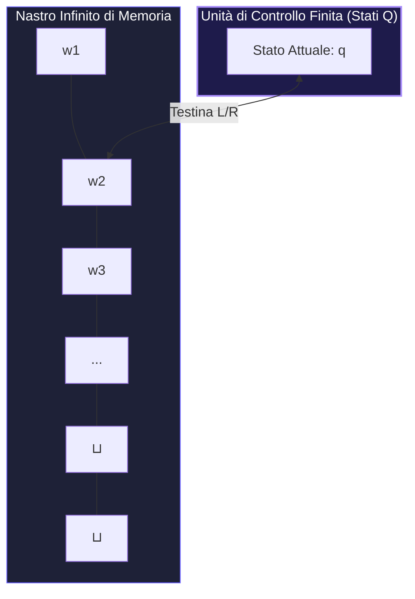

---

## 7.1 Definizione Formale Rigorosa (7-Tupla)

> [!NOTE]
> Una Macchina di Turing deterministica a nastro singolo è una 7-tupla:
> $$M = (Q, \Sigma, \Gamma, \delta, q_0, q_{acc}, q_{rif})$$

- $Q$: insieme finito e non vuoto di **stati interni**.
- $\Sigma$: l'**alfabeto di input**, che **non contiene** il simbolo speciale blank $\sqcup$.
- $\Gamma$: l'**alfabeto del nastro**, insieme finito tale che $\Sigma \subset \Gamma$ e $\sqcup \in \Gamma$.
- $\delta: Q \times \Gamma \to Q \times \Gamma \times \{L, R\}$: la **funzione di transizione**. Se $\delta(q, a) = (p, b, D)$, la macchina trovandosi nello stato $q$ e leggendo $a$:
  1. Transita nello stato $p$.
  2. Sovrascrive la cella corrente con il simbolo $b$.
  3. Sposta la testina nella direzione $D \in \{L, R\}$ ($L = \text{Left}, R = \text{Right}$).
- $q_0 \in Q$: lo **stato iniziale**.
- $q_{acc} \in Q$: lo **stato di accettazione**.
- $q_{rif} \in Q$: lo **stato di rifiuto**, con il vincolo strutturale $q_{rif} \neq q_{acc}$.

Gli stati $q_{acc}$ e $q_{rif}$ sono **stati di arresto immediato** (*halting states*): non generano ulteriori transizioni.

---

## 7.2 Configurazioni e Dinamica della Computazione (Relazione Yields)

Una **configurazione** rappresenta lo snapshot istantaneo della macchina ed è formalizzata da una stringa:
$$uqv \quad \text{con } u, v \in \Gamma^*, q \in Q$$
- $u$: contenuto del nastro a sinistra della testina.
- $q$: stato interno corrente.
- $v$: contenuto del nastro dalla posizione attuale della testina (inclusa) verso destra.

La relazione di transizione tra configurazioni è denotata con $\vdash$ (*yields*):
- **Spostamento a Sinistra ($L$)**: Se $\delta(q, b) = (p, c, L)$, allora $uaqbv \vdash upacv$.
  - *Bordo sinistro*: Se la testina si trova sulla prima cella ($u = \epsilon$), non può arretrare oltre: $qbv \vdash pcv$.
- **Spostamento a Destra ($R$)**: Se $\delta(q, b) = (p, c, R)$, allora $uaqbv \vdash uacpv$.
  - *Espansione a destra*: Se la testina supera l'ultimo carattere scritto, legge il blank: $uqa \vdash ucp\sqcup$.

---

## 7.3 Linguaggi Decidibili ($R$) vs Turing-Riconoscibili ($RE$)

Poiché una MdT può continuare a computare all'infinito, emergono due classi fondamentali di linguaggi:

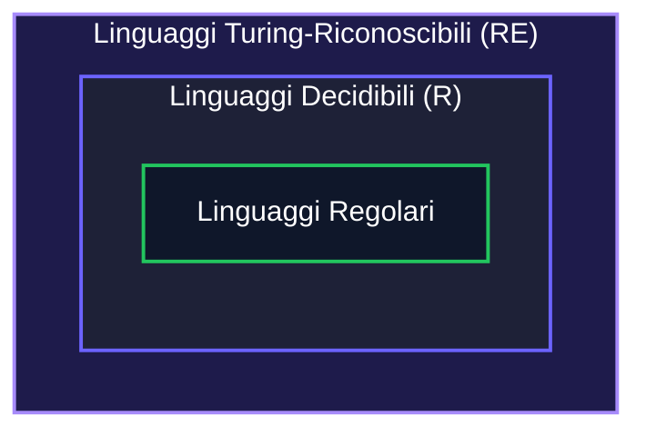

1. **Linguaggio Turing-Riconoscibile ($\mathcal{RE}$ — Recursively Enumerable)**:
   Un linguaggio $L$ per cui esiste una MdT $M$ tale che:
   - Se $w \in L \implies M$ si ferma in $q_{acc}$.
   - Se $w \notin L \implies M$ si ferma in $q_{rif}$ **oppure va in loop infinito**.

2. **Linguaggio Decidibile ($\mathcal{R}$ — Recursive)**:
   Un linguaggio $L$ per cui esiste una MdT $M$ (detta **Decisore**) che **garantisce sempre la terminazione in tempo finito**:
   - Se $w \in L \implies M$ termina in $q_{acc}$.
   - Se $w \notin L \implies M$ termina in $q_{rif}$.

---

## 7.4 Varianti della Macchina di Turing

Tutte le estensioni architetturali standard sono **computazionalmente equivalenti** alla MdT a singolo nastro (Tesi di Church-Turing).

### 7.4.1 MdT Multinastro
Dispone di $k$ nastri e $k$ testine indipendenti con transizione $\delta: Q \times \Gamma^k \to Q \times \Gamma^k \times \{L, R, S\}^k$.
- **Simulazione**: Una MdT a nastro singolo $S$ simula $M$ memorizzando le $k$ tracce separate da delimitatori $\#$ e contrassegnando le posizioni delle testine con simboli "puntati" $\dot{a} \in \dot{\Gamma}$.

### 7.4.2 MdT Non Deterministica (NTM)
In una NTM, $\delta: Q \times \Gamma \to \mathcal{P}(Q \times \Gamma \times \{L, R\})$. La computazione forma un albero di percorsi.
- **Simulazione Deterministica via BFS**: Una DTM a 3 nastri simula la NTM esplorando l'albero di computazione in ampiezza (*Breadth-First Search*), garantendo che, se esiste un ramo di accettazione a profondità finita, esso verrà individuato senza bloccarsi in rami infiniti.

---

## 7.5 Esempio Pratico e Traccia di Configurazione

MdT per il linguaggio non regolare $L = \{0^n 1^n \mid n \ge 1\}$ con alfabeto $\Sigma=\{0, 1\}$, $\Gamma=\{0, 1, X, Y, \sqcup\}$:

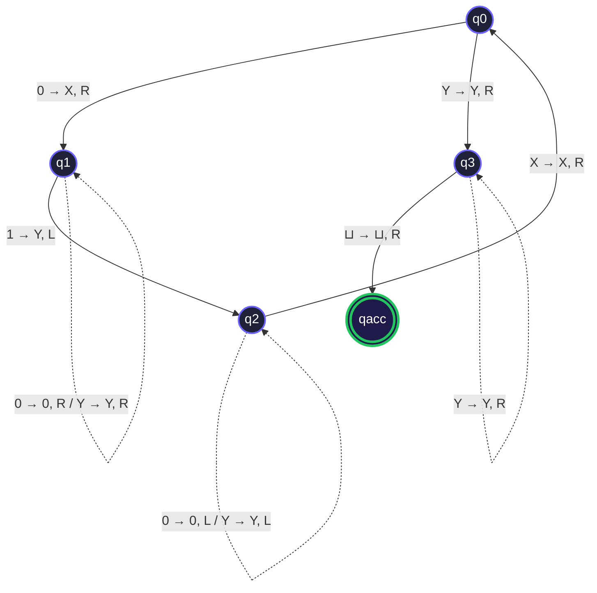

#### Ruolo degli Stati del Controllore:
- **$q_0$ (Scansione iniziale)**: Cerca il primo `0` non ancora marcato e lo sovrascrive con `X`. Se legge direttamente `Y`, significa che tutti gli `0` sono stati consumati e passa a $q_3$ per la verifica finale.
- **$q_1$ (Ricerca dell'1)**: Si sposta verso destra scavalcando gli altri `0` e le `Y` già processate, fino a trovare il primo `1` da marcare come `Y`.
- **$q_2$ (Ritorno a sinistra)**: Si muove a ritroso verso sinistra scavalcando `Y` e `0` finché non incontra l'ultima `X` scritta; a quel punto si sposta di una posizione a destra e ritorna in $q_0$ per ripetere il ciclo.
- **$q_3$ (Verifica assenza di 1 spaiati)**: Scansiona verso destra verificando che sul nastro siano presenti esclusivamente `Y`; se incontra il blank $\sqcup$, accetta in $q_{acc}$. Se trovasse un altro `0` o `1` spaiato, la macchina si bloccherebbe rifiutando.

### Traccia di Esecuzione su $w = 0011$:
$$q_0 0011 \vdash X q_1 011 \vdash X 0 q_1 11 \vdash X q_2 0 Y 1 \vdash q_2 X 0 Y 1 \vdash X q_0 0 Y 1$$
$$\vdash XX q_1 Y 1 \vdash XX Y q_1 1 \vdash XX q_2 Y Y \vdash X q_2 X Y Y \vdash XX q_0 Y Y$$
$$\vdash XX Y q_3 Y \vdash XX Y Y q_3 \sqcup \vdash XX Y Y \sqcup q_{acc} \quad \implies \text{\textbf{ACCETTATA}}$$

---

## 7.6 Il Sunto del Boss: Macchine di Turing

> [!TIP]
> ### Concetti Salvavita per l'Esame
> - **Configurazione $uqv$**: Rappresenta in modo compatto il nastro sinistro $u$, lo stato interno $q$ e il nastro destro $v$.
> - **Riconoscere vs Decidere**: Un decisore si ferma **sempre** (risponde con certezza Sì/No); un riconoscitore può perdersi in un loop infinito se l'input non appartiene al linguaggio.
> - **Equivalenza delle Varianti**: Nastri multipli o non-determinismo velocizzano la computazione ma **non ampliano** l'insieme dei problemi risolvibili.

---
---

# Capitolo 8 — Decidibilità e Limiti della Computazione

La **Teoria della Calcolabilità** dimostra rigorosamente che esistono problemi computazionali ben definiti per i quali **non può esistere alcun algoritmo risolutivo generale**.

---

## 8.1 Codifica degli Oggetti e Macchina di Turing Universale

Indichiamo con $\langle O \rangle$ la rappresentazione serializzata in stringa di un generico oggetto matematico (automa, grafo, formula, MdT).

> [!NOTE]
> **Macchina di Turing Universale ($U$)**:
> Esiste una MdT universale $U$ che, ricevuta in input la coppia $\langle M, w \rangle$, simula passo per passo il comportamento di $M$ su $w$:
> $$U(\langle M, w \rangle) = M(w)$$
> $U$ costituisce il modello formale del moderno computer programmabile (architettura di Von Neumann).

---

## 8.2 Il Problema dell'Accettazione ($A_{TM}$) e Dimostrazione via Diagonalizzazione

Definiamo il linguaggio dell'accettazione per Macchine di Turing:
$$A_{TM} = \{\langle M, w \rangle \mid M \text{ è una MdT e } M \text{ accetta } w\}$$

- $A_{TM}$ è **Turing-Riconoscibile** (la macchina universale $U$ lo riconosce).
- **Teorema Fondamentale (Turing, 1936)**: $A_{TM}$ è **INDECIDIBILE**.

### Dimostrazione per Assurdo (Metodo della Diagonalizzazione):
1. Supponiamo per assurdo che $A_{TM}$ sia decidibile mediante un decisore $H$:
   $$H(\langle M, w \rangle) = \begin{cases} \text{accetta} & \text{se } M \text{ accetta } w \\ \text{rifiuta} & \text{se } M \text{ non accetta } w \text{ (rifiuta o va in loop)} \end{cases}$$
2. Costruiamo una nuova MdT $D$ che prende in input la descrizione $\langle M \rangle$ di una macchina, invoca $H$ su $\langle M, \langle M \rangle \rangle$ e ne **inverte il risultato**:
   - $D(\langle M \rangle)$:
     1. Esegue $H$ su $\langle M, \langle M \rangle \rangle$.
     2. Se $H$ accetta $\implies D$ **rifiuta**.
     3. Se $H$ rifiuta $\implies D$ **accetta**.
3. Cosa accade se eseguiamo $D$ passando come input la propria codifica $\langle D \rangle$?
   $$D(\langle D \rangle) \text{ accetta} \iff H(\langle D, \langle D \rangle \rangle) \text{ rifiuta} \iff D(\langle D \rangle) \text{ non accetta}$$
4. Abbiamo generato una **contraddizione logica insanabile** ($D$ accetta $\iff D$ non accetta). Dunque il decisore ipotetico $H$ non può esistere: **$A_{TM}$ è indecidibile**.

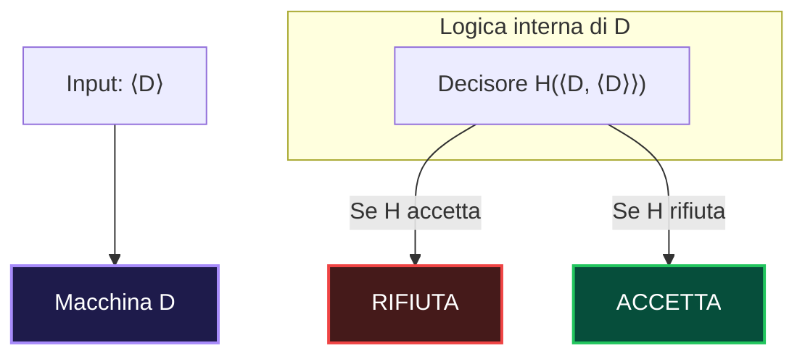

---

## 8.3 Co-Turing Riconoscibilità e il Teorema del Complemento

Un linguaggio $L$ è **co-Turing-riconoscibile** ($L \in \text{co-}\mathcal{RE}$) se il suo complemento $\overline{L} = \Sigma^* \setminus L$ è Turing-riconoscibile.

> [!IMPORTANT]
> **Teorema del Complemento**:
> Un linguaggio $L$ è **decidibile** se e solo se $L \in \mathcal{RE}$ e $\overline{L} \in \mathcal{RE}$.
> 
> **Dimostrazione ($\Leftarrow$)**:
> Siano $M_1$ e $M_2$ i riconoscitori per $L$ e $\overline{L}$. Costruiamo un decisore $M$: su input $w$, $M$ simula $M_1(w)$ e $M_2(w)$ **in parallelo** alternando un passo ciascuna. Poiché $w$ appartiene necessariamente a $L$ oppure a $\overline{L}$, esattamente una delle due simulazioni terminerà in tempo finito. Se si ferma $M_1 \implies M$ accetta; se si ferma $M_2 \implies M$ rifiuta. $M$ termina sempre, quindi $L$ è decidibile.

> [!WARNING]
> **Corollario**:
> Il linguaggio complemento $\overline{A_{TM}}$ **NON è Turing-riconoscibile** ($\overline{A_{TM}} \notin \mathcal{RE}$). Se lo fosse, poiché $A_{TM} \in \mathcal{RE}$, per il teorema sopra $A_{TM}$ risulterebbe decidibile, contraddicendo il teorema di Turing.

---

## 8.4 Riducibilità per Mappatura (Mapping Reducibility $\le_m$)

La **riduzione per mappatura** è la metodologia fondamentale per dimostrare l'indecidibilità di nuovi problemi riconducendoli a problemi già noti.

> [!NOTE]
> **Definizione**:
> Un linguaggio $A$ è riducibile per mappatura a un linguaggio $B$ ($A \le_m B$) se esiste una **funzione calcolabile** $f: \Sigma^* \to \Sigma^*$ tale che:
> $$\forall w \in \Sigma^*, \quad w \in A \iff f(w) \in B$$

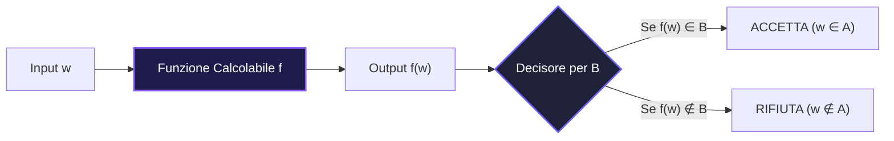

### Proprietà di Propagazione:
1. Se $A \le_m B$ e $B$ è **decidibile** $\implies A$ è **decidibile**.
2. Se $A \le_m B$ e $A$ è **indecidibile** $\implies B$ è **indecidibile** *(utilizzo primario per le dimostrazioni)*.
3. Se $A \le_m B$ e $B \in \mathcal{RE} \implies A \in \mathcal{RE}$.
4. Se $A \le_m B$ e $A \notin \mathcal{RE} \implies B \notin \mathcal{RE}$.

---

## 8.5 Il Problema della Fermata ($HALT_{TM}$)

$$HALT_{TM} = \{\langle M, w \rangle \mid M \text{ è una MdT che termina su input } w\}$$

> [!IMPORTANT]
> **Teorema**: $HALT_{TM}$ è **indecidibile**.
> 
> **Dimostrazione (per riduzione $A_{TM} \le_m HALT_{TM}$)**:
> Se per assurdo esistesse un decisore $R$ per $HALT_{TM}$, potremmo costruire un decisore $S$ per $A_{TM}$:
> 1. $S$ riceve $\langle M, w \rangle$.
> 2. Esegue $R$ su $\langle M, w \rangle$.
> 3. Se $R$ rifiuta ($M$ entra in un loop infinito su $w$) $\implies S$ **rifiuta**.
> 4. Se $R$ accetta ($M$ termina su $w$) $\implies S$ simula $M(w)$ in sicurezza. Se $M$ accetta $\implies S$ **accetta**, altrimenti **rifiuta**.
> 
> Abbiamo ottenuto un decisore per $A_{TM}$, il che è impossibile. Dunque $R$ non può esistere: **$HALT_{TM}$ è indecidibile**.

---

## 8.6 Il Teorema di Rice: L'Impossibilità dell'Analisi Semantica

Il **Teorema di Rice (1953)** rappresenta uno dei risultati più devastanti dell'informatica teorica: stabilisce l'impossibilità matematica di creare algoritmi capaci di verificare in modo automatico e generale qualsiasi proprietà sul **comportamento semantico** dei programmi.

---

### 8.6.1 Definizione Formale e Requisiti

Sia $\mathcal{RE}$ l'insieme di tutti i linguaggi Turing-riconoscibili. Una proprietà $\mathcal{P}$ è un sottoinsieme $\mathcal{P} \subseteq \mathcal{RE}$.

> [!NOTE]
> Affinché il Teorema di Rice sia applicabile, la proprietà $\mathcal{P}$ deve soddisfare due condizioni imprescindibili:
> 
> 1. **Proprietà di Linguaggio (Semantica)**:
>    La proprietà riguarda **esclusivamente il linguaggio riconosciuto** $\mathcal{L}(M)$ e non i dettagli implementativi interni di $M$.
>    $$\mathcal{L}(M_1) = \mathcal{L}(M_2) \implies (\mathcal{L}(M_1) \in \mathcal{P} \iff \mathcal{L}(M_2) \in \mathcal{P})$$
> 2. **Non Banalità (Non-Trivial)**:
>    La proprietà non è né sempre vera né sempre falsa. Esiste almeno un linguaggio $L_1 \in \mathcal{RE}$ che soddisfa $\mathcal{P}$ e almeno un linguaggio $L_2 \in \mathcal{RE}$ che non la soddisfa:
>    $$\mathcal{P} \neq \emptyset \quad \text{e} \quad \mathcal{P} \neq \mathcal{RE}$$

> [!CAUTION]
> **Enunciato del Teorema di Rice**:
> Se $\mathcal{P}$ è una proprietà semantica non banale dei linguaggi Turing-riconoscibili, allora il linguaggio di decisione corrispondente è **INDECIDIBILE**:
> 
> $$L_{\mathcal{P}} = \{\langle M \rangle \mid \mathcal{L}(M) \in \mathcal{P}\} \notin \mathcal{R}$$

---

### 8.6.2 Dimostrazione Costruttiva del Teorema di Rice

La dimostrazione si basa sulla riduzione per mappatura $A_{TM} \le_m L_{\mathcal{P}}$.

1. **Ipotesi senza perdita di generalità**: Assumiamo che il linguaggio vuoto $\emptyset \notin \mathcal{P}$ (se $\emptyset \in \mathcal{P}$, la dimostrazione si applica identicamente al complemento $\overline{\mathcal{P}}$ che è anch'esso non banale).
2. **Esistenza di un linguaggio bersaglio**: Poiché $\mathcal{P} \neq \emptyset$, esiste almeno un linguaggio $L_0 \in \mathcal{P}$. Sia $M_0$ la Macchina di Turing che riconosce $L_0$ ($\mathcal{L}(M_0) = L_0$).
3. **Costruzione della Riduzione $f(\langle M, w \rangle) = \langle M' \rangle$**:
   Data un'istanza $\langle M, w \rangle$ per $A_{TM}$, l'algoritmo di riduzione progetta una nuova macchina $M'$ che accetta una stringa $x$ in input comportandosi nel seguente modo:
   
   ```mermaid
   flowchart TD
       x["Input: x"] --> SimM["1. Simula M su w"]
       SimM -->|"Se M rifiuta o loop"| Loop["Non accetta mai (L(M') = ∅)"]
       SimM -->|"Se M accetta w"| SimM0["2. Simula M0 su x"]
       SimM0 -->|"Se M0 accetta x"| Acc["Accetta x (L(M') = L0)"]
       
       style SimM fill:#1e1b4b,stroke:#a78bfa,stroke-width:2px,color:#fff
       style SimM0 fill:#1e2137,stroke:#6c63ff,stroke-width:2px,color:#fff
       style Acc fill:#064e3b,stroke:#10b981,stroke-width:2px,color:#fff
       style Loop fill:#451a1a,stroke:#ef4444,stroke-width:2px,color:#fff
   ```

4. **Analisi del Linguaggio $\mathcal{L}(M')$**:
   - **Se $M$ accetta $w$**: il passo 1 termina positivamente e la macchina $M'$ esegue il passo 2 su $x$. Quindi $M'$ accetta $x \iff M_0$ accetta $x$. Dunque:
     $$\mathcal{L}(M') = \mathcal{L}(M_0) = L_0 \in \mathcal{P} \implies \langle M' \rangle \in L_{\mathcal{P}}$$
   - **Se $M$ non accetta $w$** (rifiuta o entra in loop infinito): il passo 1 non termina mai con successo o rifiuta, perciò nessun $x$ viene mai accettato. Dunque:
     $$\mathcal{L}(M') = \emptyset \notin \mathcal{P} \implies \langle M' \rangle \notin L_{\mathcal{P}}$$

5. **Conclusione**:
   $$\langle M, w \rangle \in A_{TM} \iff \langle M' \rangle \in L_{\mathcal{P}}$$
   Abbiamo ottenuto una riduzione $A_{TM} \le_m L_{\mathcal{P}}$. Poiché $A_{TM}$ è indecidibile, **$L_{\mathcal{P}}$ è indecidibile**. $\blacksquare$

---

### 8.6.3 Checklist in 3 Passi per Applicare il Teorema di Rice

Per dimostrare rapidamente l'indecidibilità di un linguaggio $L = \{\langle M \rangle \mid \dots\}$ all'esame, basta seguire questa sequenza:

```
Passo 1 (Semanticità) ──► La proprietà dipende SOLO dal linguaggio L(M)?
                             └─► Se Sì: procedi al Passo 2.
                             └─► Se No: Rice NON si applica (proprietà sintattica).
Passo 2 (Test "Sì")   ──► Esiste una MdT M_SI tale che L(M_SI) possiede la proprietà?
Passo 3 (Test "No")   ──► Esiste una MdT M_NO tale che L(M_NO) NON possiede la proprietà?
                             └─► Se entrambi i test hanno successo: il linguaggio è INDECIDIBILE per Rice!
```

---

### 8.6.4 Esempi Svolti di Applicazione

#### Esempio 1 — Linguaggio non vuoto: $L_1 = \{\langle M \rangle \mid \mathcal{L}(M) \neq \emptyset\}$
- **Proprietà semantica**: La condizione "il linguaggio contiene almeno una stringa" dipende solo da $\mathcal{L}(M)$.
- **Test Sì**: Sia $M_{acc}$ la macchina che accetta qualsiasi stringa ($\mathcal{L}(M_{acc}) = \Sigma^*$). Poiché $\Sigma^* \neq \emptyset \implies \langle M_{acc} \rangle \in L_1$.
- **Test No**: Sia $M_{loop}$ la macchina che va sempre in loop ($\mathcal{L}(M_{loop}) = \emptyset$). Poiché $\emptyset$ è vuoto $\implies \langle M_{loop} \rangle \notin L_1$.
- **Conclusione**: Proprietà semantica non banale $\implies$ **$L_1$ è indecidibile**.

---

#### Esempio 2 — Riconoscimento della stringa vuota: $L_2 = \{\langle M \rangle \mid \epsilon \in \mathcal{L}(M)\}$
- **Proprietà semantica**: Dipende unicamente dal fatto che la parola $\epsilon$ appartenga a $\mathcal{L}(M)$.
- **Test Sì**: $M_{acc}$ con $\mathcal{L}(M_{acc}) = \Sigma^*$; dato che $\epsilon \in \Sigma^* \implies \langle M_{acc} \rangle \in L_2$.
- **Test No**: $M_\emptyset$ che rifiuta ogni stringa; dato che $\epsilon \notin \emptyset \implies \langle M_\emptyset \rangle \notin L_2$.
- **Conclusione**: **$L_2$ è indecidibile**.

---

#### Esempio 3 — Regolarità del Linguaggio: $L_3 = \{\langle M \rangle \mid \mathcal{L}(M) \text{ è un linguaggio regolare}\}$
- **Proprietà semantica**: Dipende dalla classe formale di appartenenza di $\mathcal{L}(M)$.
- **Test Sì**: Sia $M_1$ con $\mathcal{L}(M_1) = \{0^*\}$ (linguaggio regolare) $\implies \langle M_1 \rangle \in L_3$.
- **Test No**: Sia $M_2$ con $\mathcal{L}(M_2) = \{0^n 1^n \mid n \ge 0\}$ (linguaggio non regolare) $\implies \langle M_2 \rangle \notin L_3$.
- **Conclusione**: **$L_3$ è indecidibile**.

---

#### Esempio 4 — Finitezza del Linguaggio: $L_4 = \{\langle M \rangle \mid \mathcal{L}(M) \text{ è un insieme finito}\}$
- **Proprietà semantica**: La cardinalità $|\mathcal{L}(M)| < \infty$ è una proprietà puramente di linguaggio.
- **Test Sì**: Sia $M_{fin}$ che accetta solo la stringa `01` ($\mathcal{L}(M_{fin}) = \{01\}$, cardinalità $1 < \infty$) $\implies \langle M_{fin} \rangle \in L_4$.
- **Test No**: Sia $M_{acc}$ con $\mathcal{L}(M_{acc}) = \Sigma^*$ (infinito) $\implies \langle M_{acc} \rangle \notin L_4$.
- **Conclusione**: **$L_4$ è indecidibile**.

---

#### Esempio 5 — Simmetria / Proprietà dei Palindromi: $L_5 = \{\langle M \rangle \mid \mathcal{L}(M) = \mathcal{L}(M)^R\}$
- **Proprietà semantica**: Riguarda la simmetria del linguaggio riconosciuto.
- **Test Sì**: $M_1$ con $\mathcal{L}(M_1) = \{010, 11\}$ (chiuso per inversione speculare) $\implies \langle M_1 \rangle \in L_5$.
- **Test No**: $M_2$ con $\mathcal{L}(M_2) = \{01\}$ (poiché $\{01\}^R = \{10\} \neq \{01\}$) $\implies \langle M_2 \rangle \notin L_5$.
- **Conclusione**: **$L_5$ è indecidibile**.

---

### 8.6.5 Tranelli d'Esame: Dove Rice NON si Applica!

> [!WARNING]
> Nei compiti d'esame compaiono spesso quesiti a trabocchetto formulati come proprietà di Macchine di Turing. Bisogna distinguere nettamente se la proprietà è **semantica**, **sintattica** o **banale**:

| Linguaggio Proposto | Perché Rice NON si applica | Decidibilità Reale |
| :--- | :--- | :--- |
| $L_A = \{\langle M \rangle \mid M \text{ ha meno di 10 stati}\}$ | **Proprietà Sintattica**: riguarda la struttura interna della tupla di $M$, non il linguaggio. | **Decidibile** (basta contare gli elementi dell'insieme $Q$ nella codifica). |
| $L_B = \{\langle M, w \rangle \mid M \text{ termina su } w \text{ in } \le 100 \text{ passi}\}$ | **Proprietà di Computazione Limitata**: non riguarda l'intero linguaggio $\mathcal{L}(M)$. | **Decidibile** (si simula $M(w)$ per 100 passi: se si arresta accetta, altrimenti rifiuta). |
| $L_C = \{\langle M \rangle \mid \mathcal{L}(M) \subseteq \Sigma^*\}$ | **Proprietà Banale**: ogni linguaggio riconosciuto è per definizione un sottoinsieme di $\Sigma^*$. Quindi $\mathcal{P} = \mathcal{RE}$. | **Decidibile** (l'algoritmo risponde sempre "Sì"). |
| $L_D = \{\langle M \rangle \mid M \text{ entra nello stato } q_5 \text{ durante la computazione su } \epsilon\}$ | **Proprietà di Traccia d'Esecuzione**: due macchine con lo stesso linguaggio possono avere percorsi di stati interni diversi. | **Indecidibile** (ma si dimostra per riduzione diretta da $A_{TM}$, non con Rice). |

---

## 8.7 Il Sunto del Boss: Decidibilità e Limiti

> [!TIP]
> ### Quadro di Sintesi
> - **$A_{TM}$ e $HALT_{TM}$**: Sono entrambi in $\mathcal{RE}$ (riconoscibili) ma **indecidibili**.
> - **$\overline{A_{TM}}$ e $E_{TM}$**: Non sono neppure Turing-riconoscibili ($\notin \mathcal{RE}$).
> - **Teorema di Rice**: Uccide l'idea del "compilatore perfetto" capace di verificare bug o equivalenze logiche sul codice in modo universale.

---
---

# Capitolo 9 — Teoria della Complessità Computazionale

La **Teoria della Complessità** classifica i problemi decidibili in base al costo delle risorse di calcolo (**tempo** e **spazio**) al crescere della dimensione dell'input $n = |w|$.

---

## 9.1 Complessità di Tempo e Classi $TIME(t(n))$ / $NTIME(t(n))$

Sia $M$ una MdT deterministica che si ferma sempre. La complessità temporale di $M$ è la funzione $f: \mathbb{N} \to \mathbb{N}$ dove $f(n)$ è il numero massimo di passi che $M$ compie su qualsiasi input di lunghezza $n$.

- $\mathbf{TIME(t(n))}$: Insieme di tutti i linguaggi decisi da una DTM in tempo $O(t(n))$.
- $\mathbf{NTIME(t(n))}$: Insieme di tutti i linguaggi decisi da una NTM in tempo $O(t(n))$.

---

## 9.2 La Classe $\mathcal{P}$ (Tempo Polinomiale Deterministico)

> [!NOTE]
> $$\mathcal{P} = \bigcup_{k \ge 0} \text{TIME}(n^k)$$
> $\mathcal{P}$ rappresenta la classe dei problemi **computazionalmente trattabili** (efficientemente risolvibili da un algoritmo deterministico su MdT deterministica / DTM).

### 9.2.1 Esempi Notevoli di Problemi in $\mathcal{P}$ e Algoritmi su DTM

#### 1. Il Problema PATH (Raggiungibilità su Grafi Orientati)
- **Linguaggio**: $\text{PATH} = \{\langle G, s, t \rangle \mid G \text{ è un grafo orientato con un cammino da } s \text{ a } t\}$
- **Algoritmo Deterministico (BFS / Marcamento su DTM a 3 nastri)**:
  1. Marca il nodo di partenza $s$.
  2. Scandisci il nastro degli archi $E$: per ogni arco $(u, v)$, se $u$ è marcato e $v$ non lo è, marca $v$.
  3. Ripeti il passo 2 finché in un'intera scansione non vengono aggiunti nuovi nodi marcati (al massimo $|V|$ iterazioni).
  4. Se il nodo di arrivo $t$ risulta marcato, **accetta**; altrimenti **rifiuta**.
- **Analisi di Complessità**: Il ciclo itera al più $|V|$ volte. Ciascuna scansione degli archi richiede tempo proporzionale a $O(|E| \cdot \text{lunghezza codifica})$. Il tempo totale su DTM è $O(|V| \cdot |E|) = O(n^3)$ passi polinomiali $\implies \mathbf{\text{PATH} \in \mathcal{P}}$.

---

#### 2. Il Problema RELPRIME (Primalità Relativa / MCD)
- **Linguaggio**: $\text{RELPRIME} = \{\langle x, y \rangle \mid x, y \in \mathbb{N} \text{ e } \gcd(x, y) = 1\}$
- **Algoritmo Deterministico (Algoritmo di Euclide su DTM)**:
  1. Esegui la divisione intera con resto sul nastro: $x \pmod y = r$.
  2. Sostituisci $x \leftarrow y$ e $y \leftarrow r$.
  3. Se $y = 0$, il MCD è il valore attuale di $x$. Se $x = 1$ **accetta**, altrimenti **rifiuta**.
- **Analisi di Complessità**: A ogni due iterazioni il valore del resto si dimezza ($r < x/2$). Il numero totale di iterazioni è limitato da $2 \log_2(\min(x, y))$. Poiché la dimensione dell'input in bit è $n = \lceil \log_2 x \rceil + \lceil \log_2 y \rceil$, il numero di passi su DTM è quadratico rispetto ai bit d'ingresso ($O(n^2)$) $\implies \mathbf{\text{RELPRIME} \in \mathcal{P}}$.

---

#### 3. Il Problema 2SAT (Soddisfacibilità con Clausole a 2 Letterali)
- **Linguaggio**: $\text{2SAT} = \{\langle \phi \rangle \mid \phi \text{ è in 2-CNF ed è soddisfacibile}\}$
- **Algoritmo Deterministico (Grafo delle Implicazioni)**:
  - Ogni clausola $(a \vee b)$ equivale a due implicazioni logiche: $(\neg a \implies b)$ e $(\neg b \implies a)$.
  - Si costruisce un grafo orientato $G_{\phi}$ i cui nodi sono i letterali $x_i, \neg x_i$.
  - $\phi$ è insoddisfacibile $\iff \exists x_i$ tale che $x_i \rightsquigarrow \neg x_i$ e contemporaneamente $\neg x_i \rightsquigarrow x_i$ (appartengono alla stessa Componente Fortemente Connessa).
  - Si calcolano le componenti fortemente connesse (algoritmo di Tarjan/Kosaraju) su DTM in tempo $O(|V| + |E|) = O(n)$ $\implies \mathbf{\text{2SAT} \in \mathcal{P}}$.

> [!TIP]
> Notare l'enorme salto di complessità: mentre **2SAT** è in $\mathcal{P}$ (tempo lineare), basta aumentare i letterali per clausola a 3 (**3SAT**) per rendere il problema **NP-Completo**!

---

## 9.3 La Classe $\mathcal{NP}$ (NTM e Verificatori Polinomiali)

La classe $\mathcal{NP}$ (*Non-deterministic Polynomial time*) ammette due definizioni formali equivalenti:

### Definizione 1 (Basata su NTM):
$$\mathcal{NP} = \bigcup_{k \ge 0} \text{NTIME}(n^k)$$
$\mathcal{NP}$ è la classe dei linguaggi decisi da una Macchina di Turing Non Deterministica in tempo polinomiale.

### Definizione 2 (Basata su Verificatori e Certificati):
Un linguaggio $L \in \mathcal{NP}$ se e solo se esiste un algoritmo deterministico polinomiale $V$ (detto **Verificatore**) e un polinomio $p(n)$ tali che:
$$w \in L \iff \exists c \text{ con } |c| \le p(|w|) \text{ tale che } V(\langle w, c \rangle) = \text{accetta}$$
La stringa $c$ è detta **certificato** (o *testimone* polinomiale).

> [!IMPORTANT]
> **Intuito**: 
> - In $\mathcal{P}$: *Trovare* la soluzione è facile (tempo polinomiale).
> - In $\mathcal{NP}$: *Verificare* una soluzione fornita dall'esterno è facile (tempo polinomiale).
> - È evidente che $\mathcal{P} \subseteq \mathcal{NP}$. La questione se $\mathcal{P} = \mathcal{NP}$ o $\mathcal{P} \neq \mathcal{NP}$ è il più celebre problema aperto dell'informatica teorica.

---

### 9.3.1 Esempi Notevoli di Problemi in $\mathcal{NP}$: Paradigma "Guess & Check" vs Verificatore

In una Macchina di Turing Non Deterministica (NTM), l'esecuzione polinomiale segue sempre lo schema **Guess & Check** (Indovina e Controlla):

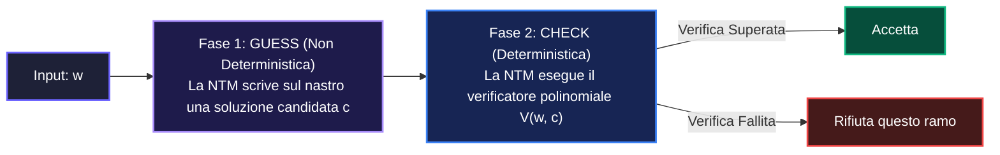

#### 1. HAMPATH (Cammino Hamiltoniano)
- **Istanza**: $\langle G, s, t \rangle$ dove $G=(V, E)$ è un grafo orientato con $|V|=m$ nodi.
- **Risoluzione con NTM (Guess & Check)**:
  1. **Fase Guess (Non Deterministica)**: Scrivi in modo non deterministico una sequenza di $m$ numeri di vertice sul secondo nastro: $c = (v_1, v_2, \dots, v_m)$. Questa scrittura richiede $m$ scelte non deterministiche $\implies O(m \log m)$ passi.
  2. **Fase Check (Deterministica)**:
     - Controlla che $v_1 = s$ e $v_m = t$.
     - Controlla che non vi siano vertici ripetuti (tutti i $v_i$ distinti).
     - Controlla che per ogni $i \in \{1, \dots, m-1\}$, la coppia $(v_i, v_{i+1}) \in E$.
     - Se tutti i controlli hanno successo **accetta**, altrimenti **rifiuta**.
  - **Tempo Totale NTM**: $O(m^2)$ deterministico $\implies$ Polinomiale.
- **Verificatore Equivalente**: $V(\langle G, s, t \rangle, c)$ riceve il cammino $c$ come certificato e convalida in tempo polinomiale $O(m^2)$.

---

#### 2. CLIQUE (Cricca di Dimensione $k$)
- **Istanza**: $\langle G, k \rangle$ dove $G=(V, E)$ e $k \in \mathbb{N}$.
- **Risoluzione con NTM**:
  1. **Guess**: Indovina un sottoinsieme di $k$ vertici $C = \{u_1, \dots, u_k\} \subseteq V$ in tempo $O(k \log |V|)$.
  2. **Check**: Per ciascuna delle $\binom{k}{2} = \frac{k(k-1)}{2}$ coppie distinte $(u_i, u_j)$, verifica se l'arco $\{u_i, u_j\} \in E$.
  3. Se tutte le coppie sono collegate da un arco, **accetta**; altrimenti **rifiuta**.
- **Complessità**: $\binom{k}{2} \le |V|^2$ verifiche su nastro $\implies O(|V|^2)$ tempo polinomiale $\implies \mathbf{\text{CLIQUE} \in \mathcal{NP}}$.

---

#### 3. SUBSET-SUM (Somma di Sottoinsiemi)
- **Istanza**: $\langle S, T \rangle$ con $S = \{x_1, \dots, x_k\}$ e target $T$.
- **Risoluzione con NTM**:
  1. **Guess**: Per ogni elemento $x_j$, indovina non deterministicamente un bit $b_j \in \{0, 1\}$ (che indica se $x_j$ è incluso nel sottoinsieme $S'$).
  2. **Check**: Calcola sul nastro di lavoro la somma $\sum_{j=1}^k b_j \cdot x_j$. Confronta il risultato con $T$. Se coincidono **accetta**, altrimenti **rifiuta**.
- **Complessità**: La somma di $k$ numeri di $b$ bit richiede tempo $O(k \cdot b)$ $\implies$ Polinomiale $\implies \mathbf{\text{SUBSET-SUM} \in \mathcal{NP}}$.

---

## 9.4 Riducibilità in Tempo Polinomiale ($\le_p$)

> [!NOTE]
> Un linguaggio $A$ è **riducibile in tempo polinomiale** a $B$ ($A \le_p B$) se esiste una funzione $f: \Sigma^* \to \Sigma^*$ calcolabile in tempo polinomiale da una DTM tale che:
> $$\forall w \in \Sigma^*, \quad w \in A \iff f(w) \in B$$

**Proprietà**:
- Se $A \le_p B$ e $B \in \mathcal{P} \implies A \in \mathcal{P}$.
- Se $A \le_p B$ e $B \in \mathcal{NP} \implies A \in \mathcal{NP}$.
- **Transitività**: Se $A \le_p B$ e $B \le_p C \implies A \le_p C$.

---

## 9.5 NP-Completezza e il Teorema di Cook-Levin

I problemi **NP-Completi** rappresentano i problemi più complessi dell'intera classe $\mathcal{NP}$. Se si scoprisse un algoritmo polinomiale per uno solo di essi, allora $\mathcal{P} = \mathcal{NP}$.

> [!IMPORTANT]
> **Definizione (NP-Completezza)**:
> Un linguaggio $B$ è **NP-Completo** se soddisfa entrambe le condizioni:
> 1. $B \in \mathcal{NP}$ *(Condizione di appartenenza)*.
> 2. $\forall A \in \mathcal{NP}, \quad A \le_p B$ *(Condizione di NP-Hardness / Arduità)*.

> [!NOTE]
> **Teorema di Cook-Levin (1971)**:
> Il problema della soddisfacibilità delle formule booleane (**SAT**) è **NP-Completo**.

Catena fondamentale di riduzioni polinomiali:
$$\text{SAT} \le_p \text{3SAT} \le_p \text{CLIQUE} \le_p \text{VERTEX-COVER} \le_p \text{HAMPATH} \le_p \text{UHAMPATH}$$

---

## 9.6 Catalogo Formale dei Problemi NP-Completi

### 9.6.1 SAT (Soddisfacibilità Booleana)
Determinare se esiste un'assegnazione di verità alle variabili booleane $x_1, \dots, x_n$ tale che una formula proposizionale $\phi$ valga Vero.
- **Linguaggio**: $\text{SAT} = \{\langle \phi \rangle \mid \phi \text{ è una formula booleana soddisfacibile}\}$
- **Certificato**: L'assegnazione dei valori di verità alle variabili.

### 9.6.2 3SAT (3-Conjunctive Normal Form SAT)
Variante di SAT in cui la formula è una congiunzione ($\wedge$) di clausole, e ciascuna clausola è una disgiunzione ($\vee$) di **esattamente 3 letterali**.
- **Linguaggio**: $\text{3SAT} = \{\langle \phi \rangle \mid \phi \text{ è in 3-CNF ed è soddisfacibile}\}$
- **Esempio**: $(x_1 \vee \neg x_2 \vee x_3) \wedge (\neg x_1 \vee x_2 \vee x_4)$

### 9.6.3 CLIQUE (Cricca di Vertici)
Dato un grafo non orientato $G=(V, E)$ e un intero $k$, determinare se $G$ contiene un sottografo completo di $k$ nodi.
- **Linguaggio**: $\text{CLIQUE} = \{\langle G, k \rangle \mid G \text{ ha una clique di dimensione } k\}$
- **Certificato**: L'insieme dei $k$ vertici formanti la cricca.

### 9.6.4 VERTEX-COVER (Copertura di Vertici)
Dato un grafo non orientato $G$ e un intero $k$, determinare se esiste un insieme di $k$ nodi che tocca tutti gli archi di $G$.
- **Linguaggio**: $\text{VERTEX-COVER} = \{\langle G, k \rangle \mid G \text{ possiede un vertex cover di cardinalità } k\}$
- **Riduzione da CLIQUE**: Un grafo $G$ ha una clique di dimensione $k \iff$ il grafo complemento $\overline{G}$ ha un vertex cover di dimensione $|V| - k$.

### 9.6.5 HAMPATH (Cammino Hamiltoniano Orientato)
Dato un grafo orientato $G$ e due nodi $s, t$, determinare se esiste un cammino da $s$ a $t$ che visita ogni vertice di $G$ esattamente una volta.
- **Linguaggio**: $\text{HAMPATH} = \{\langle G, s, t \rangle \mid G \text{ contiene un cammino hamiltoniano da } s \text{ a } t\}$
- **Certificato**: La sequenza ordinata degli $n$ vertici che compongono il cammino.

### 9.6.6 UHAMPATH (Cammino Hamiltoniano Non Orientato)
Variante di HAMPATH su grafi non orientati.
- **Gadget di Riduzione ($\text{HAMPATH} \le_p \text{UHAMPATH}$)**: Ogni nodo $v$ orientato viene espanso in una terna non orientata $v_{in} - v_{mid} - v_{out}$ per imporre il verso di percorrenza.

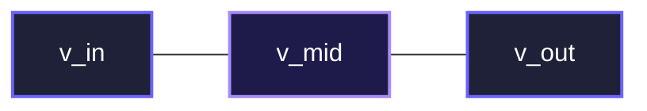

### 9.6.7 SUBSET-SUM (Somma di Sottoinsiemi)
Dato un multinsieme di numeri $S = \{x_1, \dots, x_k\}$ e un target $T$, stabilire se esiste un sottoinsieme $S' \subseteq S$ tale che $\sum_{x \in S'} x = T$.
- **Linguaggio**: $\text{SUBSET-SUM} = \{\langle S, T \rangle \mid \exists S' \subseteq S \text{ con } \sum_{x \in S'} x = T\}$
- **Rappresentazione Binaria**: I numeri devono essere codificati in base binaria affinché il problema sia NP-Completo (la codifica unaria lo renderebbe risolvibile in tempo pseudo-polinomiale con la Programmazione Dinamica).

---

### 9.6.8 Esempi Svolti Passo-Passo di Riduzioni Polinomiali ($\le_p$)

Ecco le quattro riduzioni polinomiali fondamentali spiegate nei minimi dettagli costruttivi con istanze concrete:

---

#### Riduzione 1: $3SAT \le_p CLIQUE$

**Obiettivo**: Convertire una formula $\phi$ in 3-CNF con $k$ clausole in una coppia $\langle G, k \rangle$ tale che $\phi$ è soddisfacibile $\iff G$ ha una clique di dimensione $k$.

**Costruzione del Gadget**:
1. Per ogni clausola $C_r = (l_{r1} \vee l_{r2} \vee l_{r3})$, creiamo un gruppo (gadget) di 3 vertici contrassegnati con i rispettivi letterali. Con $k$ clausole, il grafo ha $|V| = 3k$ nodi.
2. Inseriamo un arco tra due nodi $u$ e $v$ se e solo se:
   - $u$ e $v$ appartengono a **clausole diverse** (non ci sono archi interni allo stesso gadget di clausola).
   - I letterali associati a $u$ e $v$ sono **logicamente compatibili** (cioè $u \neq \neg v$).

**Esempio Concreto**:
Sia data la formula $\phi$ con $k=3$ clausole:
$$\phi = \underbrace{(x_1 \vee x_1 \vee x_2)}_{C_1} \wedge \underbrace{(\neg x_1 \vee \neg x_2 \vee \neg x_2)}_{C_2} \wedge \underbrace{(\neg x_1 \vee x_2 \vee x_2)}_{C_3}$$

- **Nodi**: Creiamo 3 gruppi di 3 nodi:
  - $C_1 = \{v_{1,1}: x_1, \, v_{1,2}: x_1, \, v_{1,3}: x_2\}$
  - $C_2 = \{v_{2,1}: \neg x_1, \, v_{2,2}: \neg x_2, \, v_{2,3}: \neg x_2\}$
  - $C_3 = \{v_{3,1}: \neg x_1, \, v_{3,2}: x_2, \, v_{3,3}: x_2\}$
- **Archi**: Colleghiamo ad esempio $v_{1,3} (x_2)$ con $v_{3,2} (x_2)$ e con $v_{2,1} (\neg x_1)$, poiché sono in clausole diverse e non sono letterali opposti. Invece $v_{1,3} (x_2)$ **non** sarà collegato a $v_{2,2} (\neg x_2)$ perché $x_2$ e $\neg x_2$ sono incompatibili.
- **Verifica**:
  - L'assegnazione soddisfacente $x_1 = 0, x_2 = 1$ rende veri: $x_2$ in $C_1$, $\neg x_1$ in $C_2$, $x_2$ in $C_3$.
  - I tre nodi selezionati $\{v_{1,3}, v_{2,1}, v_{3,2}\}$ sono mutuamente compatibili e formano un triangolo completo (**3-clique** nel grafo).
- **Tempo di Riduzione**: Creare $3k$ nodi e al più $\binom{3k}{2} = O(k^2)$ archi richiede tempo polinomiale $O(k^2)$. $\blacksquare$

---

#### Riduzione 2: $CLIQUE \le_p VERTEX\text{-}COVER$

**Obiettivo**: Mostrare che trovare una cricca di dimensione $k$ equivale a trovare una copertura di vertici di dimensione $|V| - k$ nel grafo complemento.

> [!NOTE]
> **Teorema Chiave**:
> Sia $G = (V, E)$ un grafo non orientato e sia $\overline{G} = (V, \overline{E})$ il suo grafo complemento (dove $\{u, v\} \in \overline{E} \iff \{u, v\} \notin E$).
> Un sottoinsieme di nodi $S \subseteq V$ è una **clique** in $G$ di dimensione $k$ $\iff$ il complemento $V \setminus S$ è un **vertex cover** in $\overline{G}$ di dimensione $|V| - k$.

**Dimostrazione dell'Equivalenza**:
1. $(\implies)$ Sia $S$ una $k$-clique in $G$. Ogni coppia di nodi in $S$ ha un arco in $G$, quindi **nessuna coppia in $S$ ha un arco in $\overline{G}$**.
   - Sia $e = \{u, v\}$ un arco qualsiasi in $\overline{G}$.
   - Poiché non ci sono archi di $\overline{G}$ interni a $S$, $u$ e $v$ non possono appartenere entrambi a $S$.
   - Almeno uno tra $u$ e $v$ deve trovarsi in $V \setminus S$.
   - Dunque $V \setminus S$ tocca ogni arco di $\overline{G}$, ed è quindi un **vertex cover** di dimensione $|V| - k$.
2. $(\impliedby)$ Sia $V \setminus S$ un vertex cover in $\overline{G}$. Per definizione, nessun arco in $\overline{G}$ può connettere due nodi che stanno entrambi fuori dalla copertura (cioè in $S$). Dunque tutti i nodi in $S$ sono reciprocamente connessi in $G \implies S$ è una clique in $G$.

**Esempio Numerico**:
- Dato $G$ con $|V| = 5$ vertici e $k = 3$ (cerchiamo una 3-clique).
- Costruiamo $\overline{G}$ in tempo $O(|V|^2)$.
- Poniamo $k' = |V| - k = 5 - 3 = 2$.
- Diamo in input $\langle \overline{G}, 2 \rangle$ al decisore di VERTEX-COVER. $\blacksquare$

---

#### Riduzione 3: $VERTEX\text{-}COVER \le_p SET\text{-}COVER$

**Definizione di SET-COVER**: Dato un universo finito $U = \{e_1, \dots, e_m\}$, una famiglia di sottoinsiemi $\mathcal{S} = \{S_1, \dots, S_n\}$ con $S_i \subseteq U$, e un intero $k$, stabilire se esistono al più $k$ sottoinsiemi la cui unione copre interamente $U$ ($\bigcup_{j=1}^k S_{i_j} = U$).

**Funzione di Riduzione $f(\langle G, k \rangle) = \langle U, \mathcal{S}, k \rangle$**:
1. L'universo $U$ corrisponde esattamente all'insieme degli archi del grafo: $U = E$.
2. Per ogni vertice $v \in V$, definiamo un sottoinsieme $S_v \in \mathcal{S}$ formato dagli archi incidenti a $v$:
   $$S_v = \{e \in E \mid v \text{ è un estremo di } e\}$$
3. Il target di copertura $k$ rimane invariato.

**Correttezza**:
- Un insieme di $k$ vertici $V' \subseteq V$ tocca tutti gli archi in $E$ $\iff$ i corrispondenti $k$ insiemi $\{S_v\}_{v \in V'}$ hanno come unione l'intero universo $E$.
- La riduzione crea $|V|$ sottoinsiemi di dimensione al più $|V|$ in tempo $O(|V| + |E|) \implies$ Polinomiale. $\blacksquare$

---

#### Riduzione 4: $3SAT \le_p SUBSET\text{-}SUM$

**Obiettivo**: Trasformare una formula 3-CNF $\phi$ con $n$ variabili $x_1, \dots, x_n$ e $m$ clausole $C_1, \dots, C_m$ in un insieme di interi $S$ e un target $T$.

**Struttura della Tabella Decimale**:
I numeri vengono costruiti con $n + m$ cifre posizionali (nessun riporto sommando cifre $\le 3$):
- Le prime $n$ colonne tracciano le **variabili** ($x_1, \dots, x_n$).
- Le ultime $m$ colonne tracciano le **clausole** ($C_1, \dots, C_m$).

| Elemento in $S$ | $x_1$ | $\dots$ | $x_n$ | $C_1$ | $\dots$ | $C_m$ | Ruolo |
| :--- | :---: | :---: | :---: | :---: | :---: | :---: | :--- |
| $y_1$ | 1 | 0 | 0 | 1 se $x_1 \in C_1$ | $\dots$ | 1 se $x_1 \in C_m$ | Scelta $x_1 = \text{True}$ |
| $z_1$ | 1 | 0 | 0 | 1 se $\neg x_1 \in C_1$ | $\dots$ | 1 se $\neg x_1 \in C_m$ | Scelta $x_1 = \text{False}$ |
| $\dots$ | $\dots$ | $\dots$ | $\dots$ | $\dots$ | $\dots$ | $\dots$ | $\dots$ |
| $y_n, z_n$ | 0 | 0 | 1 | $\dots$ | $\dots$ | $\dots$ | Scelta per variabile $x_n$ |
| $g_1, h_1$ | 0 | 0 | 0 | 1, 1 | 0 | 0 | *Slack variables* clausola $C_1$ |
| $\dots$ | 0 | 0 | 0 | 0 | $\dots$ | $\dots$ | $\dots$ |
| $g_m, h_m$ | 0 | 0 | 0 | 0 | 0 | 1, 1 | *Slack variables* clausola $C_m$ |
| **TARGET $T$** | **1** | **1** | **1** | **3** | **3** | **3** | Somma obiettivo da ottenere |

**Perché la Riduzione Funziona**:
1. Per ogni variabile $x_i$, possiamo scegliere esattamente **uno** tra $y_i$ e $z_i$ affinché la colonna $x_i$ sommi a $1$ nel target.
2. In ciascuna colonna di clausola $C_j$, i letterali scelti contribuiscono con un valore da $1$ a $3$ (se la clausola è soddisfatta).
3. Le due variabili di slack $g_j$ e $h_j$ (ciascuna con valore $1$ nella colonna $C_j$) permettono di assorbire la differenza e raggiungere esattamente il target **$3$** (es: se la clausola ha 1 letterale vero, prendiamo $1 + g_j + h_j = 1 + 1 + 1 = 3$; se ne ha 2, prendiamo $2 + g_j = 3$; se ne ha 3, prendiamo solo 3).
4. Se una clausola avesse $0$ letterali veri, la somma massima ottenibile sarebbe $0 + 1 + 1 = 2 < 3$, rendendo impossibile raggiungere il target $T$. $\blacksquare$

---

## 9.7 Mappa delle Classi di Complessità e Gerarchia

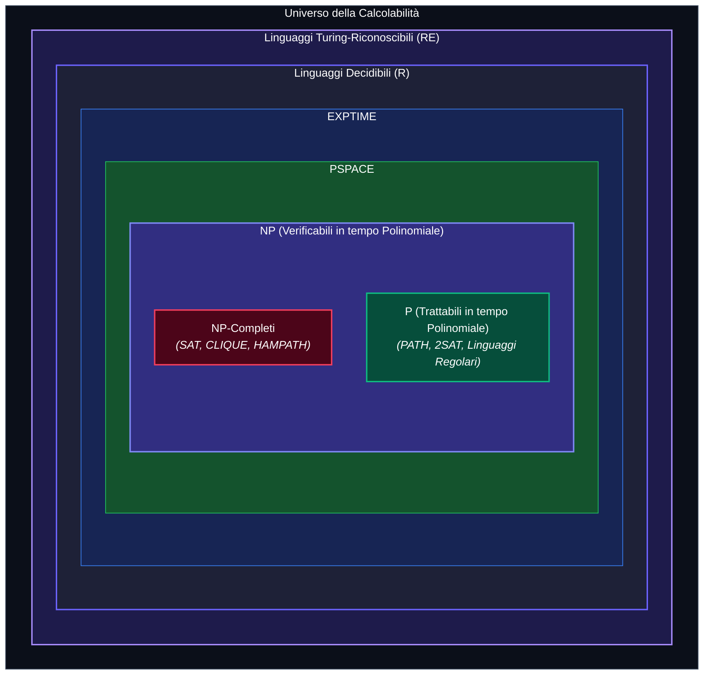

---

## 9.8 Il Sunto del Boss: P vs NP

> [!TIP]
> ### In Pillole
> - **$\mathcal{P}$**: Problemi che sappiamo **risolvere velocemente** (algoritmi efficienti deterministici).
> - **$\mathcal{NP}$**: Problemi di cui sappiamo **controllare velocemente la soluzione** (tramite certificato).
> - **NP-Completi**: I rappresentanti universali della difficoltà in $\mathcal{NP}$. Risolvere efficientemente uno solo di essi equivale a risolvere efficientemente tutti i problemi in $\mathcal{NP}$ contemporaneamente.

---
---

# Capitolo 10 — Formulario: Codifiche, Classificazioni e Riduzioni Notevoli

---

## 10.1 Gerarchia della Calcolabilità

- **$\mathcal{R}$ (Decidibili / Recursive)**: Macchine che si arrestano sempre con risposta $q_{acc}$ o $q_{rif}$.
- **$\mathcal{RE}$ (Turing-Riconoscibili / Recursively Enumerable)**: Macchine che accettano gli elementi del linguaggio ma possono andare in loop sul resto.
- **$\text{co-}\mathcal{RE}$**: Linguaggi il cui complemento appartiene a $\mathcal{RE}$.
- **Né $\mathcal{RE}$ né $\text{co-}\mathcal{RE}$**: Linguaggi situati oltre il confine di riconoscibilità (es. $EQ_{TM}$).

---

## 10.2 Tabella Sinottica dei Linguaggi Fondamentali

| Linguaggio | Definizione Formale | Classificazione | Tecnica / Risoluzione |
| :--- | :--- | :--- | :--- |
| **$A_{DFA}$** | $\{\langle B, w \rangle \mid B \text{ è un DFA e accetta } w\}$ | **Decidibile ($\mathcal{R}$)** | Simulazione diretta del DFA |
| **$A_{NFA}$** | $\{\langle B, w \rangle \mid B \text{ è un NFA e accetta } w\}$ | **Decidibile ($\mathcal{R}$)** | Conversione in DFA via Subset Construction |
| **$A_{REX}$** | $\{\langle R, w \rangle \mid R \text{ è una RegEx e genera } w\}$ | **Decidibile ($\mathcal{R}$)** | Conversione RegEx $\to$ NFA $\to$ DFA |
| **$E_{DFA}$** | $\{\langle B \rangle \mid B \text{ è un DFA e } \mathcal{L}(B) = \emptyset\}$ | **Decidibile ($\mathcal{R}$)** | Algoritmo di raggiungibilità su grafo (BFS) |
| **$EQ_{DFA}$** | $\{\langle A, B \rangle \mid A, B \text{ sono DFA e } \mathcal{L}(A) = \mathcal{L}(B)\}$ | **Decidibile ($\mathcal{R}$)** | Costruzione DFA per differenza simmetrica |
| **$A_{TM}$** | $\{\langle M, w \rangle \mid M \text{ è una MdT e accetta } w\}$ | **$\mathcal{RE}$, Indecidibile** | Riconosciuto da $U$; Indecidibile per Diagonalizzazione |
| **$HALT_{TM}$** | $\{\langle M, w \rangle \mid M \text{ è una MdT e termina su } w\}$ | **$\mathcal{RE}$, Indecidibile** | Riduzione $A_{TM} \le_m HALT_{TM}$ |
| **$E_{TM}$** | $\{\langle M \rangle \mid M \text{ è una MdT e } \mathcal{L}(M) = \emptyset\}$ | **$\text{co-}\mathcal{RE}$, Indecidibile** | $A_{TM} \le_m \overline{E_{TM}} \implies \overline{A_{TM}} \le_m E_{TM}$ |
| **$REGULAR_{TM}$** | $\{\langle M \rangle \mid M \text{ è una MdT e } \mathcal{L}(M) \text{ è regolare}\}$ | **Né $\mathcal{RE}$ né $\text{co-}\mathcal{RE}$** | Teorema di Rice / Riduzioni da $A_{TM}$ e $\overline{A_{TM}}$ |
| **$EQ_{TM}$** | $\{\langle M_1, M_2 \rangle \mid M_1, M_2 \text{ MdT e } \mathcal{L}(M_1) = \mathcal{L}(M_2)\}$ | **Né $\mathcal{RE}$ né $\text{co-}\mathcal{RE}$** | Riduzioni da $A_{TM}$ e $\overline{A_{TM}}$ |

---

## 10.3 Problemi di Decisione in $\mathcal{NP}$

| Problema | Input Formale $\langle \dots \rangle$ | Domanda Decisionale | Certificato Polinomiale |
| :--- | :--- | :--- | :--- |
| **SAT** | $\langle \phi \rangle$, $\phi$ formula booleana | Esiste assegnazione che rende $\phi = \text{Vero}$? | Assegnazione di verità a ciascuna variabile |
| **3SAT** | $\langle \phi \rangle$, $\phi$ in 3-CNF | $\phi$ è soddisfacibile? | Assegnazione di verità alle variabili |
| **CLIQUE** | $\langle G, k \rangle$, $G$ grafo, $k \in \mathbb{N}$ | $G$ contiene un sottografo completo di $k$ nodi? | Insieme di $k$ vertici del grafo |
| **VERTEX-COVER** | $\langle G, k \rangle$, $G$ grafo, $k \in \mathbb{N}$ | Esistono $k$ nodi che coprono tutti gli archi? | Insieme di $k$ nodi di copertura |
| **HAMPATH** | $\langle G, s, t \rangle$, $G$ orientato | Esiste cammino semplice da $s$ a $t$ toccando tutti i nodi? | Sequenza ordinata di nodi $|V|$ |
| **UHAMPATH** | $\langle G, s, t \rangle$, $G$ non orientato | Esiste cammino hamiltoniano da $s$ a $t$? | Sequenza ordinata di nodi $|V|$ |
| **SUBSET-SUM** | $\langle S, T \rangle$, $S \subset \mathbb{Z}$, $T \in \mathbb{Z}$ | Esiste $S' \subseteq S$ tale che $\sum S' = T$? | Sottoinsieme $S' \subseteq S$ |

---

## 10.4 Mappa delle Riduzioni di Calcolabilità ($\le_m$)

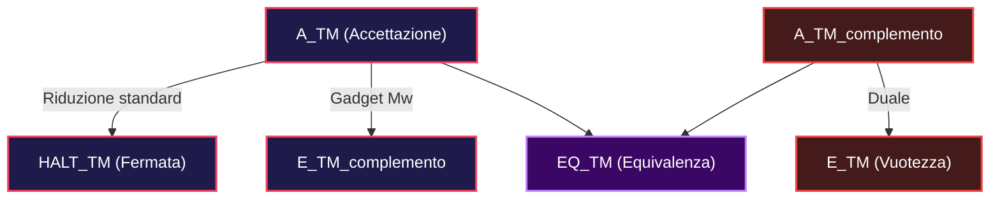

1. **$A_{TM} \le_m HALT_{TM}$**:
   La funzione $f(\langle M, w \rangle) = \langle M', w \rangle$ modifica $M$ in modo che se $M$ entra in uno stato di rifiuto, $M'$ entra invece in un loop infinito.
2. **$A_{TM} \le_m \overline{E_{TM}}$**:
   Costruisce $M_w(x)$ che ignora il proprio input $x$ ed esegue $M(w)$. Se $M$ accetta $w$, $\mathcal{L}(M_w) = \Sigma^* \neq \emptyset$.

---

## 10.5 Mappa delle Riduzioni Polinomiali ($\le_p$) e Gadget

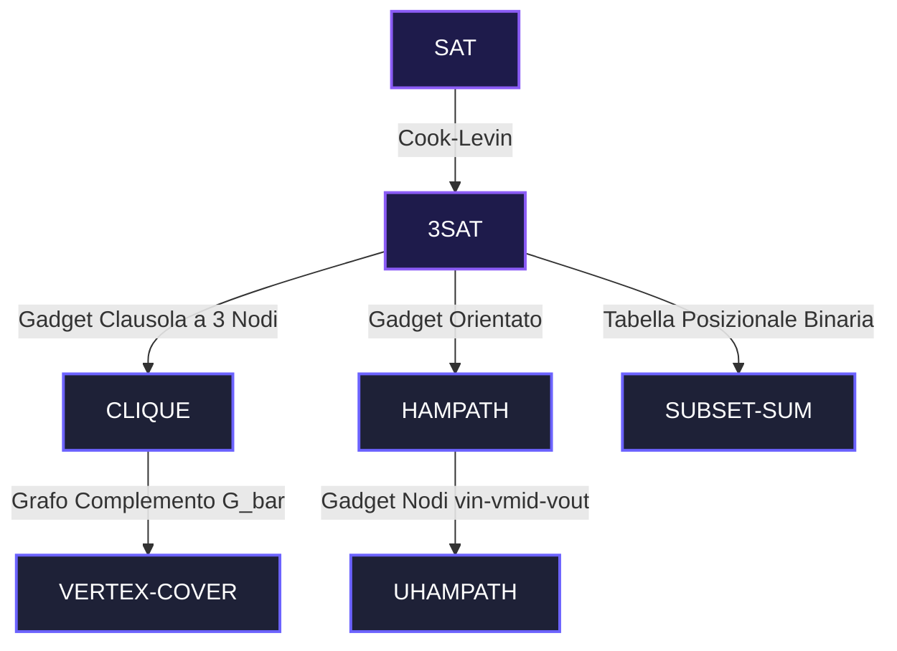

### Gadget di Riduzione Principali:
1. **$3SAT \le_p CLIQUE$**:
   - Ogni clausola $C_r = (l_1 \vee l_2 \vee l_3)$ genera una tripla di vertici nel grafo.
   - Si collegano due nodi appartenenti a clausole distinte se e solo se i rispettivi letterali sono **logicamente compatibili** (non opposti, es. $x_i$ e $\neg x_i$).
   - La formula ha $k$ clausole soddisfacibili $\iff$ il grafo possiede una $k$-clique.

2. **$CLIQUE \le_p VERTEX\text{-}COVER$**:
   - Dato $G=(V, E)$, si costruisce il grafo complemento $\overline{G} = (V, \overline{E})$.
   - $G$ possiede una clique di dimensione $k \iff \overline{G}$ possiede un vertex cover di dimensione $|V| - k$.

3. **$HAMPATH \le_p UHAMPATH$**:
   - Ogni vertice orientato $v$ viene sostituito da un gadget non orientato formato da 3 nodi in serie: $v_{in} - v_{mid} - v_{out}$.
   - Ogni arco orientato $(u, v)$ diventa un arco non orientato $\{u_{out}, v_{in}\}$.
   - Questo forza qualsiasi cammino ad attraversare i gadget sempre nel senso $v_{in} \to v_{mid} \to v_{out}$.

4. **$3SAT \le_p SUBSET\text{-}SUM$**:
   - Si costruisce una tabella di numeri decimali/binari con cifre posizionali:
     - Le prime $n$ colonne tracciano le scelte per ciascuna variabile ($x_1, \dots, x_n$).
     - Le successive $k$ colonne tracciano la verifica di ciascuna clausola ($C_1, \dots, C_k$).
   - Per ogni variabile $x_i$, si creano due numeri $y_i$ (se $x_i = 1$) e $z_i$ (se $x_i = 0$).
   - Per ogni clausola si creano variabili di riempimento (*slack variables*) per raggiungere la somma target $T = \underbrace{11\dots 1}_{n \text{ volte}} \underbrace{33\dots 3}_{k \text{ volte}}$.
