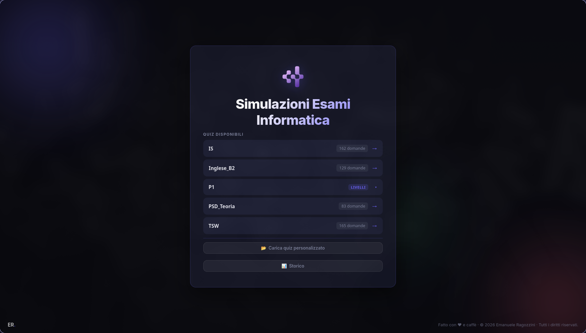

# 🎓 IUE — InformaticaUnisaExams

App desktop per simulare gli esami di informatica dell'**Università degli Studi di Salerno (Unisa)**.  
Progettata per studiare in modo attivo attraverso quiz a scelta multipla, con feedback immediato e storico delle sessioni.

---

## 📸 Anteprima



---

## ✨ Funzionalità

- **Quiz a scelta multipla** con feedback immediato (risposta corretta/errata)
- **Barra di progresso** durante il quiz
- **Schermata risultato** con resoconto dettagliato di ogni domanda
- **Storico sessioni** con grafico dell'andamento (solo modalità desktop)
- **Caricamento quiz personalizzato** tramite file `.json`
- **Lista quiz precaricati** dalla cartella `Quizzes/` (solo modalità desktop)
- Interfaccia moderna con animazioni e supporto dark mode
- Funziona sia come **app desktop (Electron)** che come **pagina web nel browser**

---

## 📚 Quiz inclusi

| Materia | File | Domande |
|---|---|---|
| Ingegneria del Software | `IS.json` | 162 |
| Tecnologie e Software per il Web | `TSW.json` | 165 |
| Inglese B2 | `Inglese_B2.json` | 129 |
| Programmazione e Strutture Dati | `PSD.json` | 83 |

---

## 📥 Download

Non vuoi compilare il progetto da sol*? Gli eseguibili già pronti per **Windows** e **Linux** sono disponibili nella sezione [**Releases**](../../releases) di questa repository GitHub.

Scarica la versione per il tuo sistema operativo, estraila (se necessario) ed eseguila direttamente — nessuna installazione richiesta.

---

## 🚀 Come avviare il progetto

### Prerequisiti

- [Node.js](https://nodejs.org/) (v18 o superiore)
- npm

### Installazione dipendenze

```bash
npm install
```

### Avvio in modalità sviluppo (desktop)

```bash
npm start
```

### Avvio nel browser (senza Electron)

Apri direttamente il file `quiz-web/index.html` nel browser, oppure usa un server locale:

```bash
npx serve quiz-web
```

> **Nota:** in modalità browser, la lista quiz precaricati e lo storico sessioni non sono disponibili. Puoi comunque caricare manualmente un file `.json`.

---

## 📦 Build dell'app

### Windows (installer .exe)

```bash
npm run build
```

### Linux (.tar.gz)

```bash
npm run build:linux
```

I file di output si trovano nella cartella `dist/`.

---

## 🗂️ Struttura del progetto

```
TUE/
├── main.js              # Entry point Electron (processo principale)
├── preload.js           # Bridge sicuro tra Electron e la web app
├── package.json
├── quiz-web/            # Frontend (HTML + CSS + JS puro)
│   ├── index.html
│   ├── style.css
│   └── app.js
├── Quizzes/             # File JSON con i quiz precaricati
│   ├── IS.json
│   ├── TSW.json
│   ├── PSD.json
│   └── Inglese_B2.json
└── Appunti&VecchieDomande/   # Materiale sorgente
```

---

## ➕ Aggiungere un nuovo quiz

Basta inserire un file `.json` nella cartella `Quizzes/`. Il formato deve rispettare la seguente struttura:

```json
[
  {
    "domanda": "Testo della domanda",
    "risposta1": "Opzione A",
    "risposta2": "Opzione B",
    "risposta3": "Opzione C",
    "corretta": "Opzione A"
  }
]
```

---

## 🛠️ Tecnologie utilizzate

- **Electron** — app desktop cross-platform
- **HTML5 / CSS3 / JavaScript** — frontend puro, senza framework
- **Google Fonts (Inter)** — tipografia moderna

---

## 👤 Autore

***Emanuele Ragozzini*** — condivisione libera tra studenti del *DI*.
