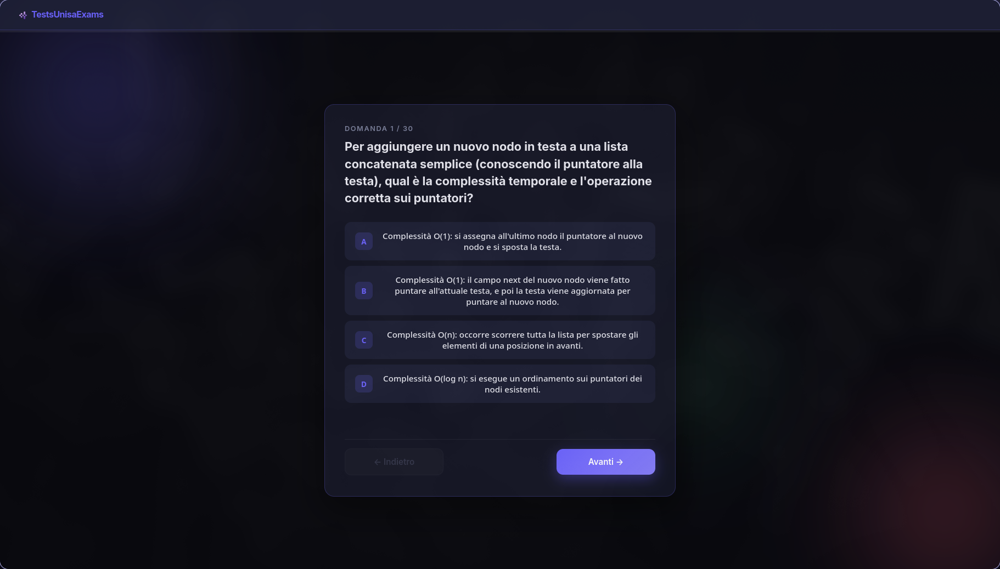
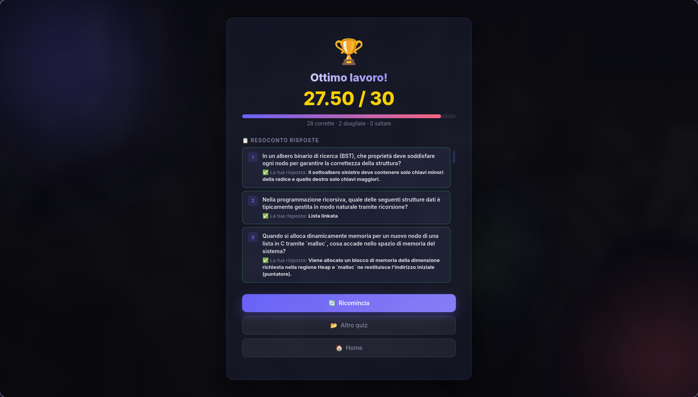

<p align="center">
  
</p>
<h1 align="center">IUE — InformaticaUnisaExams</h1>
App desktop per simulare gli esami di informatica dell'**Università degli Studi di Salerno (Unisa)**.  
Progettata per studiare in modo attivo attraverso quiz a scelta multipla e quiz di programmazione interattivi, con feedback immediato e storico delle sessioni.

---

## 📸 Anteprima


<div style="display: flex; flex-direction:row">
  
</div>

---

## ✨ Funzionalità

- **Quiz di Programmazione C integrati** — Scrivi, compila ed esegui codice C direttamente nell'app.
- **Test-cases interattivi** — Verifica il tuo codice contro vari input/output con un resoconto dettagliato.
- **Livelli di Difficoltà** — I quiz possono essere suddivisi in livelli (es. *Facile*, *Medio*, *Difficile*) organizzati in cartelle (solo modalità desktop).
- **Navigazione libera** tra le domande con i pulsanti ← Indietro / Avanti →
- **Salta e torna** — puoi saltare una domanda e tornarci in seguito.
- **Risposte modificabili** — puoi cambiare una risposta già data prima di consegnare.
- **Quiz a scelta multipla** e a risposta aperta (con fuzzy matching).
- **Barra di progresso** che mostra le domande risposte.
- **Schermata risultato** con resoconto dettagliato di ogni domanda (3 colonne per gli errori di codice: Input, Atteso, Ottenuto).
- **Storico sessioni** con grafico dell'andamento (solo modalità desktop).
- **Supporto Markdown e Syntax Highlighting** — Nelle tracce delle domande.
- Interfaccia moderna **Glassmorphism** con animazioni fluide e supporto dark mode.
- Funziona sia come **app desktop (Electron)** che come **pagina web nel browser**.

---

## 📚 Quiz inclusi

| Materia | File / Cartella |
|---|---|
| Ingegneria del Software | `IS.json` |
| Tecnologie e Software per il Web | `TSW.json` |
| Inglese B2 | `Inglese_B2.json` |
| Programmazione e Strutture Dati | `PSD.json` |
| P1 (Programmazione 1 - C) | Cartella `P1` (Facile, Medio, Difficile) |

---

## 📥 Download

Non vuoi compilare il progetto da sol*? Gli eseguibili già pronti per **Windows** e **Linux** sono disponibili nella sezione [**Releases**](../../releases) di questa repository GitHub.

Scarica la versione per il tuo sistema operativo, estraila (se necessario) ed eseguila direttamente — nessuna installazione richiesta.

---

## 🚀 Come avviare il progetto

### Prerequisiti

- [Node.js](https://nodejs.org/) (v18 o superiore)
- npm
- **GCC (Compilatore C)** — richiesto solo per i quiz di programmazione C (`sudo apt install build-essential` su Linux, MinGW su Windows).

### Installazione dipendenze

```bash
npm install
```

### Avvio in modalità sviluppo (desktop)

```bash
npm start
```

### Avvio nel browser (senza Electron)

Apri direttamente il file `quiz-web/index.html` nel browser, oppure usa un server locale:

```bash
npx serve quiz-web
```

> **Nota:** in modalità browser, la compilazione C, i livelli di difficoltà a cartelle e lo storico sessioni non sono disponibili. Puoi comunque caricare manualmente un quiz `.json` classico.

---

## 📦 Build dell'app

### Windows (installer .exe)

```bash
npm run build
```

### Linux (.tar.gz)

```bash
npm run build:linux
```

I file di output si trovano nella cartella `dist/`.

---

## 🗂️ Struttura del progetto

```
TUE/
├── main.js              # Entry point Electron (processo principale, compilazione C)
├── preload.js           # Bridge sicuro tra Electron e la web app
├── package.json
├── quiz-web/            # Frontend (HTML + CSS + JS puro, Monaco Editor)
│   ├── index.html
│   ├── style.css
│   └── app.js
├── Quizzes/             # File JSON e Cartelle con i quiz
│   ├── IS.json
│   ├── P1/              # Esempio di quiz con livelli di difficoltà
│   │   ├── P1_facile.json
│   │   └── P1_difficile.json
│   └── ...
└── Appunti&VecchieDomande/   # Materiale sorgente
```

---

## ➕ Aggiungere un nuovo quiz

Basta inserire un file `.json` nella cartella `Quizzes/`. Puoi anche creare una **cartella** (es. `Quizzes/Materia/`) per abilitare i **livelli di difficoltà**.

### Formato per quiz classico:
```json
[
  {
    "domanda": "Testo della domanda",
    "risposta1": "Opzione A",
    "risposta2": "Opzione B",
    "risposta3": "Opzione C",
    "corretta": "Opzione A"
  }
]
```

### Formato per quiz di programmazione C (`tipo: "codice"`):
```json
[
  {
    "tipo": "codice",
    "domanda": "Scrivi un programma in C che stampa 'Ciao'.",
    "test_cases": [
      { "stdin": "", "expected": "Ciao\n" }
    ]
  }
]
```

---

## 🛠️ Tecnologie utilizzate

- **Electron** — app desktop cross-platform
- **Monaco Editor** — l'editor di codice di VS Code integrato nell'app
- **HTML5 / CSS3 / JavaScript** — frontend puro, senza framework
- **GCC** — compilazione nativa C via IPC
- **Google Fonts (Fira Code, Inter)** — tipografia moderna per testo e codice

---

## 👤 Autore

***Emanuele Ragozzini*** — condivisione libera tra studenti del *DI*.
