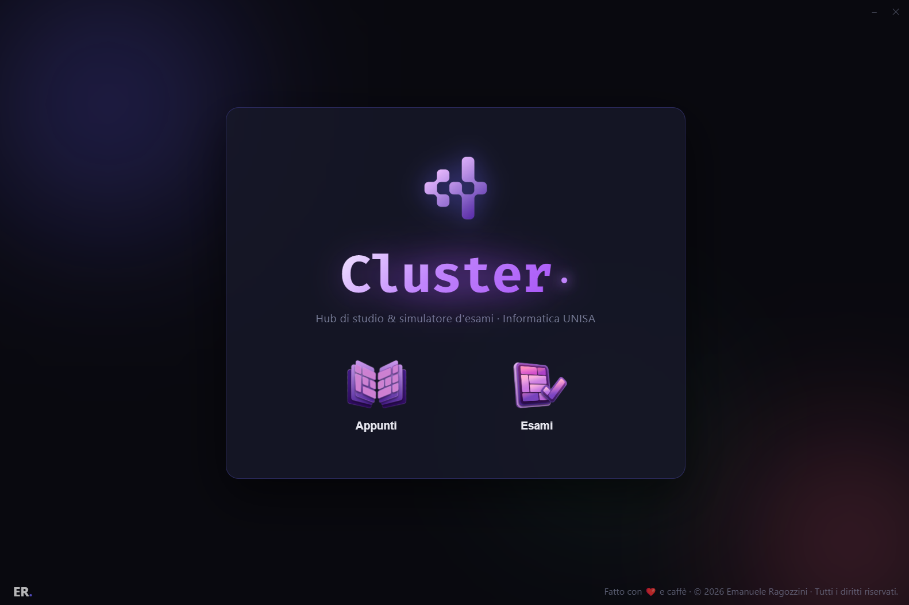
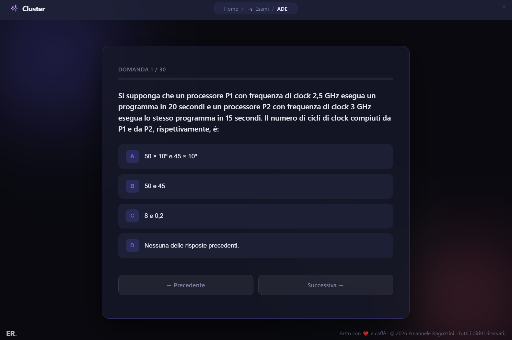
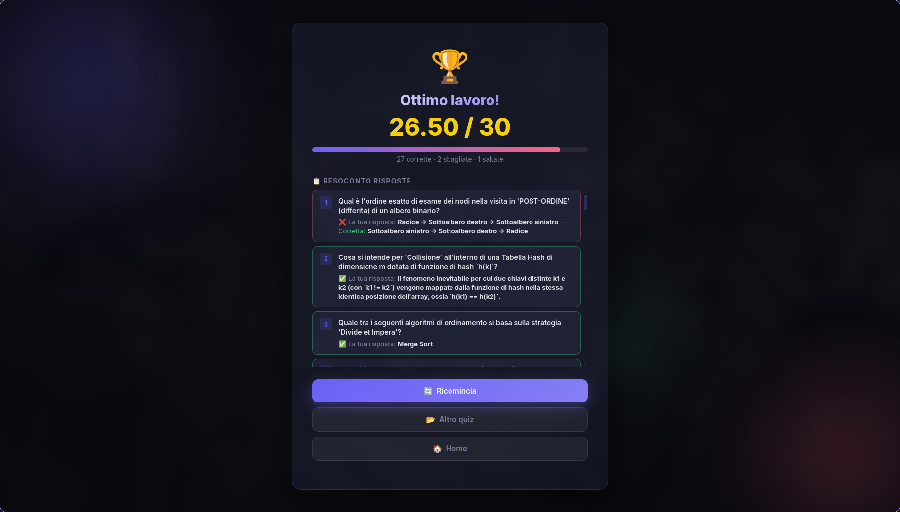

<p align="center">
  
</p>
<h1 align="center">Cluster<span style="color: #c084fc; display: inline-block; vertical-align: 0.13em; margin-left: 2px;">.</span></h1>

<p align="center">
  <b>Hub di studio all-in-one e simulatore d'esami desktop per il corso di laurea in Informatica dell'Università degli Studi di Salerno (UNISA).</b>
</p>

---

## 📸 Anteprima


<div style="display: flex; flex-direction:row">
  
</div>

---

## ✨ Funzionalità Principali

### 📖 Sezione Appunti & Studio
- **Viewer Markdown Integrato** — Consulta tutti gli appunti e le dispense organizzate per anno e materia direttamente nell'app.
- **Navigazione Laterale** — Struttura ad albero intuitiva per passare da un argomento all'altro senza distrazioni.

### 📝 Quiz e Simulatore d'Esame
- **Quiz di Programmazione C Integrati** — Scrivi, compila ed esegui codice C in tempo reale grazie all'integrazione con Monaco Editor (VS Code) e GCC nativo.
- **Esercizi Interattivi Canvas (ADE)** — Risolvi quesiti di Architettura degli Elaboratori manipolando graficamente schemi di circuiti e datapath SVG con drag & drop.
- **Quiz a Scelta Multipla e Risposta Aperta** — Con sistema di valutazione adattivo e fuzzy matching per risposte scritte.
- **Valutazione e Test Cases** — Verifica istantanea con analisi dell'output atteso vs ottenuto.
- **Navigazione Flessibile** — Salta le domande difficili, modifica le risposte prima di consegnare e monitora il progresso con la barra di avanzamento.

### 📊 Dashboard & Statistiche
- **Media Voti Calcolata** — Monitora la tua media espressa in trentesimi in tempo reale.
- **Grafico di Andamento (Trend SVG)** — Grafico a linee vettoriale nativo per visualizzare i progressi nelle ultime 15 sessioni.
- **Filtri e Ordinamento** — Filtra lo storico per materia specifica o ordina per data e votazione.
- **Reset Dati** — Ripristina lo storico in qualsiasi momento con un semplice click.

### 🎨 Design & Esperienza Utente
- **Estetica Dark Glassmorphism** — Interfaccia minimale e moderna con trasparenze, sfumature viola e animazioni ad alte prestazioni.
- **Navigazione Nativa** — Breadcrumb dinamico per spostarsi facilmente tra Home, Esami, Appunti e Storico.

---

## 📚 Materie & Quiz Inclusi

| Materia | Tipo Contenuto | File / Cartella |
|---|---|---|
| **Programmazione 1 (P1)** | Codice C (Facile, Medio, Difficile) | `Quizzes/Primo anno/` |
| **Architettura degli Elaboratori (ADE)** | Esercizi Canvas & Datapath | `Quizzes/Primo anno/` |
| **Programmazione e Strutture Dati (PSD)** | Quiz & Teoria | `Quizzes/Secondo anno/PSD.json` |
| **Ingegneria del Software (IS)** | Quiz a Scelta Multipla | `Quizzes/Secondo anno/IS.json` |
| **Tecnologie Software per il Web (TSW)** | Quiz & Codice Web | `Quizzes/Secondo anno/TSW.json` |
| **Inglese B2** | Quiz a Scelta Multipla | `Quizzes/Terzo anno/Inglese_B2.json` |

---

## 📥 Download Eseguibili

Non vuoi compilare il progetto? Gli eseguibili già pronti per **Windows** e **Linux** sono disponibili nella sezione [**Releases**](../../releases) di questa repository GitHub.

Scarica la versione per il tuo sistema operativo, estraila (se necessario) ed eseguila direttamente, nessuna installazione richiesta.

---

## 🚀 Guida all'Avvio

### Prerequisiti

- **Node.js** (v18 o superiore)
- **npm**
- **GCC (Compilatore C)** — Richiesto per l'esecuzione dei quiz di programmazione C (`sudo apt install build-essential` su Linux, MinGW/MSYS2 su Windows).

### 1. Installazione Dipendenze

```bash
npm install
```

### 2. Avvio in Sviluppo (Desktop Electron)

```bash
npm start
```

---

## 📦 Compilazione ed Eseguibili

Per generare l'eseguibile desktop distribuibile:

### Windows (.exe)
```bash
npm run build
```

### Linux (.tar.gz)
```bash
npm run build:linux
```

I file generati verranno salvati automaticamente nella cartella `dist/`.

---

## 🗂️ Struttura del Progetto

```text
Cluster/
├── main.cjs                # Main process Electron (IPC, compilatore C, gestione file)
├── preload.cjs             # Bridge IPC sicuro Electron-React
├── package.json
├── vite.config.js          # Configurazione Vite per il bundler React
├── Quizzes/                # Banca dati quiz divisi per anno e materia
├── Notes/                  # Appunti e dispense in formato Markdown
├── design/                 # Screenshot e risorse grafiche di presentazione
└── renderer/               # Frontend React
    ├── index.html
    └── src/
        ├── assets/         # Risorse statiche dell'interfaccia (loghi, icone)
        ├── components/     # Componenti UI (Header, HUD, domande quiz)
        ├── screens/        # Schermate (Home, Esami, Study, Stats, Result, Quiz)
        ├── styles/         # Fogli di stile (global.css, canvas-quiz.css)
        └── utils/          # Helper e funzioni di supporto
```

---

## ➕ Aggiungere Nuovi Quiz

Per aggiungere una nuova materia o un nuovo test, inserisci un file `.json` nella directory `Quizzes/`.

### Formato Quiz Scelta Multipla:
```json
[
  {
    "domanda": "Qual è la complessità temporale della ricerca binaria?",
    "risposta1": "O(log n)",
    "risposta2": "O(n)",
    "risposta3": "O(n^2)",
    "corretta": "O(log n)"
  }
]
```

### Formato Quiz di Codice C (`tipo: "codice"`):
```json
[
  {
    "tipo": "codice",
    "domanda": "Scrivi una funzione che calcoli la somma dei primi N numeri naturali.",
    "test_cases": [
      { "stdin": "5\n", "expected": "15\n" }
    ]
  }
]
```

---

## 🛠️ Tecnologie Utilizzate

- **Electron** — Shell desktop nativa e cross-platform
- **React 19 + Vite** — Interfaccia utente dinamica ad alte prestazioni
- **Monaco Editor** — Editor di codice integrato (stesso motore di VS Code)
- **GCC** — Compilazione ed esecuzione nativa del codice C via IPC
- **Marked** — Parsing dinamico degli appunti Markdown
- **CSS Vanilla & Glassmorphism** — Stile custom responsive e performante senza dipendenze grafiche esterne

---

## 👤 Autore & Licenza

**Emanuele Ragozzini** — *Progetto creato per gli studenti del Dipartimento di Informatica (UNISA).*  
Rilasciato sotto licenza [MIT](LICENSE). Fatto con ❤️ e caffè. © 2026 Tutti i diritti riservati.
